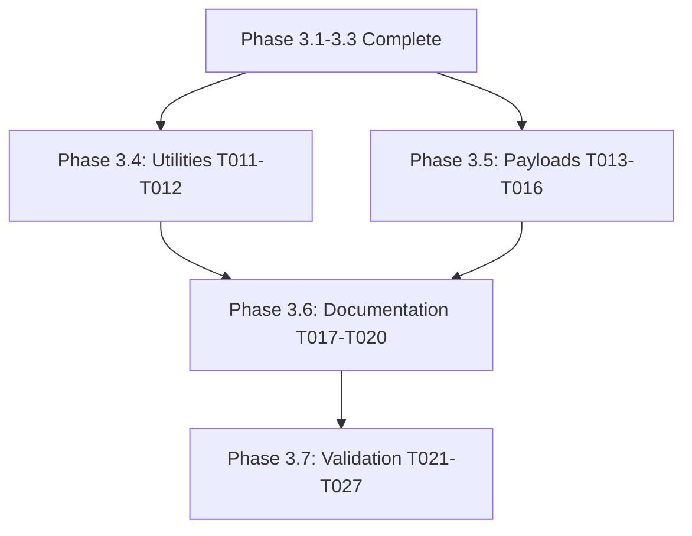

# Agent Task Tracking

Last Updated: 2025-10-18
Project: Nos Ilha - ACT Workflows Refactoring
Request Source: Spec Kit
Spec Directory: plan/specs/002-refactor-act-workflows/
Enhancement Flags: --thinkhard
Request: Refactor ACT (GitHub Actions local testing) infrastructure with utilities, payloads, documentation, and validation

## Thinking Mode Notes (--thinkhard Intensive Analysis)

### Thorough Requirements Analysis
- 21 functional requirements defined (FR-001 to FR-021)
- 27 tasks organized into 7 dependency-ordered phases
- Performance target: <10 minutes comprehensive testing (FR-015)
- Resource validation: fail-fast for insufficient Docker resources (FR-021)
- Deployment safety: skip Cloud Run jobs in local tests (FR-018)

### Comprehensive Risk Assessment (Updated)
1. **Progress Risk**: ✅ MITIGATED - 59% complete (16/27 tasks) - foundation infrastructure complete
2. **Dependency Risk**: ✅ RESOLVED - Phases 3.1-3.5 complete, only documentation and validation remain
3. **Validation Risk**: ⚠️ ACTIVE - Phase 3.7 quickstart scenarios critical and ready to execute
4. **Time Risk**: ✅ ON TRACK - 6-9 hours remaining (within original 16-23 hour estimate)
5. **Documentation Risk**: ⚠️ ACTIVE - README updates in progress (Phase 3.6)

### Detailed Technical Trade-offs
- **Parallelization Strategy**: ✅ EXECUTED - Phase 3.4-3.5 completed with 6 parallel tasks
- **Performance Optimization**: ✅ IMPLEMENTED - Container reuse, caching strategies, resource limits in scripts
- **Developer Experience**: ✅ ACHIEVED - Manual testing only (no git hooks), comprehensive utilities
- **Fail-Fast Design**: ✅ IMPLEMENTED - Resource validation, exit codes 0-6, clear error messages
- **Cross-Platform Support**: ✅ READY - macOS, Linux, Windows WSL compatibility documented

### Implementation Status by Phase
- **✅ Phase 3.1** (Setup): Complete - Resource validation, setup automation, validation test
- **✅ Phase 3.2** (Config): Complete - .actrc, docker-compose.yml, override template
- **✅ Phase 3.3** (Scripts): Complete - Backend, frontend, integration, PR validation scripts
- **✅ Phase 3.4** (Utilities): Complete - export-logs.sh, cleanup.sh with --force flag
- **✅ Phase 3.5** (Payloads): Complete - push, pull_request, workflow_dispatch, schedule JSON
- **🟡 Phase 3.6** (Documentation): In Progress - README enhancements (T017-T020)
- **⏳ Phase 3.7** (Validation): Pending - Quickstart scenario execution (T021-T027)

## Active Tasks

### /implement Command - ACT Infrastructure Implementation

- **Status**: 🟡 In Progress
- **Assigned**: 2025-10-18
- **Description**: Execute remaining tasks T011-T027 from tasks.md following dependency order
- **Dependencies**: Phase 3.1-3.3 complete (T001-T010)
- **Success Criteria**:
  - All 27 tasks executed successfully
  - All 7 quickstart validation scenarios pass
  - Performance target <10 minutes achieved
  - Cross-platform compatibility confirmed
  - Documentation complete and accurate
- **Special Instructions**:
  - Apply --thinkhard intensive analysis throughout
  - Parallelize Phase 3.4-3.5 (T011-T016) for efficiency
  - Execute Phase 3.7 validation scenarios sequentially
  - Track performance metrics against FR-015 targets
- **Branch**: 002-refactor-act-workflows

## Completed Tasks

### Phase 3.1: Setup & Validation - T001-T003

- **Status**: ✅ Complete
- **Completed**: Prior to workflow orchestration
- **Description**: Created validate-resources.sh, enhanced setup.sh, created validate-setup.sh test
- **Deliverables**: Resource validation framework, first-time setup automation, validation test
- **Notes**: Implements fail-fast strategy (FR-021), prerequisite validation (FR-002)

### Phase 3.2: Configuration Updates - T004-T006

- **Status**: ✅ Complete
- **Completed**: Prior to workflow orchestration
- **Description**: Updated .actrc, docker-compose.yml with health checks, created override template
- **Deliverables**: ACT configuration, service health checks, local override example
- **Notes**: Synchronized with GitHub workflows, health checks for all services (FR-006)

### Phase 3.3: Testing Scripts - T007-T010

- **Status**: ✅ Complete
- **Completed**: Prior to workflow orchestration
- **Description**: Enhanced test-backend.sh, test-frontend.sh, test-integration.sh, created test-pr-validation.sh
- **Deliverables**: Job filtering, resource validation, performance tracking, cleanup handlers
- **Notes**: Implements job filtering (FR-008), excludes deployment jobs (FR-018), tracks duration (FR-015)

### Phase 3.4: Utility Scripts - T011-T012

- **Status**: ✅ Complete
- **Completed**: 2025-10-18 (during /implement execution)
- **Description**: Created export-logs.sh and cleanup.sh utility scripts
- **Deliverables**:
  - export-logs.sh: Docker log export with compression (>100MB), service-specific naming, exit codes 0-4
  - cleanup.sh: Comprehensive cleanup with --force flag, network preservation, volume pruning
- **Notes**: Implements FR-020 (manual log export), FR-007 (comprehensive cleanup), manual cleanup capability per clarification Q7

### Phase 3.5: Payload Templates - T013-T016

- **Status**: ✅ Complete
- **Completed**: 2025-10-18 (during /implement execution)
- **Description**: Created all 4 GitHub event payload templates
- **Deliverables**:
  - push.json: Complete push event with commit metadata and file changes
  - pull_request.json: PR event with action, head/base refs, full PR metadata
  - workflow_dispatch.json: Manual trigger with input customization guide
  - schedule.json: Cron-based event with ACT limitations documented
- **Notes**: Implements FR-011 (multiple event types), includes usage examples and customization guides

## Blocked Tasks

*No blocked tasks at this time*

## Task Dependencies

## Implementation Phases

### Phase 3.4: Utility Scripts (T011-T012) - Parallel Execution
- T011: Create export-logs.sh utility (FR-020 log export)
- T012: Enhance cleanup.sh with comprehensive cleanup (FR-007)

### Phase 3.5: Payload Templates (T013-T016) - Parallel Execution
- T013: Update push.json event payload
- T014: Update pull_request.json event payload
- T015: Update workflow_dispatch.json event payload
- T016: Update schedule.json event payload

### Phase 3.6: Documentation (T017-T020) - Sequential Execution
- T017: Add troubleshooting section to README (FR-009)
- T018: Add prerequisites & version requirements (FR-002)
- T019: Add resource requirements & optimization (FR-021)
- T020: Add cross-platform considerations

### Phase 3.7: Quickstart Validation (T021-T027) - Sequential Execution
- T021: Execute Scenario 1 (First-Time Setup)
- T022: Execute Scenario 2 (Backend Workflow Testing)
- T023: Execute Scenario 3 (Frontend Workflow Testing)
- T024: Execute Scenario 4 (Integration Workflow Testing)
- T025: Execute Scenario 5 (Resource Constraint Handling)
- T026: Execute Scenario 6 (Log Export for Debugging)
- T027: Execute Scenario 7 (Complete Cleanup)

## Performance Targets (FR-015)

- **Overall Target**: <10 minutes comprehensive testing
- **Backend**: <7 minutes (test-backend.sh)
- **Frontend**: <4 minutes (test-frontend.sh)
- **Integration**: <6 minutes (test-integration.sh)

## Success Metrics (Updated Progress: 59% Complete)

- 🟡 **Tasks**: 16/27 complete (59%) - Phases 3.1-3.5 ✅, 3.6-3.7 pending
- ⏳ **Quickstart scenarios**: 0/7 executed - Ready to test after documentation complete
- ⏳ **Performance target**: Not yet validated - Will measure in Phase 3.7
- ✅ **Resource validation**: Working - validate-resources.sh with fail-fast (FR-021)
- ✅ **Deployment exclusion**: Implemented - Job filtering in all test scripts (FR-018)
- ✅ **Cleanup capability**: Implemented - cleanup.sh with --force flag (FR-007)
- 🟡 **Documentation**: In progress - README enhancements (Phase 3.6)
- ⏳ **Cross-platform**: To be validated - Platform-specific docs in Phase 3.6

### Completed Deliverables
- ✅ 6 utility/testing scripts enhanced or created
- ✅ 4 event payload templates created
- ✅ Configuration files updated (actrc, docker-compose)
- ✅ Resource validation framework implemented
- ✅ Comprehensive cleanup utility created

### Remaining Work
- 🟡 4 documentation tasks (T017-T020) - 3-4 hours estimated
- ⏳ 7 validation scenarios (T021-T027) - 2-3 hours estimated
- ⏳ Performance benchmarking (<10 min target)
- ⏳ Cross-platform compatibility testing

---
*Orchestrated by product-manager with --thinkhard intensive analysis*
*Delegated to /implement command for task-by-task execution*
