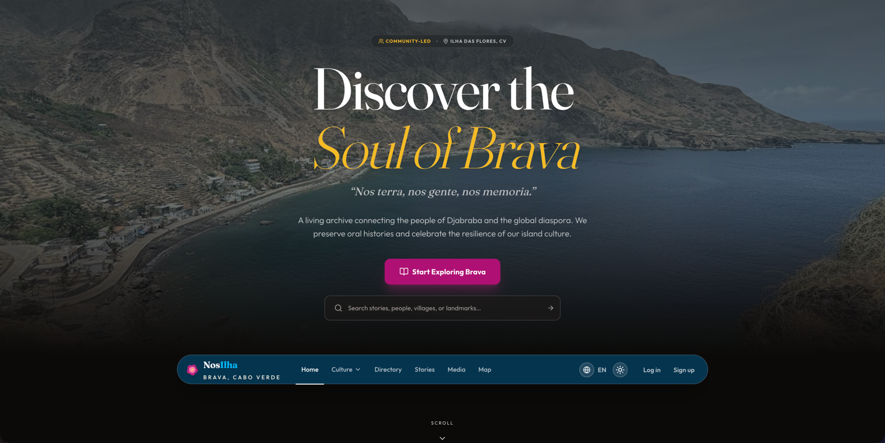

# Nos Ilha - Brava Island Cultural Heritage Hub

[](LICENSE)
[](https://nextjs.org/)
[](https://spring.io/projects/spring-boot)
[](CONTRIBUTING.md)

**[View Live Site](https://nosilha.com)**



**nosilha.com** is a community-driven cultural heritage hub for Brava Island, Cape Verde. This open-source, volunteer-supported project preserves and celebrates the island's rich cultural memory while connecting the global Cape Verdean diaspora, local residents, and international visitors to the heart of Brava.

**Quick Links:** [Features](#core-features) | [Getting Started](#getting-started) | [Documentation](#documentation) | [Contributing](#contributing)

---

## Project Status

🚧 **Pre-Release** (v0.0.2) — Actively developed. Core features functional, some areas under construction.

[View Roadmap](../../issues) | [View Changelog](CHANGELOG.md)

---

## Target Audience

| Audience | What They'll Find |
|----------|-------------------|
| Cape Verdean Diaspora | Cultural heritage, community connection, homeland updates |
| Local Residents | Shared heritage celebration, local services directory |
| Cultural Researchers | History, traditions, cultural documentation |
| International Visitors | Trip planning, authentic experiences, heritage sites |

---

## Core Features

| Feature | Description |
|---------|-------------|
| 🏛️ Cultural Archive | History, traditions, and cultural practices with stories of significant figures |
| 🏘️ Town Pages | Detailed pages for each town with historical context |
| 📸 Media Galleries | Photo and video galleries of landscapes, people, and culture |
| 🗺️ Interactive Maps | Mapbox-powered maps with landmarks and heritage sites |
| 📒 Community Directory | Local businesses, artisans, and services |
| 🌐 Multilingual | English, Portuguese, and French support |

---

## Built With

| Frontend | Backend | Infrastructure |
|----------|---------|----------------|
| Next.js 16 + React 19.2 (App Router) | Spring Boot 4.0.0 + Kotlin 2.3.0 | Google Cloud Run (serverless) |
| TypeScript + Tailwind CSS | PostgreSQL 15 + Flyway migrations | Terraform IaC |
| Supabase Auth + Mapbox GL | Spring Modulith 2.0.1 | GitHub Actions CI/CD |

---

## Getting Started

### Prerequisites

#### Local Development
- **Node.js 20.9+** (see `.nvmrc`) and **pnpm** ([install](https://pnpm.io/installation))
- **Java 25** (OpenJDK or Oracle JDK)
- **Docker** and Docker Compose

#### Production Deployment
- **Google Cloud SDK**
- **Terraform**

### Local Development Setup

1. **Start infrastructure services**:
   ```bash
   cd infrastructure/docker && docker-compose up -d
   ```
   This starts PostgreSQL database (localhost:5432)

2. **Backend setup**:
   ```bash
   cd apps/api
   ./gradlew bootRun --args='--spring.profiles.active=local'
   ```

3. **Frontend setup**:
   ```bash
   cd apps/web
   pnpm install
   pnpm run dev
   ```

### Environment Variables

Create `apps/web/.env.local` for frontend:
```bash
NEXT_PUBLIC_API_URL=http://localhost:8080
NEXT_PUBLIC_MAPBOX_ACCESS_TOKEN=your_token  # Required for maps
NEXT_PUBLIC_SUPABASE_URL=your_url           # Required for auth
NEXT_PUBLIC_SUPABASE_ANON_KEY=your_key      # Required for auth
```

### Application URLs

| Service | URL |
|---------|-----|
| Frontend | http://localhost:3000 |
| Backend API | http://localhost:8080/api/v1/ |
| Health Check | http://localhost:8080/actuator/health |
| PostgreSQL | localhost:5432 (`nosilha_db` / `nosilha` / `nosilha`) |

### Verification

```bash
# Test backend health
curl http://localhost:8080/actuator/health

# Test API endpoint
curl http://localhost:8080/api/v1/directory/entries

# Check database
docker-compose exec db psql -U nosilha -d nosilha_db -c "SELECT version();"
```

### Running Tests

```bash
# Backend tests
cd apps/api && ./gradlew test

# Frontend type checking and linting
cd apps/web && pnpm run lint && npx tsc --noEmit

# Frontend E2E tests (local only)
cd apps/web && pnpm run test:e2e

# Frontend unit tests
cd apps/web && pnpm run test:unit
```

### Production Deployment

1. **Review Setup**: See [`docs/ci-cd-pipeline.md`](docs/ci-cd-pipeline.md)
2. **Configure Secrets**: Set up GitHub secrets and Google Cloud credentials
3. **Deploy Infrastructure**: Use Terraform to provision GCP resources
4. **Automated Deployment**: Push to `main` branch triggers automatic deployment

---

## Documentation

| Document | Description |
|----------|-------------|
| [Architecture](docs/architecture.md) | System design, components, data flow |
| [Design System](docs/design-system.md) | UI components, styling, patterns |
| [API Reference](docs/api-reference.md) | Backend endpoints and schemas |
| [API Coding Standards](docs/api-coding-standards.md) | Backend coding conventions |
| [Testing Guide](docs/testing.md) | E2E and unit testing approach |
| [State Management](docs/state-management.md) | Zustand, TanStack Query patterns |
| [Spring Modulith](docs/spring-modulith.md) | Backend module architecture |
| [CI/CD Pipeline](docs/ci-cd-pipeline.md) | Deployment and automation |
| [Troubleshooting](docs/troubleshooting.md) | Common issues and solutions |

---

## Version History

See the [Changelog](CHANGELOG.md) for releases, updates, and milestones.

---

## Contributing

This is an open project dedicated to the celebration of Brava. We welcome contributions from the community. Please read our [Contributing Guide](CONTRIBUTING.md) for details on our code of conduct and the process for submitting pull requests.

---

## Getting Help

- **Questions & Discussion**: [GitHub Discussions](../../discussions)
- **Bug Reports & Features**: [GitHub Issues](../../issues)
- **Security Vulnerabilities**: See [SECURITY.md](SECURITY.md)

---

## License

This project is licensed under the MIT License - see the [LICENSE](LICENSE) file for details.

**Why MIT?** This permissive license allows maximum flexibility for developers and organizations to use, modify, and build upon Nos Ilha while encouraging contributions back to the community.

---

*For Brava. By Brava. Always.*
