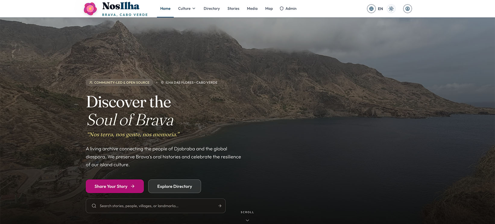

# Nos Ilha - Brava Island Cultural Heritage Hub

[](LICENSE)
[](https://nextjs.org/)
[](https://spring.io/projects/spring-boot)
[](CONTRIBUTING.md)

**[View Live Site](https://nosilha.com)**



**nosilha.com** is a community-driven cultural heritage hub for Brava Island, Cape Verde. This open-source, volunteer-supported project preserves and celebrates the island's rich cultural memory while connecting the global Cape Verdean diaspora, local residents, and international visitors to the heart of Brava.

**Quick Links:** [Features](#core-features) | [Getting Started](#getting-started) | [Documentation](#documentation) | [Contributing](#contributing)

---

## Project Status

🚧 **Pre-Release** (v0.0.2) — Actively developed. Core features functional, some areas under construction.

[View Roadmap](../../issues) | [View Changelog](CHANGELOG.md)

---

## Target Audience

| Audience | What They'll Find |
|----------|-------------------|
| Cape Verdean Diaspora | Cultural heritage, community connection, homeland updates |
| Local Residents | Shared heritage celebration, local services directory |
| Cultural Researchers | History, traditions, cultural documentation |
| International Visitors | Trip planning, authentic experiences, heritage sites |

---

## Core Features

| Feature | Description |
|---------|-------------|
| 🏛️ Cultural Archive | History, traditions, and cultural practices with stories of significant figures |
| 🏘️ Town Pages | Detailed pages for each town with historical context |
| 📸 Media Galleries | Photo and video galleries of landscapes, people, and culture |
| 🗺️ Interactive Maps | Mapbox-powered maps with landmarks and heritage sites |
| 📒 Community Directory | Local businesses, artisans, and services |
| 🌐 Multilingual | English, Portuguese, and French support |

---

## Built With

| Frontend | Backend | Infrastructure |
|----------|---------|----------------|
| Next.js 16 + React 19.2 (App Router) | Spring Boot 4.0.0 + Kotlin 2.3.0 | Google Cloud Run (serverless) |
| TypeScript + Tailwind CSS | PostgreSQL 15 + Flyway migrations | Terraform IaC |
| Supabase Auth + Mapbox GL | Spring Modulith 2.0.1 | GitHub Actions CI/CD |

---

## Getting Started

The project uses [Taskfile](https://taskfile.dev/) to orchestrate development workflows. Install it with `brew install go-task`.

### Quick Start

```bash
task check    # Verify prerequisites (Docker, Node, pnpm, Java)
task setup    # Copy web env template, install web dependencies
cp apps/api/src/main/resources/application-local.yml.example apps/api/src/main/resources/application-local.yml
task dev      # Start API (auto-starts postgres) + web in parallel
```

The API uses Spring Boot Docker Compose integration to auto-start and configure PostgreSQL — no manual `docker-compose up` needed.

**Frontend-only (no backend)?** Use `task setup:mock && task dev:web` to run with mock data.

> **Full guide:** See [`docs/00-getting-started/getting-started.md`](docs/00-getting-started/getting-started.md) for prerequisites, environment variables, daily workflows, and troubleshooting.

### Application URLs

| Service | URL |
|---------|-----|
| Frontend | http://localhost:3000 |
| Backend API | http://localhost:8080/api/v1/ |
| Swagger UI | http://localhost:8080/swagger-ui.html |
| Health Check | http://localhost:8080/actuator/health |
| PostgreSQL | `localhost:5432` (db: `nosilha_db`, user: `nosilha`, password: `nosilha`) |

### Running Tests

```bash
task test     # Run all tests (API + web)
task lint     # Run all linters (ktlint + ESLint)
```

### Production Deployment

1. **Review Setup**: See [`docs/40-operations/ci-cd-pipeline.md`](docs/40-operations/ci-cd-pipeline.md)
2. **Configure Secrets**: Set up GitHub secrets and Google Cloud credentials
3. **Deploy Infrastructure**: Use Terraform to provision GCP resources
4. **Automated Deployment**: Push to `main` branch triggers automatic deployment

---

## Documentation

| Document | Description |
|----------|-------------|
| [Getting Started](docs/00-getting-started/getting-started.md) | Developer setup, prerequisites, daily workflows |
| [Architecture](docs/20-architecture/architecture.md) | System design, components, data flow |
| [Design System](docs/10-product/design-system.md) | UI components, styling, patterns |
| [API Reference](docs/20-architecture/api-reference.md) | Backend endpoints and schemas |
| [API Coding Standards](docs/20-architecture/api-coding-standards.md) | Backend coding conventions |
| [Testing Guide](docs/20-architecture/testing.md) | E2E and unit testing approach |
| [State Management](docs/20-architecture/state-management.md) | Zustand, TanStack Query patterns |
| [Spring Modulith](docs/20-architecture/spring-modulith.md) | Backend module architecture |
| [CI/CD Pipeline](docs/40-operations/ci-cd-pipeline.md) | Deployment and automation |
| [Troubleshooting](docs/00-getting-started/troubleshooting.md) | Common issues and solutions |

---

## Version History

See the [Changelog](CHANGELOG.md) for releases, updates, and milestones.

---

## Contributing

This is an open project dedicated to the celebration of Brava. We welcome contributions from the community. Please read our [Contributing Guide](CONTRIBUTING.md) for details on our code of conduct and the process for submitting pull requests.

---

## Getting Help

- **Questions & Discussion**: [GitHub Discussions](../../discussions)
- **Bug Reports & Features**: [GitHub Issues](../../issues)
- **Security Vulnerabilities**: See [SECURITY.md](SECURITY.md)

---

## License

This project is licensed under the MIT License - see the [LICENSE](LICENSE) file for details.

**Why MIT?** This permissive license allows maximum flexibility for developers and organizations to use, modify, and build upon Nos Ilha while encouraging contributions back to the community.

---

*For Brava. By Brava. Always.*
