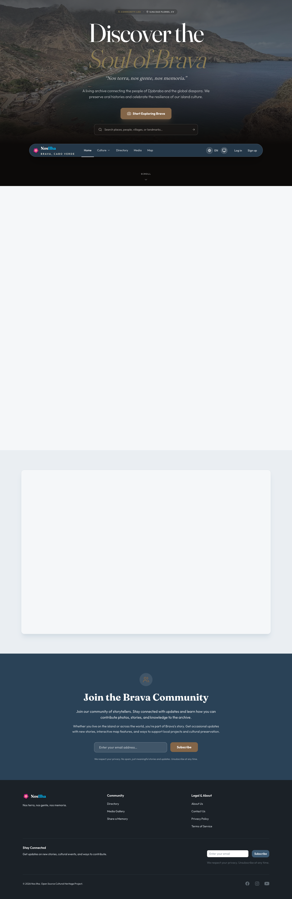
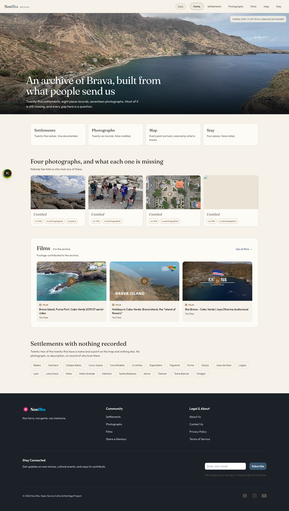
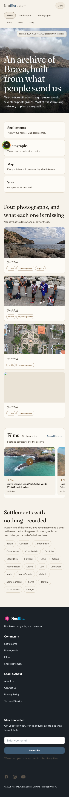

# Instagram on the Archive Home — Design Brief

**Date:** 2026-09-19
**Audience:** UI/UX design team
**Status:** Open for design. The direction has not been chosen yet (see [Design directions](#design-directions)).
**Related:** [Redesign UX audit](redesign-ux-audit-2026-09.md) (§5 Home: "Instagram and newsletter need a decision"), spec 028 (social media integration), spec 034 (media/map redesign), spec 035 (films)

---

## TL;DR

- We already have a working Instagram integration: a server-side fetch of the latest @nosilha posts and a finished feed section component. **Neither one appears on the redesigned home.** Spec 034 left the section unused.
- **It is also broken in production.** The live (pre-redesign) home still mounts the section, but it renders nothing. The API token expired around 2026-03-07, and nothing refreshes it.
- The redesigned home has a strong editorial voice: *"An archive of Brava, built from what people send us"*. Every gap is named. The old feed ("Our Island, Our Story", glossy bento grid, pink CTA) does not fit that voice.
- **We are asking design to choose a direction and design one section** (desktop and mobile, light and dark) that fits the archive home. Three directions are laid out below with their trade-offs.

---

## 1. What exists today

### 1.1 Data: `apps/web/src/lib/instagram.ts`

| Aspect | Current behaviour |
|---|---|
| Source | Instagram Graph API `v22.0/me/media` for the @nosilha account |
| Fields available | `id`, `caption`, `media_type` (`IMAGE` / `VIDEO` / `CAROUSEL_ALBUM`), `media_url`, `thumbnail_url` (videos), `timestamp`, `permalink` |
| Volume | Latest 9 posts (configurable) |
| Freshness | Cached for 30 minutes (`revalidate: 1800`); CI warms `/` after each deploy |
| Failure mode | Returns an empty list on any error or missing token, **and the section then hides itself entirely** |
| Security | Token is server-only (`INSTAGRAM_ACCESS_TOKEN`, Google Secret Manager in prod) |

**Not available from the API:** likes and comment counts (would need extra permissions), location, tagged people, alt text, and the individual images inside a carousel (each would need a separate call). Captions are free text written for Instagram, with hashtags and emoji.

### 1.2 UI: `apps/web/src/components/landing/instagram-feed-section.tsx`

Built in spec 028 for the old home, from the Stitch prompts in `design-intent/google-stitch/instagram-feed-section/prompt-v1.md`.

- **Header:** "Our Island, Our Story" / "Snapshots from home" / Instagram icon + `@NOSILHA`
- **Layout:** bento grid. One featured post spans 2 columns × 3 rows on the left, with its caption always visible. Up to 6 square thumbnails fill the right side, showing their caption on hover. Mobile: featured post on top, then a 2×2 grid.
- **Badges:** play icon on videos, layers icon on carousels
- **CTA:** filled brand button "Follow @nosilha on Instagram"
- **Motion:** Framer Motion fade/slide-in on scroll, with a reduced-motion fallback
- **Links:** every tile opens the post on instagram.com in a new tab

### 1.3 Other Instagram touchpoints

| Where | What |
|---|---|
| Footer | Instagram icon link (`social-media-links.tsx`), next to Facebook and YouTube. This is the only Instagram element visible in production today. |
| SEO | `instagram.com/nosilha` listed in Organization `sameAs` (`lib/metadata.ts`) |
| Photo credits | Backend `CreditParser` recognises `instagram.com/<handle>`, `@handle (ig)` and similar. An archive photo can show a credit linked to the contributor's Instagram. |
| Images and CSP | `*.cdninstagram.com` is allowed for `next/image`, and CSP `img-src https:` permits Instagram CDN images |

---

## 2. What we observed (Playwright, 2026-09-19)

### Production (`www.nosilha.com`, pre-redesign home)



- Section order: hero → Featured Heritage → What is NosIlha? → Interactive map teaser → **(Instagram slot: empty)** → Join the community newsletter → footer.
- **0 Instagram images on the page.** The only Instagram link is the footer icon.
- The blank blocks in the full-page capture are scroll-triggered animations that haven't fired in a headless capture. They are not bugs.

### Redesigned home (local, spec 034/035), which is what ships next

| Desktop 1440 | Mobile 390 |
|---|---|
|  |  |

Current section order:

1. **Hero:** archive photograph, "An archive of Brava, built from what people send us", credit chip top-right
2. **Route cards:** Settlements / Photographs / Map / Stay, each with an honest count ("Twenty-six records. Nine credited.")
3. **"Four photographs, and what each one is missing"**: photo tiles with "no title / no photographer / no place" pills
4. **Films strip:** boxed card, "Films · 9 in the archive", "See all films →", 3 video tiles
5. **"Settlements with nothing recorded"**: chips for empty towns
6. Footer (includes newsletter signup and social icons)

There is **no social or Instagram content** on the redesigned home.

---

## 3. Design constraints

These come from the redesign and the codebase. Please treat them as fixed unless you want to challenge one explicitly.

1. **Voice.** The home speaks plainly and honestly: it counts records and names gaps. Marketing copy ("Discover the Soul of Brava", "Our Island, Our Story") was removed on purpose.
2. **Visual language.** Serif headings (~30px h2, weight 400), 14px secondary standfirst under each heading, and `--card` surfaces with `--border-subtle` borders and 12px radius. The content width is 1180px, and sections are spaced 56px apart. There are no filled pink CTAs on the home: links are text ("See all films →").
3. **Existing pattern to reuse.** The **Films strip** is the closest analogue: a boxed card with a title, a count, a one-line note, a "see all" link and 3 tiles. An Instagram section should look like a sibling of it, not a separate visual system.
4. **Themes.** It must work in light and dark. Ink over photos stays light in both themes, as in the hero.
5. **It must survive having no data.** The feed can be empty (expired token, API outage). Today the section simply disappears. Design should decide whether that is acceptable or whether a static fallback (e.g. follow/tag CTA only) should appear.
6. **Images are not ours.** Instagram media is hot-linked from Instagram's CDN, its URLs expire, and it has no alt text. Tiles must link out to the post on Instagram, and captions are raw Instagram text (hashtags, emoji, mixed EN/PT/Kriolu).
7. **Accessibility.** Hover-only captions (current thumbnails) don't work on touch or for keyboard users. Tiles need an accessible name. Respect reduced motion.
8. **Placement.** The page already has three image-heavy blocks (hero, photographs, films). A fourth grid of images risks monotony, so consider where the section goes and how much visual weight it gets.

---

## Design directions

Please choose one (or propose a hybrid) and design it. Engineering effort is noted for each so that trade-offs are visible.

### A. Live feed, in the archive's voice

Show the latest 3–6 @nosilha posts, restyled as a sibling of the Films strip.

```
┌──────────────────────────────────────────────────────────┐
│ From Instagram  · @nosilha               Follow on IG →   │
│ What we've been posting lately.                           │
│ ┌────────┐ ┌────────┐ ┌────────┐ ┌────────┐               │
│ │  img   │ │ ▶ img  │ │ ⧉ img  │ │  img   │               │
│ └────────┘ └────────┘ └────────┘ └────────┘               │
│ caption…    caption…   caption…   caption…  · 3 days ago  │
└──────────────────────────────────────────────────────────┘
```

- **Pros:** lowest effort, since the data layer exists and we mainly restyle the component. It shows the project is active.
- **Cons:** these are our own marketing posts, not archive records, which blurs the "built from what people send us" message. It also depends on a token that silently breaks.
- **Design questions:** how many tiles? Should captions be visible, truncated, or hidden? Show a relative date? What goes in the empty state?
- **Engineering:** small (restyle, plus fix token refresh).

### B. Instagram as a contribution channel

Instead of showcasing our posts, invite people to **send** the archive photos through Instagram (tag @nosilha or use a hashtag such as `#NosilhaBrava`). Optionally show a few recent posts as proof that it works.

```
┌──────────────────────────────────────────────────────────┐
│ Have a photograph of Brava?                               │
│ Tag @nosilha or #NosilhaBrava on Instagram, or upload it  │
│ here. We'll ask who took it, where, and when.             │
│ [ Share a photograph ]   Tag us on Instagram →            │
│ (optional: 3 recent @nosilha posts, small)                │
└──────────────────────────────────────────────────────────┘
```

- **Pros:** strongest fit with the home's thesis and with the "what each one is missing" section. Works even when the feed is empty.
- **Cons:** showing *other people's* tagged posts would need a Business account plus hashtag/mentions API review, and brings consent and moderation issues. Without that, this is mostly a CTA.
- **Design questions:** how does this relate to the existing "Share a Memory" / contribute flow? Should it sit next to the "Settlements with nothing recorded" section, as a "help fill these gaps" call?
- **Engineering:** small for CTA-only. Large if it shows tagged community posts (Meta app review, moderation queue).

### C. Promote posts into the archive (no separate feed)

Treat Instagram like YouTube is treated for Films: selected posts are **imported as archive photograph records** with credit, place and date. They then appear in the existing Photographs row and on `/photographs`, with an "via Instagram" source label, rather than in a new section.

- **Pros:** one consistent archive. Posts gain title, place, credit and the "missing" pills. Images get stored by us, so there are no expiring URLs.
- **Cons:** the most engineering work (backend sync like `YouTubeSyncConfig`, a curation step, rights and consent for re-hosting). No visible "Instagram section" on the home.
- **Design questions:** how should a record's source be labelled ("via Instagram @handle")? What does the admin curation flow look like? Do we still want a small "Follow" link somewhere?
- **Engineering:** large (backend module work, storage, admin UI).

### Comparison

| | A. Live feed | B. Contribution CTA | C. Import to archive |
|---|---|---|---|
| Fits "built from what people send us" | Weak | Strong | Strong |
| Works when the API is down | No (unless fallback) | Yes | Yes |
| New visual pattern needed | Minor (Films sibling) | New CTA block | None (reuses photo tiles) |
| Engineering effort | S | S (CTA) / L (tagged feed) | L |
| Keeps a visible "Instagram" presence on home | Yes | Yes | Minimal |

---

## 4. What we need from design

For the chosen direction:

1. **Placement** in the home's section order, with rationale
2. **Desktop (1440) and mobile (390)** layouts, **light and dark**
3. **States:** loaded, loading (if any), **empty/unavailable**, and single-post
4. **Tile anatomy:** image ratio, media-type badges (video / carousel), caption treatment on touch and keyboard, date, and link-out affordance
5. **Copy:** heading, standfirst and CTA wording in the archive's voice. English first; PT and Kriolu later.
6. **Motion:** keep or drop the scroll-reveal animation. It must respect reduced motion.

---

## 5. Engineering notes (not blocking design)

These will be fixed whichever direction is chosen:

- **Token lifecycle.** The token is a 60-day Instagram User token (expired about 2026-03-07 per `plan/community/active/meta-app-setup.md`), and nothing refreshes it. We need a scheduled refresh, or at minimum an alert when the fetch starts returning non-OK.
- **Silent failure.** The fetch logs a warning and the section disappears, so nobody notices that production has shown no feed for months.
- **Unused code.** `InstagramFeedSection`, `MapTeaserSection`, `NewsletterCtaSection` and `CommunityStatsSection` are exported but unused since spec 034 wave 7. Once a direction is chosen, the Instagram component will be rebuilt or removed.
- **Cache coupling.** The home is `"use cache"` with `cacheLife("content")` (1h). A live feed would need its own boundary so that a failed Instagram fetch doesn't get cached into the page for an hour.

---

## Appendix: key files

| File | Role |
|---|---|
| `apps/web/src/lib/instagram.ts` | Graph API fetch, types |
| `apps/web/src/components/landing/instagram-feed-section.tsx` | Old bento feed section (unused) |
| `apps/web/src/app/(archive)/page.tsx` | Redesigned home: data fetching |
| `apps/web/src/components/archive-home/archive-home.tsx` | Redesigned home: layout |
| `apps/web/src/components/films/films-strip.tsx` | Closest visual analogue (Films strip) |
| `apps/web/src/components/ui/social-media-links.tsx` | Footer social icons |
| `apps/api/.../gallery/domain/CreditParser.kt` | Instagram handle detection for photo credits |
| `design-intent/google-stitch/instagram-feed-section/prompt-v1.md` | Original Stitch prompts (old visual language) |
| `plan/community/active/NOS_ILHA_INSTAGRAM_CONTENT_STRATEGY.md` | Posting and hashtag strategy |
| `plan/community/active/meta-app-setup.md` | Meta app and token setup |
