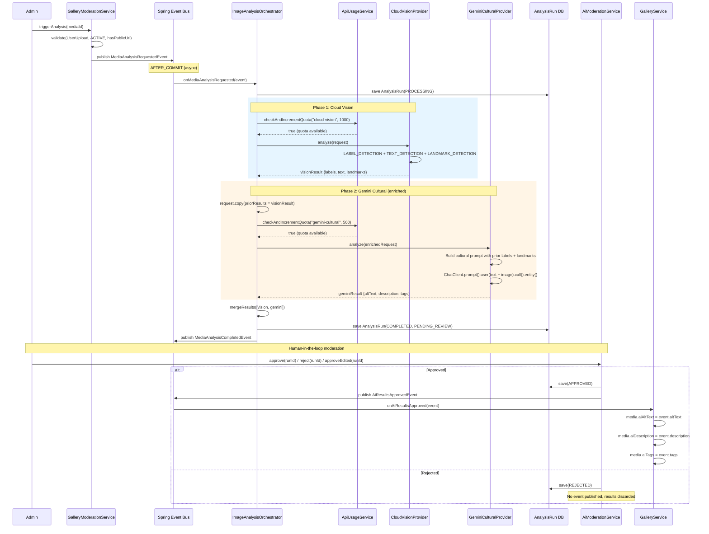

# AI Provider Orchestration Architecture

## 1. Architecture Overview

The AI image analysis system follows a **sequential enrichment pipeline** with a **human-in-the-loop moderation gate**. It spans two Spring Modulith modules — `gallery` (trigger) and `ai` (orchestration, analysis, moderation) — communicating exclusively through domain events.

```
┌─────────────────────────────────────────────────────────────────────────┐
│                          GALLERY MODULE                                 │
│                                                                         │
│  GalleryModerationService                                               │
│  ├── triggerAnalysis(mediaId)     → validates media, publishes event     │
│  └── triggerBatchAnalysis(ids)    → validates each, publishes batch      │
│                                                                         │
│  GalleryService                                                         │
│  └── onAiResultsApproved(event)  → writes AI fields to media entity     │
└───────────────────────────┬─────────────────────────────▲───────────────┘
                            │ MediaAnalysisRequestedEvent  │ AiResultsApprovedEvent
                            ▼                              │
┌─────────────────────────────────────────────────────────────────────────┐
│                            AI MODULE                                    │
│                                                                         │
│  ┌──────────────────────────────────────────────────────┐               │
│  │ ImageAnalysisOrchestrator (@ApplicationModuleListener)│               │
│  │                                                       │               │
│  │  1. Cloud Vision  ──→  visionResult                   │               │
│  │  2. Gemini (+ priorResults: visionResult) ──→ gemini  │               │
│  │  3. mergeResults([visionResult, geminiResult])         │               │
│  │  4. Save AnalysisRun (PENDING_REVIEW)                 │               │
│  │  5. Publish MediaAnalysisCompletedEvent                │               │
│  └──────────────────────────────────────────────────────┘               │
│                                                                         │
│  ┌──────────────────────────────────────────────────────┐               │
│  │ AiModerationService (human-in-the-loop)               │               │
│  │                                                       │               │
│  │  approve(runId)       → publishes AiResultsApproved  ─┼───────────────┘
│  │  reject(runId)        → marks REJECTED, no event      │
│  │  approveEdited(runId) → overrides fields, publishes   │
│  └──────────────────────────────────────────────────────┘
│                                                                         │
│  ┌──────────────┐  ┌───────────────┐                                    │
│  │ApiUsageService│  │AnalysisRun DB │                                    │
│  │(quota check)  │  │(results log)  │                                    │
│  └──────────────┘  └───────────────┘                                    │
└─────────────────────────────────────────────────────────────────────────┘
```

## 2. Provider Roles and Capabilities

| Provider | Name ID | Capabilities | Purpose |
|----------|---------|-------------|---------|
| **Cloud Vision** | `cloud-vision` | LABELS, OCR, LANDMARKS | Structured perception — detects objects, reads text, identifies geographic landmarks. Acts as the "eyes" of the system. |
| **Gemini Cultural** | `gemini-cultural` | CULTURAL_CONTEXT, ALT_TEXT, DESCRIPTION | Cultural interpretation — generates culturally-aware alt text, descriptions, and tags using Brava Island heritage context. Acts as the "cultural expert." |

**Key design insight**: Cloud Vision provides _what's in the image_ (labels, text, landmarks), while Gemini interprets _what it means_ in the cultural context of Brava Island, Cape Verde.

## 3. Provider Activation

Both providers use `@ConditionalOnProperty` — if the property is `false` or missing, the bean is not created at all:

| Provider | Config Property | Default | Monthly Limit |
|----------|----------------|---------|---------------|
| Cloud Vision | `nosilha.ai.cloud-vision.enabled` | `false` | 1,000 calls |
| Gemini | `nosilha.ai.gemini.enabled` | `false` | 500 calls |

The orchestrator receives `List<ImageAnalysisProvider>` via constructor injection. Spring injects only the beans that exist, so:
- Both enabled → list has 2 providers
- Only one enabled → list has 1 provider
- Neither enabled → empty list (all analysis requests fail)

## 4. Execution Flow — Sequential Enrichment Pipeline

The orchestrator executes providers **sequentially**, not in parallel, because Gemini needs Cloud Vision's output:

```
executeProvider("cloud-vision", request, limit, errors)
        │
        ▼
   visionResult (labels, OCR, landmarks)
        │
        ▼
request.copy(priorResults = visionResult)  ← enriched request
        │
        ▼
executeProvider("gemini-cultural", enrichedRequest, limit, errors)
        │
        ▼
   geminiResult (altText, description, tags — informed by Vision's labels/landmarks)
        │
        ▼
mergeResults([visionResult, geminiResult])
```

## 5. Result Merging Strategy

The `mergeResults()` function combines provider outputs:

| Field | Strategy |
|-------|----------|
| `labels` | Union of all labels, deduplicated by label text |
| `textDetected` | Union of all OCR text, deduplicated |
| `landmarks` | Union of all landmarks, deduplicated |
| `tags` | Union of all tags, deduplicated |
| `altText` | **Last non-null wins** (Gemini preferred over Vision) |
| `description` | **Last non-null wins** (Gemini preferred over Vision) |

Since Cloud Vision doesn't produce `altText` or `description`, and Gemini does, the merged result always uses Gemini's alt text and description when available.

## 6. Error Handling Matrix

### `executeProvider()` — Per-Provider Error Handling

```kotlin
private fun executeProvider(...): ImageAnalysisResult? {
    val provider = providers.find { it.name == providerName } ?: return null  // not registered
    if (!provider.isEnabled()) return null                                     // disabled
    if (!apiUsageService.checkAndIncrementQuota(...)) return null              // quota exceeded
    return try {
        provider.analyze(request)
    } catch (e: Exception) {
        errors.add("${provider.name}: ${e.message}")
        null                                                                   // runtime failure
    }
}
```

Each provider returns `null` on any failure — the orchestrator continues to the next provider.

### Scenario Matrix

| # | Cloud Vision | Gemini | Outcome | Status |
|---|-------------|--------|---------|--------|
| 1 | Success | Success | Best result — merged labels/OCR/landmarks + culturally-enriched alt text/description/tags. Gemini benefits from Vision's prior labels and landmarks. | `COMPLETED` |
| 2 | Success | Fails (exception) | Partial result — labels/OCR/landmarks from Vision, but no alt text, description, or cultural tags. Error logged. | `COMPLETED` |
| 3 | Success | Quota exceeded | Same as #2 — Vision results only, Gemini skipped silently. | `COMPLETED` |
| 4 | Success | Not registered | Same as #2 — Vision results only, Gemini bean doesn't exist. | `COMPLETED` |
| 5 | Fails (exception) | Success | Gemini runs without prior context (no labels/landmarks to enrich). Still produces alt text, description, and tags but without the benefit of Vision's structured perception. | `COMPLETED` |
| 6 | Fails (exception) | Fails (exception) | **Total failure** — no results to merge. AnalysisRun saved as FAILED with error messages from both providers. `MediaAnalysisFailedEvent` published. | `FAILED` |
| 7 | Quota exceeded | Quota exceeded | **Total failure** — both providers skipped. Same as #6 but without error messages (quotas return null silently). | `FAILED` |
| 8 | Not registered | Not registered | **Total failure** — empty provider list, both `find` calls return null. | `FAILED` |
| 9 | Quota exceeded | Success | Gemini runs alone without prior context. Produces alt text, description, tags. No labels/OCR/landmarks. | `COMPLETED` |
| 10 | Not registered | Success | Same as #9 — Gemini produces its own results without enrichment. | `COMPLETED` |

**Key insight**: The system is **resilient to partial failure**. As long as _at least one_ provider returns a result, the analysis is considered `COMPLETED` and enters the moderation queue.

## 7. Quota Management

The `ApiUsageService` uses an **atomic check-and-increment** pattern:

1. Tries `incrementIfUnderQuota()` — a native SQL query that atomically increments if count < limit
2. If no row updated: checks if record exists (quota exceeded) or creates first record (first call this month)

This prevents race conditions when multiple analysis requests arrive simultaneously.

## 8. Moderation Workflow (Human-in-the-Loop)

All completed analysis runs are stored with `moderationStatus = PENDING_REVIEW`. AI results are **never automatically applied** to gallery media. The workflow:

```
Analysis Complete → PENDING_REVIEW → Admin reviews → APPROVED / REJECTED
                                                        │
                                         AiResultsApprovedEvent
                                                        │
                                                        ▼
                                      GalleryService.onAiResultsApproved()
                                      → writes altText, description, tags
                                        to UserUploadedMedia entity
```

Three moderation actions:
- **Approve**: Publishes `AiResultsApprovedEvent` with original AI results
- **Reject**: Marks run as REJECTED, no event published, results discarded
- **Approve with Edits**: Admin modifies altText/description/tags, then publishes the edited values

## 9. Sequence Diagram



## 10. How the Cultural Enrichment Works

When both providers are active, Gemini receives Cloud Vision's output as context in the prompt:

```
Additional context from prior analysis:
Detected labels: Building, Cobblestone, Mountain, Flower, Architecture
Detected landmarks: Nova Sintra, Faja d'Agua
Image title: Town Square at Sunset
```

This enables Gemini to produce culturally specific output like:
- **altText**: "Colonial-era town square in Nova Sintra, Brava Island, with cobblestone streets and bougainvillea"
- **description**: "The historic town center of Nova Sintra, perched in Brava's volcanic crater, showcasing Portuguese colonial architecture..."
- **tags**: `["nova-sintra", "colonial-architecture", "brava-island", "town-square", "bougainvillea", "cape-verde-heritage"]`

Without Cloud Vision's prior context, Gemini can still analyze the image directly but may miss specific landmarks or objects that Vision's structured detection would catch.

## 11. Configuration Quick Reference

```yaml
# Enable the master AI switch
nosilha.ai.enabled: true

# Provider toggles (each independently toggleable)
nosilha.ai.cloud-vision.enabled: true    # Requires ADC or service account
nosilha.ai.gemini.enabled: true          # Requires API key

# Spring AI model (required for Gemini)
spring.ai.model.chat: google-genai
spring.ai.google.genai.api-key: ${AI_GEMINI_API_KEY}
spring.ai.google.genai.chat.options.model: gemini-2.5-flash
spring.ai.google.genai.chat.options.temperature: 0.3

# Monthly quota limits
nosilha.ai.cloud-vision.monthly-limit: 1000
nosilha.ai.gemini.monthly-limit: 500
```

## 12. Key Source Files

| File | Purpose |
|------|---------|
| `ai/domain/ImageAnalysisOrchestrator.kt` | Core orchestration — event listener, provider execution, result merging |
| `ai/domain/ImageAnalysisProvider.kt` | Provider interface (`name`, `isEnabled`, `supports`, `analyze`) |
| `ai/domain/ImageAnalysisRequest.kt` | Request model with `priorResults` for enrichment pipeline |
| `ai/domain/ImageAnalysisResult.kt` | Result model with labels, text, landmarks, altText, description, tags |
| `ai/domain/AnalysisCapability.kt` | Capability enum (LABELS, OCR, LANDMARKS, CULTURAL_CONTEXT, ALT_TEXT, DESCRIPTION) |
| `ai/domain/CulturalPromptTemplates.kt` | Brava Island cultural context prompt builder |
| `ai/domain/AiModerationService.kt` | Human-in-the-loop moderation (approve, reject, approve-edited) |
| `ai/domain/ApiUsageService.kt` | Monthly quota enforcement with atomic check-and-increment |
| `ai/provider/CloudVisionProvider.kt` | Google Cloud Vision implementation (gRPC, ADC auth) |
| `ai/provider/GeminiCulturalProvider.kt` | Google Gemini implementation (Spring AI ChatClient, structured output) |
| `gallery/domain/GalleryModerationService.kt` | Analysis trigger — validates media, publishes events |
| `gallery/domain/GalleryService.kt` | Consumes `AiResultsApprovedEvent`, writes AI fields to media entity |

## 13. Summary

The architecture achieves several goals:

1. **Graceful degradation**: Either provider can fail independently without blocking the other
2. **Sequential enrichment**: Vision's structured output feeds into Gemini's cultural interpretation
3. **Budget protection**: Per-provider monthly quotas with atomic enforcement
4. **Safety gate**: Human moderation prevents AI hallucinations from reaching production data
5. **Module boundaries**: Gallery and AI modules communicate only through domain events
6. **Flexibility**: Providers are independently toggleable via configuration, making it easy to run with just one provider or add new ones
