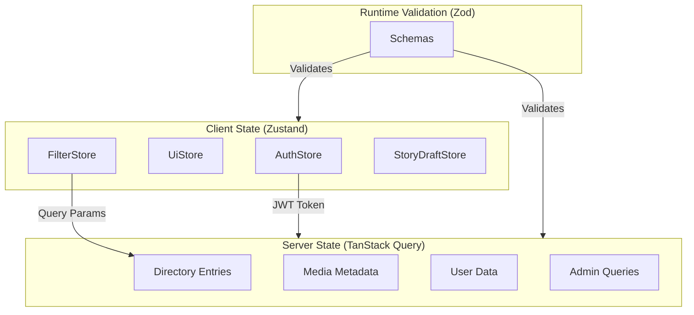

# State Management Guide

Quick reference for state management in the Nos Ilha frontend: Zustand (client), TanStack Query (server), Zod (validation).

---

## Architecture Overview



### File Structure

```
apps/web/src/
├── stores/                      # Zustand stores
│   ├── authStore.ts            # Authentication + session
│   ├── uiStore.ts              # Theme, modals, sidebar, mobile menu
│   ├── filterStore.ts          # Search/filter parameters
│   └── storyDraftStore.ts      # Story draft persistence
├── hooks/queries/               # TanStack Query hooks
│   ├── useDirectoryEntries.ts  # Paginated directory listing
│   ├── useDirectoryEntry.ts    # Single entry by slug
│   ├── useUnifiedSearch.ts     # Cross-category search
│   ├── use-bookmarks.ts        # User bookmarks + mutations
│   ├── use-contributions.ts    # User contributions
│   ├── use-update-profile.ts   # Profile mutations
│   └── admin/                  # Admin-specific queries (15+ hooks)
└── schemas/                     # Zod validation schemas
    ├── directoryEntrySchema.ts # Directory entry (discriminated union)
    ├── authSchema.ts           # Login/signup forms
    ├── filterSchema.ts         # Filter + URL params
    ├── userProfileSchema.ts    # User profile data
    ├── storySchema.ts          # Story submission
    ├── suggestionSchema.ts     # Content suggestions
    ├── contactSchema.ts        # Contact form
    ├── directorySubmissionSchema.ts  # Directory submissions
    └── adminSchemas.ts         # Admin operations
```

---

## Zustand: Client State

### Store Summary

| Store | Persistence | Purpose |
|-------|-------------|---------|
| `useAuthStore` | LocalStorage (user only) | Auth state, session, user data |
| `useUiStore` | LocalStorage (theme only) | Theme, modals, sidebar, mobile menu |
| `useFilterStore` | None (URL is source of truth) | Search, category, filters |
| `useStoryDraftStore` | LocalStorage | Story draft auto-save |

### Selectors (use these for optimized re-renders)

```typescript
// AuthStore
useUser()              // state.user
useSession()           // state.session
useAuthLoading()       // state.isLoading
useIsAuthenticated()   // state.user !== null

// FilterStore
useSearchQuery()       // state.searchQuery
useSelectedCategory()  // state.selectedCategory
useSelectedTown()      // state.selectedTown
useMinRating()         // state.minRating
useHasImageFilter()    // state.hasImage
useSortBy()            // state.sortBy
useSelectedCategories() // state.selectedCategories (map filtering)
useHasActiveFilters()  // state.hasActiveFilters()

// UiStore
useTheme()             // state.theme
useActiveModal()       // state.activeModal
useFilterPanelOpen()   // state.filterPanelOpen
useSidebarOpen()       // state.sidebarOpen

// StoryDraftStore
useDraft()             // state.draft
useLastSaved()         // state.lastSaved
useHasDraft()          // state.hasDraft()
```

### Best Practice

```typescript
// Good: selective subscription - re-renders only when user changes
const user = useAuthStore((state) => state.user);

// Bad: re-renders on ANY store change
const { user } = useAuthStore();
```

---

## TanStack Query: Server State

### Query Hooks Summary

| Hook | Query Key | Stale Time | Purpose |
|------|-----------|------------|---------|
| `useDirectoryEntries` | `["directory", "entries", category, page, size]` | 5 min | Paginated listing |
| `useDirectoryEntry` | `["directory", "entry", slug]` | 10 min | Single entry |
| `useUnifiedSearch` | `["directory", "search-index", "all"]` | 5 min | Cross-category search |
| `useBookmarks` | `["bookmarks", "list", page, size]` | 1 min | User bookmarks |
| `useContributions` | `["user", "contributions"]` | 2 min | User contributions |

Admin hooks are in `hooks/queries/admin/` - see source files for details.

### Pattern: Query with Zod Validation

```typescript
export function useDirectoryEntries(category = "all", page = 0, size = 20) {
  return useQuery({
    queryKey: ["directory", "entries", category, page, size],
    queryFn: async () => {
      const result = await getEntriesByCategory(category, page, size);
      const validated = directoryEntriesSchema.safeParse(result.items);
      if (!validated.success) {
        console.error("Validation failed:", validated.error.format());
        return result; // Graceful degradation
      }
      return { items: validated.data, pagination: result.pagination };
    },
    staleTime: 5 * 60 * 1000,
    gcTime: 30 * 60 * 1000,
  });
}
```

### Cache Key Strategy

```
["directory", "entries", ...]   # Entry listings
["directory", "entry", slug]    # Single entry
["bookmarks", "list", ...]      # User bookmarks
["user", "contributions"]       # User contributions
["admin", ...]                  # Admin queries
```

---

## Zod: Runtime Validation

### Schema Summary

| Schema | Purpose |
|--------|---------|
| `directoryEntrySchema` | Discriminated union for entry types |
| `loginSchema` / `signupSchema` | Auth form validation |
| `filterSchema` | URL param validation |
| `storySchema` | Story submission |
| `contactSchema` | Contact form |

### Pattern: Discriminated Union

```typescript
export const directoryEntrySchema = z.discriminatedUnion("category", [
  baseSchema.extend({ category: z.literal("Restaurant"), details: restaurantDetailsSchema }),
  baseSchema.extend({ category: z.literal("Hotel"), details: hotelDetailsSchema }),
  baseSchema.extend({ category: z.literal("Beach"), details: z.null() }),
  baseSchema.extend({ category: z.literal("Heritage"), details: z.null() }),
  baseSchema.extend({ category: z.literal("Nature"), details: z.null() }),
  baseSchema.extend({ category: z.literal("Town"), details: z.null() }),
  baseSchema.extend({ category: z.literal("Viewpoint"), details: z.null() }),
  baseSchema.extend({ category: z.literal("Trail"), details: z.null() }),
  baseSchema.extend({ category: z.literal("Church"), details: z.null() }),
  baseSchema.extend({ category: z.literal("Port"), details: z.null() }),
]);
```

### Pattern: Form with React Hook Form

```typescript
const form = useForm<LoginInput>({
  resolver: zodResolver(loginSchema),
});
```

---

## Integration Pattern

```typescript
function DirectoryPage() {
  // Client state (Zustand)
  const selectedCategory = useSelectedCategory();
  const setCategory = useFilterStore((s) => s.setCategory);

  // Server state (TanStack Query)
  const { data, isLoading } = useDirectoryEntries(selectedCategory || "all");

  return (
    <>
      <CategorySelector value={selectedCategory} onChange={setCategory} />
      {isLoading ? <Skeleton /> : <DirectoryList entries={data?.items} />}
    </>
  );
}
```

---

## Testing

```bash
cd apps/web && pnpm run test:unit
```

Key test files in `apps/web/src/__tests__/`:
- `authStore.test.ts` - Authentication state transitions
- `filterStore.test.ts` - Filter state and URL sync

See [`testing.md`](testing.md) for complete testing documentation.

---

## Troubleshooting

| Issue | Solution |
|-------|----------|
| State not persisting | Check `persist` middleware and `partialize` config |
| Stale cache data | Call `queryClient.invalidateQueries()` after mutations |
| Excessive re-renders | Use selective subscriptions: `useStore(s => s.field)` |
| Validation errors | Check Zod schema matches API response structure |
| Hydration mismatch | Ensure persisted state handles initial `null` gracefully |

---

## Related

- [`architecture.md`](architecture.md) - System overview
- [`testing.md`](testing.md) - Testing patterns
- [`design-system.md`](../10-product/design-system.md) - Component patterns
