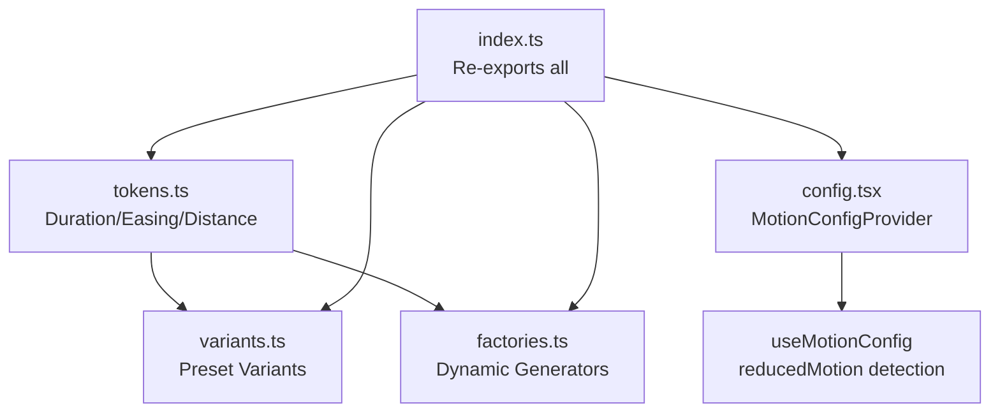

# Animation System

This document describes the centralized animation library located in `frontend/src/lib/animation/`, including design principles and implementation guidelines.

## Overview

The animation library provides a token-based motion system for Framer Motion, ensuring consistent animations across the application with built-in accessibility support.

## Design Principles

### What Makes a High-Quality Micro-Interaction?

A micro-interaction is a small, focused animation tied to a single user intent (hovering a button, opening a dropdown, navigating between views). High-quality micro-interactions are:

1. **Purposeful** - Communicate feedback, status change, or navigation
2. **Subtle** - Small distances, short durations, no large camera-like pans
3. **Predictable** - Same component type uses same animation grammar
4. **Fast** - Most live in the 150–250ms range
5. **Reversible** - Animations reverse smoothly when state is undone
6. **Accessible** - Respect `prefers-reduced-motion`

### When to Use Animation

**Use animation when:**
- Signaling state change (on/off, open/closed, success/failure)
- Providing continuity of context (shared-element transitions)
- Guiding attention to new or important content
- Representing spatial relationships (drag-and-drop, reordering)

**Avoid animation when:**
- It's purely decorative and appears frequently
- It blocks interaction (long intros, blocking splash transitions)
- It causes large movement without functional justification
- It violates user preference for reduced motion

### Timing Guidelines

| Animation Type | Duration Range | Optimal |
|---------------|----------------|---------|
| Micro feedback (hover/press) | 100–180ms | 120–150ms |
| Small state changes (accordion, dropdown) | 180–300ms | 200–240ms |
| Route/page transitions | 220–400ms | 280–350ms |

## Architecture



## File Structure

```
frontend/src/lib/animation/
├── index.ts      # Re-exports all modules
├── tokens.ts     # Core motion design tokens
├── variants.ts   # Preset Framer Motion variants
├── factories.ts  # Dynamic variant generators
└── config.tsx    # Accessibility context provider
```

---

## Core Modules

### 1. Motion Tokens (`tokens.ts`)

Canonical timing and distance values (see Design Principles section above):

```typescript
// Duration tokens (in seconds)
export const motionDuration = {
  instant: 0,
  micro: 0.12,
  fast: 0.18,
  normal: 0.24,
  slow: 0.32,
  slower: 0.38,
} as const;

// Easing curves (cubic-bezier)
export const motionEasing = {
  out: [0.16, 1, 0.3, 1] as const,      // Decelerate
  in: [0.7, 0, 0.84, 0] as const,       // Accelerate
  inOut: [0.45, 0, 0.55, 1] as const,   // Symmetric
} as const;

// Distance tokens (in pixels)
export const motionDistance = {
  xSmall: 4,
  small: 8,
  medium: 16,
  large: 24,
} as const;
```

### 2. Preset Variants (`variants.ts`)

Ready-to-use Framer Motion `Variants` objects:

| Variant | Purpose | States |
|---------|---------|--------|
| `buttonMicro` | Button hover/tap interactions | `initial`, `hover`, `tap`, `disabled` |
| `listStagger` | Container for staggered list animations | `hidden`, `show` |
| `listItem` | Individual list item entrance | `hidden`, `show` |
| `backdrop` | Modal/overlay backgrounds | `hidden`, `visible`, `exit` |

**Example usage:**
```tsx
import { motion } from "framer-motion";
import { buttonMicro } from "@/lib/animation";

<motion.button
  variants={buttonMicro}
  initial="initial"
  whileHover="hover"
  whileTap="tap"
>
  Click me
</motion.button>
```

### 3. Variant Factories (`factories.ts`)

Functions that generate customizable variants:

#### `makeFadeInUp(distance?)`
Fade in with upward translation.

```tsx
import { makeFadeInUp } from "@/lib/animation";

const fadeInUp = makeFadeInUp(16); // Custom distance

<motion.div
  variants={fadeInUp}
  initial="hidden"
  animate="visible"
  exit="exit"
/>
```

#### `makeScaleIn()`
Scale from 0.96 to 1 with fade.

```tsx
import { makeScaleIn } from "@/lib/animation";

const scaleIn = makeScaleIn();

<motion.div variants={scaleIn} initial="hidden" animate="visible" />
```

#### `makeSlideInFrom(direction, distance?)`
Slide in from any direction.

```tsx
import { makeSlideInFrom } from "@/lib/animation";

const slideFromLeft = makeSlideInFrom("left", 24);
const slideFromBottom = makeSlideInFrom("bottom");

<motion.aside variants={slideFromLeft} initial="hidden" animate="visible" />
```

### 4. Accessibility Config (`config.tsx`)

React context for respecting `prefers-reduced-motion`:

```tsx
// In app/layout.tsx or providers
import { MotionConfigProvider } from "@/lib/animation";

export default function RootLayout({ children }) {
  return (
    <MotionConfigProvider>
      {children}
    </MotionConfigProvider>
  );
}
```

```tsx
// In any component
import { useMotionConfig, buttonMicro } from "@/lib/animation";

function MyButton() {
  const { reducedMotion } = useMotionConfig();

  return (
    <motion.button
      variants={reducedMotion ? undefined : buttonMicro}
      initial="initial"
      whileHover="hover"
      whileTap="tap"
    >
      Accessible Button
    </motion.button>
  );
}
```

---

## Usage Patterns

### Basic Component Animation

```tsx
"use client";

import { motion } from "framer-motion";
import { makeFadeInUp, motionDuration, motionEasing } from "@/lib/animation";

const fadeInUp = makeFadeInUp();

export function Card({ children }) {
  return (
    <motion.div
      variants={fadeInUp}
      initial="hidden"
      animate="visible"
      exit="exit"
      className="rounded-lg bg-white p-4 shadow"
    >
      {children}
    </motion.div>
  );
}
```

### Staggered List Animation

```tsx
"use client";

import { motion } from "framer-motion";
import { listStagger, listItem } from "@/lib/animation";

export function AnimatedList({ items }) {
  return (
    <motion.ul
      variants={listStagger}
      initial="hidden"
      animate="show"
    >
      {items.map((item) => (
        <motion.li key={item.id} variants={listItem}>
          {item.content}
        </motion.li>
      ))}
    </motion.ul>
  );
}
```

### Custom Transition with Tokens

```tsx
import { motion } from "framer-motion";
import { motionDuration, motionEasing } from "@/lib/animation";

<motion.div
  animate={{ opacity: 1 }}
  transition={{
    duration: motionDuration.normal,
    ease: motionEasing.out,
  }}
/>
```

---

## Integration Guidelines

### Do's

- Import tokens for all timing/easing values
- Use preset variants for common patterns
- Wrap app in `MotionConfigProvider` for accessibility
- Check `reducedMotion` before applying animations

### Don'ts

- Define inline magic numbers for durations
- Create duplicate variants that already exist
- Skip accessibility checks for motion
- Use different easing curves without reason

### Migration Example

**Before (inline values):**
```tsx
<motion.button
  initial={{ scale: 1 }}
  whileHover={{ scale: 1.05 }}
  whileTap={{ scale: 0.95 }}
  transition={{ duration: 0.2 }}
/>
```

**After (using tokens):**
```tsx
import { buttonMicro } from "@/lib/animation";

<motion.button
  variants={buttonMicro}
  initial="initial"
  whileHover="hover"
  whileTap="tap"
/>
```

---

## Benefits

| Benefit | Description |
|---------|-------------|
| **Consistency** | All animations use the same timing and easing |
| **Maintainability** | Change values in one place, update everywhere |
| **Accessibility** | Built-in `prefers-reduced-motion` support |
| **Type Safety** | All exports are properly typed with `as const` |
| **Performance** | Variants are defined once, reused across components |

---

## Best Practices Validation

This animation system follows industry-recommended patterns from Motion.dev (formerly Framer Motion):

| Practice | Implementation | Status |
|----------|----------------|--------|
| Design Tokens | Centralized `motionDuration`, `motionEasing`, `motionDistance` | ✅ Recommended |
| Variants Pattern | Reusable `buttonMicro`, `listStagger`, `listItem` | ✅ Recommended |
| Factory Functions | Parameterized `makeFadeInUp()`, `makeSlideInFrom()` | ✅ Recommended |
| Reduced Motion | Context provider with `prefers-reduced-motion` detection | ✅ Critical for a11y |
| Custom Easing | Cubic-bezier curves for natural motion | ✅ Better than linear |

---

## Modern Motion.dev APIs

### Native `MotionConfig` (Recommended)

Motion.dev provides built-in reduced motion handling that automatically disables transforms while preserving opacity:

```tsx
import { MotionConfig } from "framer-motion";

// In app/layout.tsx
export default function RootLayout({ children }) {
  return (
    <MotionConfig reducedMotion="user">
      {children}
    </MotionConfig>
  );
}
```

Options:
- `"user"` - Respects OS setting automatically
- `"always"` - Force reduced motion
- `"never"` - Ignore OS setting

### Built-in `useReducedMotion` Hook

Motion.dev provides this hook natively:

```tsx
import { useReducedMotion } from "framer-motion";

function MyComponent() {
  const shouldReduceMotion = useReducedMotion();

  return (
    <motion.div
      animate={{ x: shouldReduceMotion ? 0 : 100 }}
    />
  );
}
```

### Spring Physics

For more natural motion, consider spring animations instead of duration-based:

```tsx
import { motionEasing } from "@/lib/animation";

// Duration-based (current approach)
transition: {
  duration: 0.24,
  ease: motionEasing.out,
}

// Spring-based (alternative)
transition: {
  type: "spring",
  stiffness: 300,
  damping: 30,
}
```

Spring animations feel more natural because they simulate physical motion rather than fixed timing.

---

## Advanced Patterns

### Layout Animations

Animate layout changes automatically with the `layout` prop:

```tsx
<motion.div layout>
  {/* Content that changes size/position */}
</motion.div>
```

### Shared Element Transitions

Use `layoutId` for smooth transitions between components:

```tsx
// List view
<motion.div layoutId={`card-${item.id}`}>
  <h3>{item.title}</h3>
</motion.div>

// Detail view
<motion.div layoutId={`card-${item.id}`}>
  <h3>{item.title}</h3>
  <p>{item.description}</p>
</motion.div>
```

### AnimatePresence for Exit Animations

```tsx
import { AnimatePresence, motion } from "framer-motion";
import { makeFadeInUp } from "@/lib/animation";

const fadeInUp = makeFadeInUp();

<AnimatePresence>
  {isVisible && (
    <motion.div
      variants={fadeInUp}
      initial="hidden"
      animate="visible"
      exit="exit"
    />
  )}
</AnimatePresence>
```

---

## Current Integration Status

> **Note**: The animation library is fully implemented but not yet integrated into existing components.
> Components like `animated-button.tsx` use inline animation values instead of importing from `@/lib/animation`.

### Migration Priority

1. Add `MotionConfig` to root layout
2. Migrate `animated-button.tsx` to use `buttonMicro` variant
3. Add entrance animations to directory cards using `listStagger`/`listItem`
4. Implement shared element transitions for card → detail views

### Future Migration Opportunities

These components still have inline animations that could benefit from centralized tokens:

| Component | Recommended Migration |
|-----------|----------------------|
| `login-form.tsx` | Use `formStagger`/`formField` for staggered field entrances |
| `loading-spinner.tsx` | Use `spinnerRotate` for infinite rotation |
| `page-transition.tsx` | Use `makeFadeInUp()` for page entrances |
| `video-hero-section.tsx` | Replace hardcoded spring values with tokens |

These migrations are optional but would improve consistency across the codebase.

---

## Related Documentation

- [DESIGN_SYSTEM.md](./DESIGN_SYSTEM.md) - Overall design system
- [Motion.dev Docs](https://motion.dev/) - Official Motion (Framer Motion) documentation
- [Motion Accessibility Guide](https://motion.dev/docs/react-accessibility) - Reduced motion best practices
