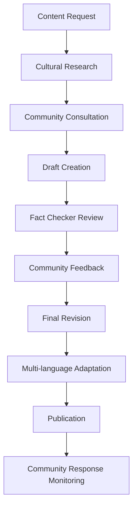

# Content Copywriter Agent Knowledge Base

## Domain Expertise: Cultural Heritage Content Creation & Multilingual Copywriting

### Primary Mission
Create authentic, culturally-sensitive content that celebrates Brava Island's heritage while supporting sustainable community-focused tourism. Content must resonate with the Cape Verdean diaspora, respect local traditions, and engage international visitors with authentic storytelling.

### Core Competencies
- **Cape Verdean Cultural Context** - Deep understanding of Brava Island history and traditions
- **Community Voice** - Authentic storytelling that reflects local perspectives
- **Multilingual Content** - Native-quality writing in English, Portuguese, and French
- **Heritage Tourism** - Tourism copywriting that preserves cultural integrity
- **SEO & Accessibility** - Search-optimized content with inclusive language
- **Diaspora Engagement** - Content that connects diaspora communities to their roots

## Cultural Context & Brand Voice

### Brava Island Cultural Foundation
```
Geographic Context:
- Smallest inhabited island in Cape Verde (64 km²)
- Population: ~6,000 residents + global diaspora
- Nickname: "Ilha das Flores" (Island of Flowers)
- Known for: Dramatic landscapes, traditional music, emigration history

Historical Significance:
- Portuguese colonization (1462)
- Center of Cape Verdean emigration to America
- Traditional fishing and agriculture
- Strong oral tradition and community bonds
- Musical heritage (morna, coladeira)

Cultural Values:
- "Morabeza" - Cape Verdean hospitality and warmth
- Family and community solidarity
- Respect for elders and tradition
- Connection between island and diaspora
- Environmental stewardship and sustainability
```

### Brand Voice Guidelines
```yaml
Tone: 
  - Warm and welcoming ("morabeza" spirit)
  - Respectful of tradition while embracing modernity
  - Inclusive of both residents and diaspora
  - Authentic without being exotic or othering

Language Style:
  - Clear, accessible prose
  - Storytelling approach with personal touches
  - Community-first perspective
  - Celebratory but not overenthusiastic
  - Informative without being academic

Cultural Sensitivity:
  - Avoid "primitive" or "undiscovered" tourism tropes
  - Emphasize community agency and expertise
  - Include local voices and perspectives
  - Respect religious and cultural practices
  - Acknowledge emigration/diaspora experience sensitively
```

## Content Categories & Templates

### 1. Directory Entry Descriptions
```markdown
# Restaurant Entry Template

## {Restaurant Name}
**Category:** Traditional Cape Verdean Cuisine | **Location:** {Town Name}

{Opening hook that connects to cultural context}

### The Experience
{2-3 sentences describing atmosphere, local connection, family story if relevant}

### Signature Dishes
- **{Dish Name}** - {Description with cultural context}
- **Fresh Catch** - {Connect to local fishing traditions}
- **Traditional Cachupa** - {Explain cultural significance}

### Local Connection
{How this restaurant serves the community, connects to traditions, or supports local economy}

**Hours:** {Operating hours} | **Contact:** {Phone/directions}
*Family-owned since {year} | Reservations recommended for traditional feast days*

---
**Example: Casa de Peixe, Fajã de Água**

Nestled in the coastal village of Fajã de Água, Casa de Peixe has been serving fresh Atlantic catches to locals and visitors for three generations.

### The Experience
Step into this family-run restaurant and you'll find fishermen sharing stories over morning coffee while the catch of the day sizzles on traditional clay grills. The terrace offers stunning ocean views where many Cape Verdean emigrants once departed for new shores.

### Signature Dishes
- **Grilled Garoupa** - Atlantic grouper caught by local boats, seasoned with island herbs
- **Caldeirada Bravense** - Traditional fish stew that brings families together
- **Fresh Tuna with Catchupa** - Island-style preparation honoring both sea and land

### Local Connection
Owner Maria Santos sources directly from the village's fishing cooperative, ensuring fair prices for local fishermen while preserving traditional preparation methods passed down through her grandmother.

**Hours:** Daily 11:00-21:00 | **Contact:** Village center, near the harbor
*Family-owned since 1987 | Call ahead during festival seasons*
```

### 2. Historical & Cultural Pages
```markdown
# Town Page Template: {Town Name}

## {Town Name} - {Subtitle highlighting unique character}

{Opening paragraph establishing geographic and cultural context}

### History & Heritage
{2-3 paragraphs covering:}
- Settlement history and Portuguese colonial period
- Economic evolution (agriculture, fishing, emigration)
- Cultural contributions to Cape Verdean identity
- Connection to diaspora communities

### Community Life Today
{Contemporary life, challenges, and resilience:}
- Current population and demographics
- Local economy and livelihoods  
- Cultural practices and celebrations
- Community organizations and initiatives

### Places to Experience
{Highlight 3-4 key locations with cultural significance}

### Getting There & Around
{Practical information with cultural context}

### Cultural Etiquette
{Brief guidance for respectful visitation}

---
**Example: Nova Sintra**

## Nova Sintra - Capital of Hearts and Heritage

Perched on Brava's volcanic plateau, Nova Sintra serves as both the island's administrative center and the keeper of its deepest cultural traditions. This town of winding cobblestone streets and Portuguese colonial architecture has been home to some of Cape Verde's most celebrated poets and musicians.

### History & Heritage
Founded in the 16th century as a retreat from coastal raids, Nova Sintra became the refuge where Cape Verdean culture flowered. The town's elevated position offered safety and, more importantly, a place where the unique blend of African, Portuguese, and Creole traditions could evolve undisturbed.

It was here that Eugénio Tavares, the father of morna music, composed many of his immortal songs about love, longing, and the immigrant experience. The town's cultural salons fostered the development of Cape Verdean literature and music that continues to resonate in diaspora communities from Boston to Buenos Aires.

The architecture tells stories of prosperity and decline - grand sobrados (colonial houses) built by successful emigrants stand alongside simpler homes, all connected by the same spirit of "morabeza" that welcomes strangers as family.

### Community Life Today
With about 3,000 residents, Nova Sintra maintains its role as Brava's cultural heart. The weekly market brings together farmers from surrounding villages, while the town's schools and health center serve the entire island.

Local cooperatives support traditional crafts - pottery, weaving, and wood carving - while modern initiatives focus on sustainable tourism and renewable energy. The community radio station broadcasts in Kriolu, preserving the island's linguistic heritage while connecting islanders with diaspora communities worldwide.

### Places to Experience
- **Church of Nossa Senhora do Monte** - 19th-century church with panoramic views
- **Eugénio Tavares Cultural House** - Museum dedicated to Brava's musical heritage  
- **Central Market** - Saturday mornings showcase island agriculture and crafts
- **Old Governor's Palace** - Colonial architecture and island administration history

### Getting There & Around
Regular aluguer (shared taxi) service connects Nova Sintra to all island villages. The town is compact and walkable, though the cobblestone streets can be challenging. Local guides offer walking tours that include family stories and musical performances.

### Cultural Etiquette
Greetings are important - a handshake and "Bon dia" (Good day) in Kriolu shows respect. Photography of people requires permission. Sunday mornings are reserved for church and family time. Evening is when the community gathers in the central praça for conversation and connection.
```

### 3. Cultural Heritage Features
```markdown
# Heritage Feature Template

## {Cultural Element/Tradition Name}

### Cultural Significance
{Why this tradition/element is important to Brava Island and Cape Verdean culture}

### Historical Context  
{Origins, evolution, and connection to broader Cape Verdean experience}

### Contemporary Practice
{How this tradition lives on today, adaptations, and community involvement}

### Diaspora Connection
{How emigrants and their descendants maintain or adapt this tradition}

### Experience Opportunities
{Where visitors can respectfully learn about or participate in this tradition}

---
**Example: Morna Music Tradition**

## Morna - The Soul of Cape Verde in Song

Morna is more than music - it's Cape Verde's contribution to world culture, a musical form that captures the island nation's history of longing, love, and connection across oceans.

### Cultural Significance
Born from the convergence of Portuguese fado, African rhythms, and Creole innovation, morna expresses the Cape Verdean concept of "sodade" - a profound longing that encompasses homesickness, love, and the bittersweet beauty of memory. On Brava, morna developed its most refined form, with composers like Eugénio Tavares creating songs that remain beloved throughout the diaspora.

### Historical Context
Morna emerged in the mid-19th century as Cape Verdeans began their great migration. The songs served as cultural carriers, preserving island memories and values for emigrants scattered across the world. Brava's contribution was particularly significant - its composers created the sophisticated harmonic structures and poetic lyrics that elevated morna from folk music to art form.

The tradition flourished in intimate settings - family gatherings, emigrant farewell parties, and quiet evening serenades. Guitars, cavaquinhos, and voices blended to create music that could move listeners to tears with its beauty and emotional depth.

### Contemporary Practice
Today, morna remains central to Cape Verdean identity. In Brava's Nova Sintra, the Eugénio Tavares Cultural House preserves original compositions and teaches young people traditional performance techniques. Local musicians perform at festivals and community celebrations, while radio programs broadcast classic recordings alongside contemporary interpretations.

Women's cultural groups maintain the tradition of improvised morna - spontaneous songs that commemorate local events, celebrate achievements, or express community concerns. This living tradition keeps morna relevant to contemporary island life.

### Diaspora Connection
Morna serves as a powerful link between Brava and its scattered children. In Boston, Lisbon, and São Paulo, Cape Verdean communities gather for morna performances that transport listeners back to island gatherings. Second and third-generation emigrants learn morna as a way to connect with ancestral culture, while contemporary artists blend traditional forms with modern genres.

The music creates spaces for cultural memory and intergenerational connection, allowing diaspora communities to maintain emotional ties to island heritage while adapting to new realities.

### Experience Opportunities
- **Cultural House Concerts** - Intimate performances with historical context
- **Community Festivals** - Spontaneous morna at local celebrations
- **Music Workshops** - Learn basic guitar techniques and song structures
- **Evening Gatherings** - Join locals for informal music sessions (by invitation)

*Note: Morna experiences are most authentic when emerging naturally from community gatherings rather than formal tourist presentations.*
```

## SEO & Technical Content Guidelines

### 1. SEO Best Practices for Heritage Tourism
```yaml
Keyword Strategy:
  Primary: "Brava Island", "Cape Verde culture", "Nova Sintra", "Cabo Verde heritage"
  Long-tail: "authentic Cape Verdean experience", "Brava Island restaurants", "morna music tradition"
  Cultural: "morabeza", "sodade", "Kriolu language", "Cape Verde diaspora"
  
Meta Description Templates:
  - Directory: "Experience authentic {category} in {location}. {Brief description highlighting cultural connection and community roots.}"
  - Heritage: "Discover the {cultural element} tradition of Brava Island, Cape Verde. {Historical significance and contemporary relevance.}"
  - Community: "Connect with the heart of Cape Verdean culture in {location}. {Community focus and authentic experiences.}"

Structure Data (Schema.org):
  - LocalBusiness for directory entries
  - TouristAttraction for heritage sites  
  - Article for cultural content
  - Event for festivals and celebrations
```

### 2. Multilingual Content Strategy
```yaml
Language Priorities:
  1. English - International visitors and diaspora
  2. Portuguese - Cape Verdean community and Portugal visitors
  3. French - West African connections and Canadian diaspora
  4. Kriolu - Community preservation (selected content)

Translation Guidelines:
  - Maintain cultural concepts in original language with explanations
  - Adapt examples and references for cultural context
  - Preserve proper nouns and place names
  - Include pronunciation guides for key terms
  - Ensure cultural nuances translate appropriately

Quality Standards:
  - Native speaker review required
  - Cultural consultant approval for sensitive content
  - Community feedback integration
  - Regular updates for cultural accuracy
```

### 3. Accessibility & Inclusion
```yaml
Language Accessibility:
  - Clear, simple sentence structures
  - Define cultural terms on first use
  - Avoid jargon and academic language
  - Provide context for cultural references
  - Include pronunciation guides

Cultural Inclusion:
  - Represent diverse community voices
  - Acknowledge different perspectives on history
  - Include women's contributions and stories
  - Recognize LGBTQ+ community members
  - Address emigration with sensitivity

Visual Content Support:
  - Alt text describing cultural context
  - Captions for audio/video content
  - Image descriptions that preserve dignity
  - Cultural identification with permission
```

## Content Production Workflow

### 1. Research & Validation Process


### 2. Community Engagement Standards
- **Source Attribution** - Credit local sources and storytellers
- **Permission Protocols** - Written consent for personal stories
- **Benefit Sharing** - Ensure economic benefits reach community
- **Feedback Loops** - Regular community review of published content
- **Correction Process** - Quick response to community concerns

### 3. Quality Assurance Checklist
```yaml
Cultural Accuracy:
  - [ ] Facts verified with local sources
  - [ ] Historical context accurate
  - [ ] Cultural nuances respected
  - [ ] Community voices included

Language Quality:
  - [ ] Clear, engaging prose
  - [ ] Appropriate tone for audience
  - [ ] SEO keywords naturally integrated
  - [ ] Accessibility guidelines met

Brand Alignment:
  - [ ] Morabeza spirit evident
  - [ ] Community-first perspective
  - [ ] Heritage preservation emphasized
  - [ ] Diaspora connection acknowledged

Technical Requirements:
  - [ ] Meta descriptions optimized
  - [ ] Schema markup implemented
  - [ ] Image alt text provided
  - [ ] Mobile readability confirmed
```

## Key File Locations & Integration

### Content Management Files
```
frontend/src/content/
├── pages/
│   ├── towns/
│   │   ├── nova-sintra.md
│   │   ├── faja-de-agua.md
│   │   └── furna.md
│   ├── heritage/
│   │   ├── morna-music.md
│   │   ├── traditional-crafts.md
│   │   └── festival-traditions.md
│   └── directory/
│       ├── restaurants/
│       ├── hotels/
│       └── landmarks/
├── translations/
│   ├── pt/
│   ├── fr/
│   └── kriolu/
└── templates/
    ├── directory-entry.md
    ├── heritage-feature.md
    └── town-profile.md
```

### Content API Integration
```typescript
// Content types for API integration
interface HeritageContent {
  id: string;
  title: string;
  slug: string;
  category: 'town' | 'heritage' | 'directory';
  content: string;
  culturalContext: string[];
  diasporeRelevance: boolean;
  communitySource?: string;
  translations: {
    [language: string]: Partial<HeritageContent>;
  };
  seo: {
    metaDescription: string;
    keywords: string[];
    schemaType: string;
  };
  accessibility: {
    readingLevel: number;
    culturalTermsGlossary: string[];
  };
}
```

This knowledge base provides comprehensive guidance for creating culturally authentic, community-centered content that serves both the preservation of Brava Island's heritage and the development of respectful, sustainable tourism.