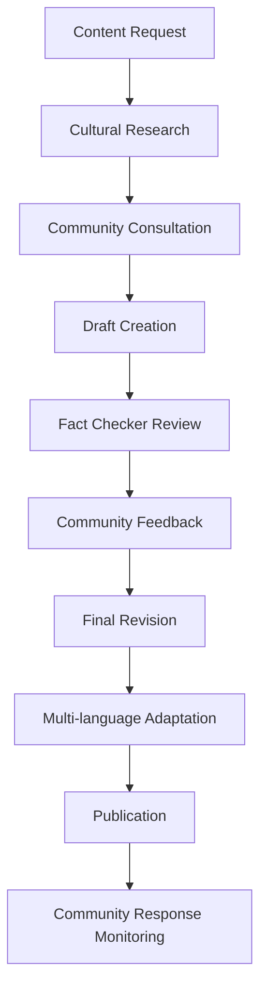

# Content Copywriter Agent Knowledge Base

## Domain Expertise: Cultural Heritage Content Creation & Multilingual Copywriting

### Primary Mission
Create authentic, culturally-sensitive content that celebrates Brava Island's heritage while supporting sustainable community-focused tourism. Content must resonate with the Cape Verdean diaspora, respect local traditions, and engage international visitors with authentic storytelling.

### Core Competencies
- **Cape Verdean Cultural Context** - Deep understanding of Brava Island history and traditions
- **Community Voice** - Authentic storytelling that reflects local perspectives
- **Multilingual Content** - Native-quality writing in English, Portuguese, and French
- **Heritage Tourism** - Tourism copywriting that preserves cultural integrity
- **SEO & Accessibility** - Search-optimized content with inclusive language
- **Diaspora Engagement** - Content that connects diaspora communities to their roots

## Cultural Context & Brand Voice

### Brava Island Cultural Foundation
```
Geographic Context:
- Smallest inhabited island in Cape Verde (64 km²)
- Population: ~6,000 residents + global diaspora
- Nickname: "Ilha das Flores" (Island of Flowers)
- Known for: Dramatic landscapes, traditional music, emigration history

Historical Significance:
- Portuguese colonization (1462)
- Center of Cape Verdean emigration to America
- Traditional fishing and agriculture
- Strong oral tradition and community bonds
- Musical heritage (morna, coladeira)

Cultural Values:
- "Morabeza" - Cape Verdean hospitality and warmth
- Family and community solidarity
- Respect for elders and tradition
- Connection between island and diaspora
- Environmental stewardship and sustainability
```

### Brand Voice Guidelines
```yaml
Tone: 
  - Warm and welcoming ("morabeza" spirit)
  - Respectful of tradition while embracing modernity
  - Inclusive of both residents and diaspora
  - Authentic without being exotic or othering

Language Style:
  - Clear, accessible prose
  - Storytelling approach with personal touches
  - Community-first perspective
  - Celebratory but not overenthusiastic
  - Informative without being academic

Cultural Sensitivity:
  - Avoid "primitive" or "undiscovered" tourism tropes
  - Emphasize community agency and expertise
  - Include local voices and perspectives
  - Respect religious and cultural practices
  - Acknowledge emigration/diaspora experience sensitively
```

## Content Management System

### React/JSX Component Structure
```
frontend/src/app/(main)/
├── history/
│   └── page.tsx          # Historical content as React component
├── people/
│   └── page.tsx          # Historical figures as React component
├── directory/
│   └── [category]/
│       └── page.tsx      # Category-based directory content
└── about/
    └── page.tsx          # About page content

Content Structure:
- Content data embedded directly in TypeScript objects within page components
- Rich data structures including images, citations, achievements arrays
- ISR caching with revalidate: 7200 (2 hours) for content pages
- Integration with custom UI components (PageHeader, CitationSection, etc.)
```

### Content Creation Workflow

1. **Research Phase**
   - Gather historical sources and verify with factchecker-agent
   - Collect high-quality images with proper attribution
   - Interview community members and elders
   - Cross-reference multiple academic sources

2. **Component Development**
   - Create TypeScript data structures within React page components
   - Structure content in organized objects/arrays with semantic organization
   - Include inline citations, achievements, and metadata
   - Integrate multimedia elements with Next.js Image optimization

3. **Review Process**
   - Submit TypeScript data structures for fact-checking review
   - Cultural sensitivity review by community members
   - SEO optimization through generateMetadata() functions
   - Final editorial review for tone and voice

4. **Publication**
   - Deploy React components with ISR caching (7200s for content pages)
   - Update navigation and cross-references between components
   - Monitor engagement and user feedback
   - Schedule regular content updates by modifying component data

## Content Categories & Templates

### 1. Directory Entry Descriptions
```markdown
# Restaurant Entry Template

## {Restaurant Name}
**Category:** Traditional Cape Verdean Cuisine | **Location:** {Town Name}

{Opening hook that connects to cultural context}

### The Experience
{2-3 sentences describing atmosphere, local connection, family story if relevant}

### Signature Dishes
- **{Dish Name}** - {Description with cultural context}
- **Fresh Catch** - {Connect to local fishing traditions}
- **Traditional Cachupa** - {Explain cultural significance}

### Local Connection
{How this restaurant serves the community, connects to traditions, or supports local economy}

**Hours:** {Operating hours} | **Contact:** {Phone/directions}
*Family-owned since {year} | Reservations recommended for traditional feast days*

---
**Example: Casa de Peixe, Fajã de Água**

Nestled in the coastal village of Fajã de Água, Casa de Peixe has been serving fresh Atlantic catches to locals and visitors for three generations.

### The Experience
Step into this family-run restaurant and you'll find fishermen sharing stories over morning coffee while the catch of the day sizzles on traditional clay grills. The terrace offers stunning ocean views where many Cape Verdean emigrants once departed for new shores.

### Signature Dishes
- **Grilled Garoupa** - Atlantic grouper caught by local boats, seasoned with island herbs
- **Caldeirada Bravense** - Traditional fish stew that brings families together
- **Fresh Tuna with Catchupa** - Island-style preparation honoring both sea and land

### Local Connection
Owner Maria Santos sources directly from the village's fishing cooperative, ensuring fair prices for local fishermen while preserving traditional preparation methods passed down through her grandmother.

**Hours:** Daily 11:00-21:00 | **Contact:** Village center, near the harbor
*Family-owned since 1987 | Call ahead during festival seasons*
```

### 2. Historical & Cultural Content (React Component Data Structure)
```typescript
// Within frontend/src/app/(main)/history/page.tsx
const historicalSections = [
  {
    title: "Cultural Flowering",
    description: "The birthplace of morna music and Crioulo literature",
    icon: MusicalNoteIcon, // Heroicons import
    content: "Brava transformed from a place of refuge into the cultural heart of Cape Verde. Here, Eugénio Tavares revolutionized the morna from satirical to soulful, creating the emotional template for the nation's music. His pioneering use of Brava Crioulo as a literary language elevated the vernacular to high art, giving voice to the universal Cape Verdean experience of *sodade*—the profound longing that defines the diaspora experience.",
    image: "/images/history/brava-culture.webp",
    image_courtesy: "Cabo Verde & a Música"
  },
  // Additional cultural elements...
];

// Historical figures organized by era
const historicalEras = [
  {
    era: "Cultural Foundation",
    period: "1867-1930", 
    description: "Forging a national soul through art and language",
    context: "This foundational era marks the period when a distinctly Cape Verdean cultural identity was first articulated, codified, and disseminated.",
    figures: [
      {
        name: "Eugénio Tavares",
        role: "Cultural Patriarch and Revolutionary",
        category: "Literature & Music",
        years: "1867-1930",
        influence: "Revolutionary",
        description: "Cape Verde's definitive cultural figure who transformed morna 'from laughter to weeping,' pioneering Crioulo as a literary language.",
        achievements: [
          "Transformed morna from satirical to deeply emotional, soulful genre",
          "Published 'Mornas: Cantigas Crioulas' posthumously in 1932",
          "Founded 'A Alvorada' (Dawn), first Portuguese-language newspaper in the United States"
        ],
        image: "/images/people/eugenio-tavares.jpg",
        courtesy: "barrosbrito.com",
        featured: true
      }
      // Additional figures...
    ]
  }
  // Additional eras...
];
```

---
**Example Implementation: Vila Nova Sintra**

## Nova Sintra - Capital of Hearts and Heritage

Perched on Brava's volcanic plateau, Nova Sintra serves as both the island's administrative center and the keeper of its deepest cultural traditions. This town of winding cobblestone streets and Portuguese colonial architecture has been home to some of Cape Verde's most celebrated poets and musicians.

### History & Heritage
Founded in the 16th century as a retreat from coastal raids, Nova Sintra became the refuge where Cape Verdean culture flowered. The town's elevated position offered safety and, more importantly, a place where the unique blend of African, Portuguese, and Creole traditions could evolve undisturbed.

It was here that Eugénio Tavares, the father of morna music, composed many of his immortal songs about love, longing, and the immigrant experience. The town's cultural salons fostered the development of Cape Verdean literature and music that continues to resonate in diaspora communities from Boston to Buenos Aires.

The architecture tells stories of prosperity and decline - grand sobrados (colonial houses) built by successful emigrants stand alongside simpler homes, all connected by the same spirit of "morabeza" that welcomes strangers as family.

### Community Life Today
With about 3,000 residents, Nova Sintra maintains its role as Brava's cultural heart. The weekly market brings together farmers from surrounding villages, while the town's schools and health center serve the entire island.

Local cooperatives support traditional crafts - pottery, weaving, and wood carving - while modern initiatives focus on sustainable tourism and renewable energy. The community radio station broadcasts in Kriolu, preserving the island's linguistic heritage while connecting islanders with diaspora communities worldwide.

### Places to Experience
- **Church of Nossa Senhora do Monte** - 19th-century church with panoramic views
- **Eugénio Tavares Cultural House** - Museum dedicated to Brava's musical heritage  
- **Central Market** - Saturday mornings showcase island agriculture and crafts
- **Old Governor's Palace** - Colonial architecture and island administration history

### Getting There & Around
Regular aluguer (shared taxi) service connects Nova Sintra to all island villages. The town is compact and walkable, though the cobblestone streets can be challenging. Local guides offer walking tours that include family stories and musical performances.

### Cultural Etiquette
Greetings are important - a handshake and "Bon dia" (Good day) in Kriolu shows respect. Photography of people requires permission. Sunday mornings are reserved for church and family time. Evening is when the community gathers in the central praça for conversation and connection.
```

### 3. Cultural Heritage Features (React Component Integration)
```typescript
// Within frontend/src/app/(main)/history/page.tsx - Cultural Traditions Section
const culturalTraditions = [
  {
    title: "The Brava Morna",
    icon: MusicalNoteIcon,
    description: "Brava pioneered the definitive morna style—slow tempo (around 60 beats per minute), romantic themes, and accentuated lyricism rooted in 19th-century Romanticism. Eugénio Tavares transformed it 'from laughter to weeping,' codifying sodade as the emotional core of Cape Verdean identity."
  },
  {
    title: "Crioulo Literature", 
    icon: BookOpenIcon,
    description: "Brava was the birthplace of Cape Verdean literature in the vernacular. Tavares pioneered writing in Brava Crioulo, elevating the people's language to high art and literary prestige."
  },
  {
    title: "Transnational Identity",
    icon: GlobeAltIcon, 
    description: "Brava's unique identity transcends geography—it exists simultaneously in Cape Verde and New England. This hyphenated identity, forged through whaling and maintained through family ties, creates communities that are uniquely Bravan."
  }
];

// JSX Integration with grid layout
<section className="mt-16 bg-gradient-to-r from-ocean-blue/10 to-valley-green/10 p-8 rounded-lg">
  <h3 className="font-serif text-2xl font-bold text-text-primary mb-6 text-center">
    Living Traditions: The Cultural DNA of Brava
  </h3>
  
  <div className="grid gap-6 md:grid-cols-3">
    {culturalTraditions.map((tradition) => (
      <div key={tradition.title} className="text-center">
        <tradition.icon className="h-12 w-12 text-ocean-blue mx-auto mb-3" />
        <h4 className="font-semibold text-text-primary mb-2">{tradition.title}</h4>
        <p className="text-sm text-text-secondary">{tradition.description}</p>
      </div>
    ))}
  </div>
</section>
```

---
**Example Implementation: Living Traditions Section**

## Morna - The Soul of Cape Verde in Song

Morna is more than music - it's Cape Verde's contribution to world culture, a musical form that captures the island nation's history of longing, love, and connection across oceans.

### Cultural Significance
Born from the convergence of Portuguese fado, African rhythms, and Creole innovation, morna expresses the Cape Verdean concept of "sodade" - a profound longing that encompasses homesickness, love, and the bittersweet beauty of memory. On Brava, morna developed its most refined form, with composers like Eugénio Tavares creating songs that remain beloved throughout the diaspora.

### Historical Context
Morna emerged in the mid-19th century as Cape Verdeans began their great migration. The songs served as cultural carriers, preserving island memories and values for emigrants scattered across the world. Brava's contribution was particularly significant - its composers created the sophisticated harmonic structures and poetic lyrics that elevated morna from folk music to art form.

The tradition flourished in intimate settings - family gatherings, emigrant farewell parties, and quiet evening serenades. Guitars, cavaquinhos, and voices blended to create music that could move listeners to tears with its beauty and emotional depth.

### Contemporary Practice
Today, morna remains central to Cape Verdean identity. In Brava's Nova Sintra, the Eugénio Tavares Cultural House preserves original compositions and teaches young people traditional performance techniques. Local musicians perform at festivals and community celebrations, while radio programs broadcast classic recordings alongside contemporary interpretations.

Women's cultural groups maintain the tradition of improvised morna - spontaneous songs that commemorate local events, celebrate achievements, or express community concerns. This living tradition keeps morna relevant to contemporary island life.

### Diaspora Connection
Morna serves as a powerful link between Brava and its scattered children. In Boston, Lisbon, and São Paulo, Cape Verdean communities gather for morna performances that transport listeners back to island gatherings. Second and third-generation emigrants learn morna as a way to connect with ancestral culture, while contemporary artists blend traditional forms with modern genres.

The music creates spaces for cultural memory and intergenerational connection, allowing diaspora communities to maintain emotional ties to island heritage while adapting to new realities.

### Experience Opportunities
- **Cultural House Concerts** - Intimate performances with historical context
- **Community Festivals** - Spontaneous morna at local celebrations
- **Music Workshops** - Learn basic guitar techniques and song structures
- **Evening Gatherings** - Join locals for informal music sessions (by invitation)

*Note: Morna experiences are most authentic when emerging naturally from community gatherings rather than formal tourist presentations.*
```

## SEO & Technical Content Guidelines

### 1. SEO Best Practices with Next.js generateMetadata()
```typescript
// Example generateMetadata() function within page component
export async function generateMetadata() {
  return {
    title: "Brava Island History: Volcanic Origins to Cultural Legacy",
    description: "Explore Brava Island's extraordinary history: volcanic birth, 1680 refugee settlement, Eugénio Tavares and morna music, whaling connections to New England.",
    openGraph: {
      title: "Brava Island: Complete Cultural History with Video Journey - Wild Island, Tender Soul",
      description: "Experience Brava's remarkable story: volcanic formation, Great Migration of 1680, Eugénio Tavares and morna music, transnational whaling era, contemporary innovation.",
      images: ["/images/history/brava-overview.jpg"]
    },
    keywords: "Brava Island history video, Cape Verde cultural heritage, Eugénio Tavares poet, morna music origins, sodade meaning, 1680 Fogo migration, American whaling industry, Cape Verdean diaspora, New Bedford connections, Brava Crioulo literature, Island of Flowers, volcanic stratovolcano, transnational community, Vila Nova Sintra, packet trade era, Brava maritime heritage"
  }
}

// Keyword Strategy Guidelines:
const keywordCategories = {
  primary: ["Brava Island", "Cape Verde culture", "Vila Nova Sintra", "Cabo Verde heritage"],
  longTail: ["authentic Cape Verdean experience", "Brava Island restaurants", "morna music tradition"],
  cultural: ["morabeza", "sodade", "Kriolu language", "Cape Verde diaspora"],
  historical: ["Eugénio Tavares", "volcanic formation", "whaling connections", "Great Migration 1680"],
  contemporary: ["cloud water collection", "airport closure 2004", "contemporary preservation"]
};
```

### 2. Multilingual Content Strategy
```yaml
Language Priorities:
  1. English - International visitors and diaspora
  2. Portuguese - Cape Verdean community and Portugal visitors
  3. French - West African connections and Canadian diaspora
  4. Kriolu - Community preservation (selected content)

Translation Guidelines:
  - Maintain cultural concepts in original language with explanations
  - Adapt examples and references for cultural context
  - Preserve proper nouns and place names
  - Include pronunciation guides for key terms
  - Ensure cultural nuances translate appropriately

Quality Standards:
  - Native speaker review required
  - Cultural consultant approval for sensitive content
  - Community feedback integration
  - Regular updates for cultural accuracy
```

### 3. Accessibility & Inclusion
```yaml
Language Accessibility:
  - Clear, simple sentence structures
  - Define cultural terms on first use
  - Avoid jargon and academic language
  - Provide context for cultural references
  - Include pronunciation guides

Cultural Inclusion:
  - Represent diverse community voices
  - Acknowledge different perspectives on history
  - Include women's contributions and stories
  - Recognize LGBTQ+ community members
  - Address emigration with sensitivity

Visual Content Support:
  - Alt text describing cultural context
  - Captions for audio/video content
  - Image descriptions that preserve dignity
  - Cultural identification with permission
```

## Content Production Workflow

### 1. Research & Validation Process


### 2. Community Engagement Standards
- **Source Attribution** - Credit local sources and storytellers
- **Permission Protocols** - Written consent for personal stories
- **Benefit Sharing** - Ensure economic benefits reach community
- **Feedback Loops** - Regular community review of published content
- **Correction Process** - Quick response to community concerns

### 3. Quality Assurance Checklist
```yaml
Cultural Accuracy:
  - [ ] Facts verified with local sources
  - [ ] Historical context accurate
  - [ ] Cultural nuances respected
  - [ ] Community voices included

Language Quality:
  - [ ] Clear, engaging prose
  - [ ] Appropriate tone for audience
  - [ ] SEO keywords naturally integrated
  - [ ] Accessibility guidelines met

Brand Alignment:
  - [ ] Morabeza spirit evident
  - [ ] Community-first perspective
  - [ ] Heritage preservation emphasized
  - [ ] Diaspora connection acknowledged

Technical Requirements:
  - [ ] Meta descriptions optimized
  - [ ] Schema markup implemented
  - [ ] Image alt text provided
  - [ ] Mobile readability confirmed
```

## Key File Locations & Integration

### Content Management Files (React/JSX Structure)
```
frontend/src/app/(main)/
├── history/
│   └── page.tsx              # Historical content with data structures
├── people/
│   └── page.tsx              # Historical figures with era organization
├── directory/
│   ├── page.tsx              # Main directory page
│   ├── [category]/
│   │   └── page.tsx          # Category-specific content
│   └── entry/[slug]/
│       └── page.tsx          # Individual entry details
├── about/
│   └── page.tsx              # About page content
└── layout.tsx                # Root layout with providers

frontend/src/components/ui/
├── page-header.tsx           # Consistent page headers
├── citation-section.tsx      # Academic citations
├── back-to-top-button.tsx    # UX navigation
├── image-with-courtesy.tsx   # Attribution handling
└── video-hero-section.tsx    # Hero video integration

frontend/public/images/
├── history/                  # Historical content images
├── people/                   # Portrait and biographical images
└── directory/                # Business and location images
```

### Content Data Structures for React Components
```typescript
// Historical figure interface
interface HistoricalFigure {
  name: string;
  role: string;
  category: string;
  years: string;
  influence: "Revolutionary" | "Phenomenal" | "National" | "Global" | "Cultural";
  description: string;
  achievements: string[];
  image: string;
  courtesy: string;
  featured: boolean;
}

// Historical section interface
interface HistoricalSection {
  title: string;
  description: string;
  icon: React.ComponentType<any>; // Heroicons component
  content: string;
  image: string;
  image_courtesy: string;
}

// Citation interface for academic sources
interface Citation {
  source: string;
  author: string;
  year: number;
  url: string;
}

// Page-level metadata interface
interface PageMetadata {
  title: string;
  description: string;
  openGraph: {
    title: string;
    description: string;
    images: string[];
  };
  keywords: string;
}

// Content validation checklist for React components
interface ContentValidation {
  historicalAccuracy: {
    datesVerified: boolean;
    sourceSupported: boolean;
    factCheckerReview: boolean;
    culturalContextExplained: boolean;
    controversiesAcknowledged: boolean;
  };
  culturalSensitivity: {
    communityReview: boolean;
    respectfulLanguage: boolean;
    diversePerspectives: boolean;
    sensitiveinfoHandled: boolean;
    contemporaryRelevance: boolean;
  };
  technicalQuality: {
    metadataComplete: boolean;
    imagesAttributed: boolean;
    internalLinking: boolean;
    isrCaching: boolean;
    accessibilityStandards: boolean;
  };
  brandConsistency: {
    designSystemClasses: boolean;
    typographyPatterns: boolean;
    uiComponents: boolean;
    navigationPatterns: boolean;
    crossReferences: boolean;
  };
}
```

This knowledge base provides comprehensive guidance for creating culturally authentic, community-centered content that serves both the preservation of Brava Island's heritage and the development of respectful, sustainable tourism.