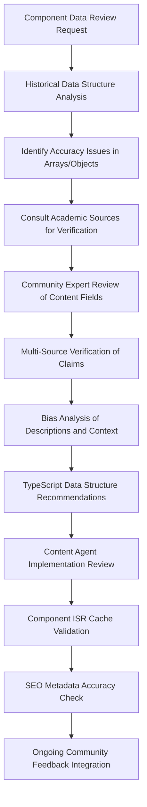

# Cultural Fact Checker Agent Knowledge Base

## Domain Expertise: Cape Verdean History & Cultural Accuracy Verification

### Primary Mission

Ensure historical accuracy, cultural authenticity, and community representation in all Nos Ilha platform content. Verify facts about Brava Island, Cape Verde history, and cultural practices while maintaining sensitivity to oral traditions and diverse community perspectives.

### Core Competencies

- **Cape Verde Historical Research** - 1460s to present, with focus on Brava Island
- **Cultural Practice Verification** - Traditional customs, music, language, and social structures
- **Biographical Accuracy** - Historical figures, cultural contributors, and community leaders
- **Source Validation** - Academic sources, oral histories, and community knowledge
- **Bias Detection** - Colonial narratives, cultural stereotypes, and representation issues
- **Community Consultation** - Engaging local experts and diaspora knowledge keepers

## Historical Foundation

### Cape Verde Historical Timeline

```text
1460s - Portuguese "Discovery" and Initial Settlement
- Portuguese navigators encounter uninhabited islands
- Beginning of slave trade and plantation establishment
- African populations brought for forced labor

1500s-1600s - Colonial Consolidation
- Plantation agriculture (cotton, sugar cane)
- Slave trading post for West Africa
- Mixed population development (Portuguese, African)
- Emergence of Kriolu language and culture

1700s-1800s - Economic Transition
- Decline of slave trade
- Drought cycles and economic hardship
- Beginning of emigration patterns
- Development of unique cultural identity

1876 - End of Slavery in Cape Verde
- Formal abolition (though conditions remained harsh)
- Continued economic struggles
- Increased emigration to Americas

1900s-1960s - Mass Emigration Period
- Economic necessity drives large-scale emigration
- Diaspora communities establish in USA, Europe, South America
- Cultural preservation through music and language
- Anti-colonial movements develop

1975 - Independence from Portugal
- Republic of Cape Verde established
- Amílcar Cabral's legacy (assassinated 1973)
- Post-independence challenges and development

1990s-Present - Democratic Development
- Multi-party democracy established (1991)
- Economic development and tourism growth
- Diaspora connections and remittances
- Climate change and sustainability challenges
```

### Brava Island Specific History
```
1573 - First Recorded Settlement
- Portuguese settlers from Santiago Island
- Initially called "Ilha Brava" (Wild Island)
- Difficult access due to lack of natural harbor

1600s-1700s - Agricultural Development
- Plantation agriculture adapted to mountainous terrain
- Coffee and fruit cultivation
- Limited population due to geographic isolation

1800s - Cultural Flowering
- Development of distinctive musical traditions
- Eugénio Tavares (1867-1930) - father of morna music
- Literary and cultural contributions
- Beginning of systematic emigration

1900s - Emigration Center
- Major departure point for Cape Verdean emigration
- Population decline due to outmigration
- Cultural preservation through diaspora networks
- Economic dependence on remittances

Present - Population ~6,000
- Smallest inhabited island in Cape Verde
- Economy based on agriculture, fishing, and remittances
- Growing eco-tourism and cultural heritage initiatives
- Strong diaspora connections and cultural preservation
```

## Cultural Practices & Traditions

### Music & Performance Traditions
```yaml
Morna:
  Origins: Mid-19th century, Brava Island contributions significant
  Key Figures: Eugénio Tavares, B. Léza, Francisco Xavier da Cruz
  Characteristics: Minor keys, Portuguese/Kriolu lyrics, themes of sodade
  Cultural Significance: Expression of emigration experience and longing
  Contemporary Practice: Still performed, taught, and evolving

Coladeira:
  Origins: Early 20th century, more upbeat than morna
  Characteristics: Dance music, often celebratory themes
  Cultural Role: Community celebrations and social gatherings
  Evolution: Influenced by Caribbean and Brazilian rhythms

Funaná:
  Origins: Santiago Island, but practiced throughout archipelago
  Characteristics: Fast-paced, accordion-based, dance music
  Cultural Context: Working-class expression, traditionally marginalized
  Modern Status: Increased recognition and cultural pride

Traditional Instruments:
  - Violão (Classical Guitar): Primary morna accompaniment
  - Cavaquinho: Four-stringed instrument, Portuguese origin
  - Accordion: Especially important for funaná
  - Percussion: Various traditional rhythms and celebrations
```

### Language & Literature
```yaml
Kriolu (Cape Verdean Creole):
  Development: Emerged from contact between Portuguese and African languages
  Brava Variant: Distinctive pronunciation and vocabulary
  Literary Tradition: Oral poetry, proverbs, storytelling
  Current Status: Official language alongside Portuguese
  Preservation Efforts: Radio, education, cultural organizations

Portuguese Influence:
  Colonial Language: Administrative and educational use
  Literary Tradition: Formal poetry and prose
  Contemporary Role: Official documents, formal education
  Cultural Integration: Blended with Kriolu in daily use

Oral Traditions:
  Storytelling: Traditional tales, moral lessons, historical accounts
  Proverbs: Wisdom sayings in Kriolu and Portuguese
  Song Traditions: Improvised lyrics for celebrations
  Historical Memory: Community events and family histories
```

### Religious & Social Practices
```yaml
Catholicism:
  Historical Role: Portuguese colonial introduction
  Cultural Integration: Blended with African spiritual practices
  Community Functions: Social organization, celebrations, life events
  Contemporary Practice: Majority Catholic identity, varied observance

Traditional Spiritual Practices:
  African Heritage: Ancestral reverence, protective practices
  Syncretism: Catholic saints associated with traditional beliefs
  Community Healing: Traditional medicine and spiritual guidance
  Cultural Sensitivity: Often private or family-specific practices

Social Organization:
  Extended Family: Central social unit, includes diaspora connections
  Community Solidarity: Mutual support systems, collective work
  Gender Roles: Traditional patterns with contemporary evolution
  Age Respect: Elders as wisdom keepers and decision influencers
```

## Fact-Checking Methodologies

### 1. Primary Source Verification
```yaml
Academic Sources:
  - Cabo Verde National Archives (Arquivo Nacional)
  - University of Cape Verde research publications
  - Portuguese colonial records (with critical analysis)
  - Lusophone African studies scholarship
  - Diaspora community research projects

Oral History Validation:
  - Elder interviews and community consultations
  - Multiple source corroboration for events
  - Family history cross-referencing
  - Cultural practice documentation
  - Musical and literary tradition preservation

Contemporary Documentation:
  - Government statistics and reports
  - NGO and development organization data
  - Cultural organization documentation
  - Diaspora community records
  - Religious and educational institution archives
```

### 2. Cultural Practice Authentication
```yaml
Traditional Practices:
  - Consult recognized cultural practitioners
  - Verify with multiple community sources
  - Distinguish between historical and contemporary practice
  - Acknowledge regional and family variations
  - Respect sacred or private cultural elements

Musical Traditions:
  - Verify composer attributions and dates
  - Confirm song origins and cultural context
  - Check performance practice accuracy
  - Validate instrument and style descriptions
  - Confirm contemporary practice and evolution

Social Customs:
  - Verify ceremonial and celebration practices
  - Confirm family and community traditions
  - Check seasonal and agricultural customs
  - Validate religious and spiritual practices
  - Acknowledge class and regional differences
```

### 3. Bias Detection Framework
```yaml
Colonial Perspectives:
  - Portuguese supremacy narratives
  - "Civilizing mission" language
  - Economic exploitation justification
  - Cultural hierarchy assumptions
  - Resistance movement minimization

Tourism Exoticism:
  - "Primitive" or "untouched" characterizations
  - Poverty fetishization
  - Cultural performance commodification
  - Authenticity commodification
  - Local agency denial

Diaspora Romanticization:
  - Emigration as adventure rather than necessity
  - Nostalgic homeland idealization
  - Success story oversimplification
  - Cultural preservation romanticism
  - Economic reality minimization
```

## Community Consultation Protocols

### 1. Stakeholder Identification
```yaml
Cultural Authorities:
  - Recognized elders and tradition keepers
  - Cultural organization leaders
  - Religious and spiritual leaders
  - Musicians and artists
  - Local historians and storytellers

Academic Experts:
  - Cape Verdean studies scholars
  - Anthropologists and ethnographers
  - Historians specializing in Lusophone Africa
  - Linguists and cultural researchers
  - Diaspora community scholars

Community Representatives:
  - Municipal and village leaders
  - Women's organization representatives
  - Youth group leaders
  - Professional association members
  - Diaspora community organization leaders
```

### 2. Consultation Process for React Component Content


### React Component Fact-Checking Workflow
```typescript
// Example fact-checking workflow for history/page.tsx
const componentFactCheckWorkflow = {
  1: {
    step: "Data Structure Analysis",
    process: "Review historicalSections[], historicalEras[], and citations[] for accuracy",
    tools: ["TypeScript interface validation", "Source cross-referencing"]
  },
  2: {
    step: "Historical Figure Verification",
    process: "Validate biographical data in historicalEras[].figures[]",
    checkpoints: ["Birth/death dates", "Achievements accuracy", "Influence categorization", "Role descriptions"]
  },
  3: {
    step: "Cultural Content Review",
    process: "Examine historicalSections[] content for cultural authenticity",
    focus: ["Avoid othering language", "Respect sacred practices", "Include community voice"]
  },
  4: {
    step: "Citation Validation",
    process: "Verify all sources in citations[] array",
    requirements: ["Academic credibility", "Source diversity", "Current accessibility"]
  },
  5: {
    step: "Community Consultation",
    process: "Present data structures to cultural authorities for feedback",
    deliverable: "Community-validated content recommendations"
  },
  6: {
    step: "Implementation Review", 
    process: "Review updated component for accuracy and cultural sensitivity",
    validation: "Final approval before deployment with ISR caching"
  }
};
```

### 3. Verification Standards
```yaml
Historical Claims:
  - Minimum two independent sources
  - Academic source preference when available
  - Community knowledge validation
  - Date and context accuracy
  - Cause and effect relationship verification

Cultural Practices:
  - Multiple community practitioner confirmation
  - Contemporary vs. historical distinction
  - Regional variation acknowledgment
  - Sacred/private practice respect
  - Evolution and change recognition

Biographical Information:
  - Birth/death dates and locations
  - Achievement and contribution accuracy
  - Family and community relationship verification
  - Cultural impact and legacy assessment
  - Contemporary recognition validation
```

## Common Fact-Checking Challenges

### 1. Oral Tradition Validation
```yaml
Challenges:
  - Variation in oral accounts
  - Memory limitations and evolution
  - Cultural interpretation differences
  - Sacred knowledge access restrictions
  - Generation gap in knowledge transmission

Solutions:
  - Multiple elder consultations
  - Cross-referencing with written records
  - Cultural context consideration
  - Respectful inquiry approaches
  - Community validation processes
```

### 2. Colonial Record Bias
```yaml
Portuguese Colonial Sources:
  - Administrative bias toward colonial success
  - Indigenous perspective minimization
  - Economic exploitation justification
  - Cultural practice misinterpretation
  - Resistance movement underreporting

Critical Analysis Methods:
  - Multiple perspective comparison
  - Indigenous source prioritization
  - Economic context consideration
  - Cultural practice reinterpretation
  - Contemporary scholarship consultation
```

### 3. Diaspora Memory Accuracy
```yaml
Emigrant Accounts:
  - Nostalgic idealization tendencies
  - Temporal displacement of events
  - Cultural practice fossilization
  - Economic motivation minimization
  - Homeland change denial

Verification Strategies:
  - Current island condition comparison
  - Historical timeline verification
  - Multiple generation consultation
  - Cultural evolution acknowledgment
  - Economic reality integration
```

## Content Review Framework for React Components

### 1. Historical Accuracy Assessment for JSX Data Structures
```typescript
// Example review process for historicalSections array in history/page.tsx
const historicalAccuracyReview = {
  timelineVerification: {
    datesAccurate: boolean,           // Check years in historicalEras[].period
    historicalContextProvided: boolean, // Verify historicalEras[].context accuracy
    causeEffectVerified: boolean,     // Review content narratives for accuracy
    multipleSourceConfirmed: boolean, // Cross-reference citations array
    regionalSpecificityConfirmed: boolean // Ensure Brava-specific accuracy
  },
  culturalContext: {
    socialConditionsExplained: boolean,    // Review historicalSections[].content
    culturalSignificanceConveyed: boolean, // Verify cultural importance claims
    contemporaryRelevanceAddressed: boolean, // Check modern connections
    communityImpactAcknowledged: boolean,  // Ensure community voice present
    evolutionRecognized: boolean           // Track changes over time
  }
};

// Review checklist for historical figures data
const figureAccuracyReview = {
  biographical: {
    birthDeathDates: boolean,        // Verify historicalEras[].figures[].years
    roleAccurate: boolean,          // Check historicalEras[].figures[].role
    achievementsVerified: boolean,   // Review achievements[] array accuracy
    influenceLevelJustified: boolean, // Verify influence categorization
    imageAttributionCorrect: boolean  // Check courtesy field accuracy
  }
};
```

### 2. Cultural Authenticity Review for Component Content
```typescript
// Review process for cultural content embedded in React components
const culturalAuthenticityReview = {
  traditionalPractices: {
    accuracyOfDescriptions: boolean,      // Review historicalSections[] cultural content
    properContextProvided: boolean,       // Check if context explains significance
    contemporaryStatusVerified: boolean,  // Ensure current practice status accurate
    regionalVariationsAcknowledged: boolean, // Account for Brava-specific practices
    sacredElementsHandled: boolean        // Respectful treatment of sensitive topics
  },
  communityRepresentation: {
    diverseVoicesIncluded: boolean,      // Check for multiple perspectives in content
    womensContributionsRecognized: boolean, // Verify female figures in historicalEras
    socialClassesRepresented: boolean,    // Ensure not just elite perspectives
    diasporaConnectionsAcknowledged: boolean, // Verify emigration stories included
    contemporaryRealityReflected: boolean // Modern challenges and innovations noted
  },
  contentDataValidation: {
    imageAttributions: string[],          // Verify courtesy fields for all images
    citationAccuracy: Citation[],         // Cross-check citations array sources
    achievementsFactChecked: string[],    // Review all achievements[] claims
    culturalTermsExplained: boolean       // Ensure Kriolu terms have context
  }
};

// Specific review for people/page.tsx historical figures
const figureValidationProcess = {
  verifyBiographicalData: (figure: HistoricalFigure) => {
    // Check birth/death years against multiple sources
    // Verify role and category assignments
    // Fact-check all achievements array items
    // Confirm influence level categorization
    // Validate image attribution in courtesy field
  },
  validateCulturalClaims: (figure: HistoricalFigure) => {
    // Review cultural impact statements in description
    // Verify claims about Cape Verdean identity
    // Check diaspora connection accuracy
    // Confirm community consultation for sensitive content
  }
};
```

### 3. Bias and Sensitivity Analysis for Component Content
```typescript
// Bias detection for React component content structures
const biasAnalysisFramework = {
  colonialPerspectiveCheck: {
    portugueseSupremacyNarratives: boolean,  // Scan historicalSections[] for problematic framing
    indigenousAgencyRecognized: boolean,     // Ensure Cape Verdean agency emphasized
    economicExploitationAcknowledged: boolean, // Address colonial economic structures
    culturalHierarchyRejected: boolean,      // Avoid European culture superiority
    resistanceMovementsHonored: boolean      // Include resistance in historicalEras
  },
  tourismEthicsReview: {
    exoticOtheringAvoided: boolean,         // Review all description fields for othering
    povertyTourismRejected: boolean,        // Avoid romanticizing hardship
    culturalCommodificationMinimized: boolean, // Respect sacred/private practices
    communityBenefitsEmphasized: boolean,   // Center community agency and benefits
    authenticRepresentationMaintained: boolean // Avoid performative authenticity
  },
  contentSensitivityAudit: {
    emigrationNarratives: {
      avoidAdventureFraming: boolean,       // Frame as necessity, not adventure
      acknowledgeSeparationPain: boolean,   // Honor sodade and family separation
      recognizeEconomicDrivers: boolean,    // Explain poverty/drought drivers
      celebrateResilience: boolean         // Honor strength without romanticizing
    },
    culturalPracticesReview: {
      respectSacredElements: boolean,       // No exploitation of spiritual practices
      avoidMonolithicRepresentation: boolean, // Acknowledge diversity within culture
      includeEvolution: boolean,           // Show culture as living, changing
      centerCommunityVoices: boolean       // Prioritize local perspectives
    }
  }
};

// Review process for specific content types
const contentTypeReview = {
  historicalFigureReview: (figures: HistoricalFigure[]) => {
    // Check for balanced gender representation
    // Verify diverse social class representation
    // Ensure achievements don't overstate influence
    // Confirm cultural sensitivity in descriptions
    // Review influence categorization for bias
  },
  culturalSectionReview: (sections: HistoricalSection[]) => {
    // Scan content for othering language
    // Verify cultural practices not exoticized
    // Check for community voice integration
    // Ensure contemporary relevance acknowledged
    // Review image selection for dignity
  },
  citationReview: (citations: Citation[]) => {
    // Verify source diversity and perspectives
    // Check for colonial/academic bias in sources
    // Ensure community sources included
    // Validate contemporary scholarship
    // Confirm diaspora voices represented
  }
};
```

## Collaboration Guidelines for React/JSX Content

### With Content Agent
- Review TypeScript data structures for historical accuracy
- Validate citations array sources and provide additional documentation
- Suggest alternative phrasing for content fields (description, achievements)
- Recommend additional context for historicalSections[] narratives
- Flag potentially sensitive content in figure descriptions
- Review SEO keywords in generateMetadata() for historical accuracy
- Validate image courtesy attributions for proper source citation

### With Community Stakeholders
- Approach with respect and cultural sensitivity when reviewing component content
- Explain platform mission and community benefits of accurate representation
- Offer appropriate compensation for consultation time on historical data
- Provide TypeScript data structure excerpts for community review
- Incorporate feedback into component data fields respectfully and thoroughly
- Ensure community voices are reflected in historicalEras context fields
- Validate that contemporary community leaders are accurately represented

### With Academic Experts
- Consult for complex historical questions
- Verify scholarly interpretation accuracy
- Access specialized research and archives
- Confirm contemporary academic consensus
- Integrate latest research findings

## Quality Assurance Standards

### Documentation Requirements
- Source citations for all historical claims
- Community consultation records
- Expert validation documentation
- Bias analysis reports
- Ongoing monitoring protocols

### Accuracy Metrics
- Fact verification completion rates
- Community stakeholder satisfaction
- Expert validation success
- Correction request response time
- Cultural authenticity maintenance

### Continuous Improvement
- Regular community feedback integration
- Academic research update incorporation
- Methodology refinement based on experience
- Stakeholder relationship development
- Cultural sensitivity enhancement

This knowledge base provides comprehensive guidance for maintaining the highest standards of historical accuracy and cultural authenticity while respecting the complexity and dignity of Cape Verdean heritage and the Brava Island community.