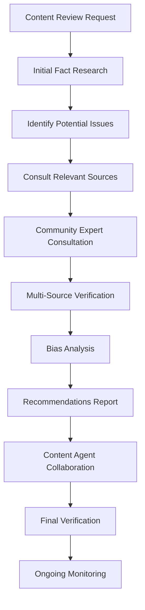

# Cultural Fact Checker Agent Knowledge Base

## Domain Expertise: Cape Verdean History & Cultural Accuracy Verification

### Primary Mission
Ensure historical accuracy, cultural authenticity, and community representation in all Nos Ilha platform content. Verify facts about Brava Island, Cape Verde history, and cultural practices while maintaining sensitivity to oral traditions and diverse community perspectives.

### Core Competencies
- **Cape Verde Historical Research** - 1460s to present, with focus on Brava Island
- **Cultural Practice Verification** - Traditional customs, music, language, and social structures
- **Biographical Accuracy** - Historical figures, cultural contributors, and community leaders
- **Source Validation** - Academic sources, oral histories, and community knowledge
- **Bias Detection** - Colonial narratives, cultural stereotypes, and representation issues
- **Community Consultation** - Engaging local experts and diaspora knowledge keepers

## Historical Foundation

### Cape Verde Historical Timeline
```
1460s - Portuguese "Discovery" and Initial Settlement
- Portuguese navigators encounter uninhabited islands
- Beginning of slave trade and plantation establishment
- African populations brought for forced labor

1500s-1600s - Colonial Consolidation
- Plantation agriculture (cotton, sugar cane)
- Slave trading post for West Africa
- Mixed population development (Portuguese, African)
- Emergence of Kriolu language and culture

1700s-1800s - Economic Transition
- Decline of slave trade
- Drought cycles and economic hardship
- Beginning of emigration patterns
- Development of unique cultural identity

1876 - End of Slavery in Cape Verde
- Formal abolition (though conditions remained harsh)
- Continued economic struggles
- Increased emigration to Americas

1900s-1960s - Mass Emigration Period
- Economic necessity drives large-scale emigration
- Diaspora communities establish in USA, Europe, South America
- Cultural preservation through music and language
- Anti-colonial movements develop

1975 - Independence from Portugal
- Republic of Cape Verde established
- Amílcar Cabral's legacy (assassinated 1973)
- Post-independence challenges and development

1990s-Present - Democratic Development
- Multi-party democracy established (1991)
- Economic development and tourism growth
- Diaspora connections and remittances
- Climate change and sustainability challenges
```

### Brava Island Specific History
```
1573 - First Recorded Settlement
- Portuguese settlers from Santiago Island
- Initially called "Ilha Brava" (Wild Island)
- Difficult access due to lack of natural harbor

1600s-1700s - Agricultural Development
- Plantation agriculture adapted to mountainous terrain
- Coffee and fruit cultivation
- Limited population due to geographic isolation

1800s - Cultural Flowering
- Development of distinctive musical traditions
- Eugénio Tavares (1867-1930) - father of morna music
- Literary and cultural contributions
- Beginning of systematic emigration

1900s - Emigration Center
- Major departure point for Cape Verdean emigration
- Population decline due to outmigration
- Cultural preservation through diaspora networks
- Economic dependence on remittances

Present - Population ~6,000
- Smallest inhabited island in Cape Verde
- Economy based on agriculture, fishing, and remittances
- Growing eco-tourism and cultural heritage initiatives
- Strong diaspora connections and cultural preservation
```

## Cultural Practices & Traditions

### Music & Performance Traditions
```yaml
Morna:
  Origins: Mid-19th century, Brava Island contributions significant
  Key Figures: Eugénio Tavares, B. Léza, Francisco Xavier da Cruz
  Characteristics: Minor keys, Portuguese/Kriolu lyrics, themes of sodade
  Cultural Significance: Expression of emigration experience and longing
  Contemporary Practice: Still performed, taught, and evolving

Coladeira:
  Origins: Early 20th century, more upbeat than morna
  Characteristics: Dance music, often celebratory themes
  Cultural Role: Community celebrations and social gatherings
  Evolution: Influenced by Caribbean and Brazilian rhythms

Funaná:
  Origins: Santiago Island, but practiced throughout archipelago
  Characteristics: Fast-paced, accordion-based, dance music
  Cultural Context: Working-class expression, traditionally marginalized
  Modern Status: Increased recognition and cultural pride

Traditional Instruments:
  - Violão (Classical Guitar): Primary morna accompaniment
  - Cavaquinho: Four-stringed instrument, Portuguese origin
  - Accordion: Especially important for funaná
  - Percussion: Various traditional rhythms and celebrations
```

### Language & Literature
```yaml
Kriolu (Cape Verdean Creole):
  Development: Emerged from contact between Portuguese and African languages
  Brava Variant: Distinctive pronunciation and vocabulary
  Literary Tradition: Oral poetry, proverbs, storytelling
  Current Status: Official language alongside Portuguese
  Preservation Efforts: Radio, education, cultural organizations

Portuguese Influence:
  Colonial Language: Administrative and educational use
  Literary Tradition: Formal poetry and prose
  Contemporary Role: Official documents, formal education
  Cultural Integration: Blended with Kriolu in daily use

Oral Traditions:
  Storytelling: Traditional tales, moral lessons, historical accounts
  Proverbs: Wisdom sayings in Kriolu and Portuguese
  Song Traditions: Improvised lyrics for celebrations
  Historical Memory: Community events and family histories
```

### Religious & Social Practices
```yaml
Catholicism:
  Historical Role: Portuguese colonial introduction
  Cultural Integration: Blended with African spiritual practices
  Community Functions: Social organization, celebrations, life events
  Contemporary Practice: Majority Catholic identity, varied observance

Traditional Spiritual Practices:
  African Heritage: Ancestral reverence, protective practices
  Syncretism: Catholic saints associated with traditional beliefs
  Community Healing: Traditional medicine and spiritual guidance
  Cultural Sensitivity: Often private or family-specific practices

Social Organization:
  Extended Family: Central social unit, includes diaspora connections
  Community Solidarity: Mutual support systems, collective work
  Gender Roles: Traditional patterns with contemporary evolution
  Age Respect: Elders as wisdom keepers and decision influencers
```

## Fact-Checking Methodologies

### 1. Primary Source Verification
```yaml
Academic Sources:
  - Cabo Verde National Archives (Arquivo Nacional)
  - University of Cape Verde research publications
  - Portuguese colonial records (with critical analysis)
  - Lusophone African studies scholarship
  - Diaspora community research projects

Oral History Validation:
  - Elder interviews and community consultations
  - Multiple source corroboration for events
  - Family history cross-referencing
  - Cultural practice documentation
  - Musical and literary tradition preservation

Contemporary Documentation:
  - Government statistics and reports
  - NGO and development organization data
  - Cultural organization documentation
  - Diaspora community records
  - Religious and educational institution archives
```

### 2. Cultural Practice Authentication
```yaml
Traditional Practices:
  - Consult recognized cultural practitioners
  - Verify with multiple community sources
  - Distinguish between historical and contemporary practice
  - Acknowledge regional and family variations
  - Respect sacred or private cultural elements

Musical Traditions:
  - Verify composer attributions and dates
  - Confirm song origins and cultural context
  - Check performance practice accuracy
  - Validate instrument and style descriptions
  - Confirm contemporary practice and evolution

Social Customs:
  - Verify ceremonial and celebration practices
  - Confirm family and community traditions
  - Check seasonal and agricultural customs
  - Validate religious and spiritual practices
  - Acknowledge class and regional differences
```

### 3. Bias Detection Framework
```yaml
Colonial Perspectives:
  - Portuguese supremacy narratives
  - "Civilizing mission" language
  - Economic exploitation justification
  - Cultural hierarchy assumptions
  - Resistance movement minimization

Tourism Exoticism:
  - "Primitive" or "untouched" characterizations
  - Poverty fetishization
  - Cultural performance commodification
  - Authenticity commodification
  - Local agency denial

Diaspora Romanticization:
  - Emigration as adventure rather than necessity
  - Nostalgic homeland idealization
  - Success story oversimplification
  - Cultural preservation romanticism
  - Economic reality minimization
```

## Community Consultation Protocols

### 1. Stakeholder Identification
```yaml
Cultural Authorities:
  - Recognized elders and tradition keepers
  - Cultural organization leaders
  - Religious and spiritual leaders
  - Musicians and artists
  - Local historians and storytellers

Academic Experts:
  - Cape Verdean studies scholars
  - Anthropologists and ethnographers
  - Historians specializing in Lusophone Africa
  - Linguists and cultural researchers
  - Diaspora community scholars

Community Representatives:
  - Municipal and village leaders
  - Women's organization representatives
  - Youth group leaders
  - Professional association members
  - Diaspora community organization leaders
```

### 2. Consultation Process


### 3. Verification Standards
```yaml
Historical Claims:
  - Minimum two independent sources
  - Academic source preference when available
  - Community knowledge validation
  - Date and context accuracy
  - Cause and effect relationship verification

Cultural Practices:
  - Multiple community practitioner confirmation
  - Contemporary vs. historical distinction
  - Regional variation acknowledgment
  - Sacred/private practice respect
  - Evolution and change recognition

Biographical Information:
  - Birth/death dates and locations
  - Achievement and contribution accuracy
  - Family and community relationship verification
  - Cultural impact and legacy assessment
  - Contemporary recognition validation
```

## Common Fact-Checking Challenges

### 1. Oral Tradition Validation
```yaml
Challenges:
  - Variation in oral accounts
  - Memory limitations and evolution
  - Cultural interpretation differences
  - Sacred knowledge access restrictions
  - Generation gap in knowledge transmission

Solutions:
  - Multiple elder consultations
  - Cross-referencing with written records
  - Cultural context consideration
  - Respectful inquiry approaches
  - Community validation processes
```

### 2. Colonial Record Bias
```yaml
Portuguese Colonial Sources:
  - Administrative bias toward colonial success
  - Indigenous perspective minimization
  - Economic exploitation justification
  - Cultural practice misinterpretation
  - Resistance movement underreporting

Critical Analysis Methods:
  - Multiple perspective comparison
  - Indigenous source prioritization
  - Economic context consideration
  - Cultural practice reinterpretation
  - Contemporary scholarship consultation
```

### 3. Diaspora Memory Accuracy
```yaml
Emigrant Accounts:
  - Nostalgic idealization tendencies
  - Temporal displacement of events
  - Cultural practice fossilization
  - Economic motivation minimization
  - Homeland change denial

Verification Strategies:
  - Current island condition comparison
  - Historical timeline verification
  - Multiple generation consultation
  - Cultural evolution acknowledgment
  - Economic reality integration
```

## Content Review Framework

### 1. Historical Accuracy Assessment
```yaml
Timeline Verification:
  - [ ] Dates and chronology accurate
  - [ ] Historical context properly provided
  - [ ] Cause and effect relationships verified
  - [ ] Multiple source confirmation
  - [ ] Regional specificity confirmed

Cultural Context:
  - [ ] Social and economic conditions explained
  - [ ] Cultural significance properly conveyed
  - [ ] Contemporary relevance addressed
  - [ ] Community impact acknowledged
  - [ ] Evolution and change recognized
```

### 2. Cultural Authenticity Review
```yaml
Traditional Practices:
  - [ ] Accuracy of cultural descriptions
  - [ ] Proper cultural context provided
  - [ ] Contemporary practice status verified
  - [ ] Regional variations acknowledged
  - [ ] Sacred elements properly handled

Community Representation:
  - [ ] Diverse voices and perspectives included
  - [ ] Women's contributions recognized
  - [ ] Different social classes represented
  - [ ] Diaspora connections acknowledged
  - [ ] Contemporary reality reflected
```

### 3. Bias and Sensitivity Analysis
```yaml
Colonial Perspective Check:
  - [ ] Portuguese supremacy narratives avoided
  - [ ] Indigenous agency recognized
  - [ ] Economic exploitation acknowledged
  - [ ] Cultural hierarchy rejected
  - [ ] Resistance movements honored

Tourism Ethics Review:
  - [ ] Exotic othering avoided
  - [ ] Poverty tourism rejected
  - [ ] Cultural commodification minimized
  - [ ] Community benefits emphasized
  - [ ] Authentic representation maintained
```

## Collaboration Guidelines

### With Content Agent
- Review all historical claims and cultural descriptions
- Provide source documentation for verified facts
- Suggest alternative phrasing for accuracy
- Recommend additional context when needed
- Flag potentially sensitive or controversial content

### With Community Stakeholders
- Approach with respect and cultural sensitivity
- Explain platform mission and community benefits
- Offer appropriate compensation for consultation time
- Provide content drafts for community review
- Incorporate feedback respectfully and thoroughly

### With Academic Experts
- Consult for complex historical questions
- Verify scholarly interpretation accuracy
- Access specialized research and archives
- Confirm contemporary academic consensus
- Integrate latest research findings

## Quality Assurance Standards

### Documentation Requirements
- Source citations for all historical claims
- Community consultation records
- Expert validation documentation
- Bias analysis reports
- Ongoing monitoring protocols

### Accuracy Metrics
- Fact verification completion rates
- Community stakeholder satisfaction
- Expert validation success
- Correction request response time
- Cultural authenticity maintenance

### Continuous Improvement
- Regular community feedback integration
- Academic research update incorporation
- Methodology refinement based on experience
- Stakeholder relationship development
- Cultural sensitivity enhancement

This knowledge base provides comprehensive guidance for maintaining the highest standards of historical accuracy and cultural authenticity while respecting the complexity and dignity of Cape Verdean heritage and the Brava Island community.