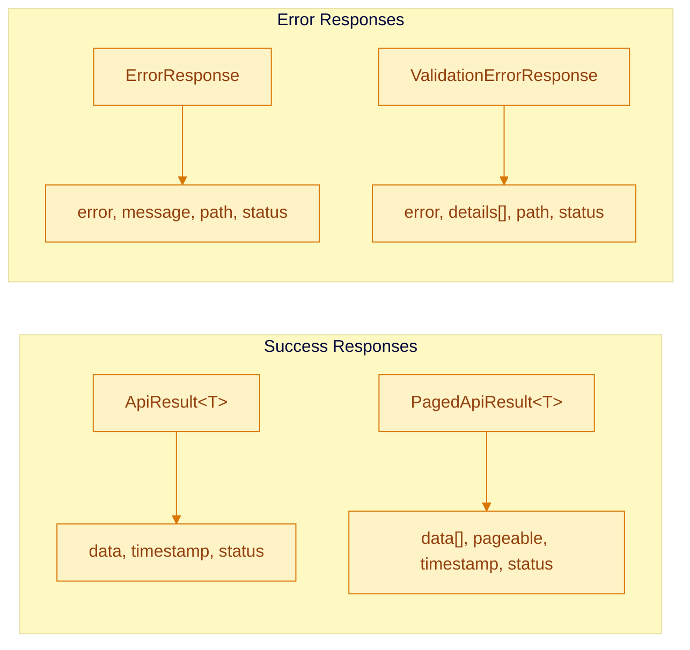

# Nos Ilha API Reference

REST API documentation for the Nos Ilha backend (Spring Boot 4.0 + Kotlin).

**Base URL**: `http://localhost:8080/api/v1` (development)
**Content-Type**: `application/json`
**Authentication**: JWT Bearer tokens (Supabase)

## Response Format

All responses use standard wrappers from `com.nosilha.core.shared.api`:



**Single Resource**:
```json
{
  "data": { "id": "uuid", "name": "..." },
  "timestamp": "2025-01-09T12:00:00Z",
  "status": 200
}
```

**Paginated List**:
```json
{
  "data": [...],
  "pageable": {
    "page": 0, "size": 20,
    "totalElements": 100, "totalPages": 5,
    "first": true, "last": false
  },
  "timestamp": "2025-01-09T12:00:00Z",
  "status": 200
}
```

**Validation Error**:
```json
{
  "error": "Validation failed",
  "details": [{ "field": "name", "rejectedValue": "", "message": "Name is required" }],
  "path": "/api/v1/directory/entries",
  "status": 400
}
```

---

## Authentication

JWT tokens from Supabase. Include in requests:

```http
Authorization: Bearer <supabase_jwt_token>
```

| Response | Meaning |
|----------|---------|
| 401 Unauthorized | Missing or invalid token |
| 403 Forbidden | Valid token but insufficient permissions |

---

## Places Module

### Directory Entries

| Method | Endpoint | Auth | Description |
|--------|----------|------|-------------|
| GET | `/directory/entries` | No | List entries with search, filter, pagination |
| GET | `/directory/entries/{id}` | No | Get entry by UUID |
| GET | `/directory/slug/{slug}` | No | Get entry by slug |
| GET | `/directory/entries/{id}/bookmark-status` | Optional | Check if entry is bookmarked |
| GET | `/directory/entries/{id}/related` | No | Get 3-5 related entries |
| POST | `/directory/entries` | Yes | Create entry |
| PUT | `/directory/entries/{id}` | Yes | Update entry |
| DELETE | `/directory/entries/{id}` | Yes | Delete entry |

#### GET /directory/entries

List entries with search, filtering, and pagination.

**Query Parameters**:
| Parameter | Type | Default | Description |
|-----------|------|---------|-------------|
| q | string | - | Full-text search (min 2 chars) |
| category | string | - | Filter: Restaurant, Hotel, Beach, Heritage, Nature |
| town | string | - | Filter by town name |
| sort | string | created_at_desc | name_asc, name_desc, rating_desc, created_at_desc, relevance |
| page | int | 0 | Page number |
| size | int | 20 | Page size |

```bash
curl "http://localhost:8080/api/v1/directory/entries?category=Restaurant&town=Nova%20Sintra&page=0&size=10"
```

**Response** (200):
```json
{
  "data": [{
    "id": "123e4567-e89b-12d3-a456-426614174000",
    "name": "Casa do Bacalhau",
    "slug": "casa-do-bacalhau",
    "description": "Traditional Cape Verdean restaurant...",
    "category": "Restaurant",
    "town": "Nova Sintra",
    "latitude": 14.8564,
    "longitude": -24.7144,
    "imageUrl": "https://...",
    "rating": 4.5,
    "reviewCount": 28,
    "createdAt": "2025-01-01T10:00:00Z",
    "updatedAt": "2025-01-15T14:30:00Z",
    "details": {
      "phoneNumber": "+238 283 1234",
      "openingHours": "Mon-Sat 11:00-22:00",
      "cuisine": ["Cape Verdean", "Seafood"]
    }
  }],
  "pageable": { "page": 0, "size": 10, "totalElements": 1, "totalPages": 1 }
}
```

#### GET /directory/entries/{id}/related

Get 3-5 related content items based on category, town, and cuisine matching.

**Query Parameters**:
| Parameter | Type | Default | Description |
|-----------|------|---------|-------------|
| limit | int | 5 | Number of results (3-5) |

```bash
curl "http://localhost:8080/api/v1/directory/entries/123e4567.../related?limit=5"
```

### Towns

| Method | Endpoint | Auth | Description |
|--------|----------|------|-------------|
| GET | `/towns` | No | List towns with pagination |
| GET | `/towns/all` | No | Get all towns (for dropdowns) |
| GET | `/towns/{id}` | No | Get town by UUID |
| GET | `/towns/slug/{slug}` | No | Get town by slug |
| POST | `/towns` | Yes | Create town |
| PUT | `/towns/{id}` | Yes | Update town |
| DELETE | `/towns/{id}` | Yes | Delete town |

---

## Gallery Module

| Method | Endpoint | Auth | Description |
|--------|----------|------|-------------|
| GET | `/gallery` | No | List active gallery media |
| GET | `/gallery/{id}` | Optional | Get media by ID |
| GET | `/gallery/entry/{entryId}` | No | Get media for directory entry |
| GET | `/gallery/categories` | No | Get distinct categories |
| POST | `/gallery/upload/presign` | Yes | Get presigned URL for upload |
| POST | `/gallery/upload/confirm` | Yes | Confirm completed upload |
| POST | `/gallery/submit` | Yes | Submit external media |

#### GET /gallery

List active gallery media (user uploads and external content).

**Query Parameters**:
| Parameter | Type | Default | Description |
|-----------|------|---------|-------------|
| category | string | - | Filter by category |
| page | int | 0 | Page number |
| size | int | 50 | Items per page (max 100) |

```bash
curl "http://localhost:8080/api/v1/gallery?category=Nature&page=0&size=20"
```

#### POST /gallery/upload/presign

Generate presigned URL for direct browser-to-R2 upload.

**Rate Limit**: 20 uploads/hour, 100 uploads/day per user.

```bash
curl -X POST "http://localhost:8080/api/v1/gallery/upload/presign" \
  -H "Authorization: Bearer <token>" \
  -H "Content-Type: application/json" \
  -d '{
    "fileName": "photo.jpg",
    "contentType": "image/jpeg",
    "fileSize": 2048576
  }'
```

**Response** (200):
```json
{
  "data": {
    "uploadUrl": "https://r2.example.com/presigned...",
    "key": "uploads/2025/01/abc123.jpg",
    "expiresAt": "2025-01-09T12:10:00Z"
  }
}
```

#### POST /gallery/upload/confirm

Confirm upload after file is uploaded to R2.

```bash
curl -X POST "http://localhost:8080/api/v1/gallery/upload/confirm" \
  -H "Authorization: Bearer <token>" \
  -H "Content-Type: application/json" \
  -d '{
    "key": "uploads/2025/01/abc123.jpg",
    "originalName": "my-photo.jpg",
    "contentType": "image/jpeg",
    "fileSize": 2048576,
    "entryId": "123e4567-e89b-12d3-a456-426614174000",
    "category": "Nature",
    "description": "Sunset view from Faja d'\''Agua"
  }'
```

---

## Engagement Module

### Reactions

| Method | Endpoint | Auth | Description |
|--------|----------|------|-------------|
| GET | `/reactions/content/{contentId}` | Optional | Get reaction counts |
| POST | `/reactions` | Yes | Submit/toggle reaction |
| DELETE | `/reactions/content/{contentId}` | Yes | Remove reaction |

**Reaction Types**: `LOVE`, `CELEBRATE`, `INSIGHTFUL`, `SUPPORT`

#### POST /reactions

Submit or toggle a reaction. Same type removes it, different type replaces it.

**Rate Limit**: 10 reactions/minute per user.

```bash
curl -X POST "http://localhost:8080/api/v1/reactions" \
  -H "Authorization: Bearer <token>" \
  -H "Content-Type: application/json" \
  -d '{
    "contentId": "789e0123-e45b-67c8-d901-234567890abc",
    "reactionType": "LOVE"
  }'
```

**Response** (201 Created / 200 OK):
```json
{
  "data": {
    "id": "550e8400-e29b-41d4-a716-446655440000",
    "contentId": "789e0123-e45b-67c8-d901-234567890abc",
    "reactionType": "LOVE",
    "count": 43
  }
}
```

#### GET /reactions/content/{contentId}

Get aggregated counts. Includes user's reaction if authenticated.

```bash
curl "http://localhost:8080/api/v1/reactions/content/789e0123..."
```

**Response** (200):
```json
{
  "data": {
    "contentId": "789e0123-e45b-67c8-d901-234567890abc",
    "reactions": {
      "LOVE": 42,
      "CELEBRATE": 15,
      "INSIGHTFUL": 8,
      "SUPPORT": 23
    },
    "userReaction": "LOVE"
  }
}
```

### Bookmarks

| Method | Endpoint | Auth | Description |
|--------|----------|------|-------------|
| POST | `/bookmarks` | Yes | Create bookmark |
| DELETE | `/bookmarks/{entryId}` | Yes | Remove bookmark |

**Limit**: 100 bookmarks per user.

#### POST /bookmarks

```bash
curl -X POST "http://localhost:8080/api/v1/bookmarks" \
  -H "Authorization: Bearer <token>" \
  -H "Content-Type: application/json" \
  -d '{ "entryId": "550e8400-e29b-41d4-a716-446655440000" }'
```

**Response** (201):
```json
{
  "data": {
    "id": "789e0123-e45b-67c8-d901-234567890abc",
    "entryId": "550e8400-e29b-41d4-a716-446655440000",
    "createdAt": "2025-01-15T10:30:00Z"
  }
}
```

### Content Registration

| Method | Endpoint | Auth | Description |
|--------|----------|------|-------------|
| POST | `/content/register` | No | Register content for reaction tracking |

```bash
curl -X POST "http://localhost:8080/api/v1/content/register" \
  -H "Content-Type: application/json" \
  -d '{ "slug": "morna-music-history", "type": "article" }'
```

**Response** (200):
```json
{
  "data": { "contentId": "550e8400-e29b-41d4-a716-446655440000" }
}
```

---

## Stories Module

| Method | Endpoint | Auth | Description |
|--------|----------|------|-------------|
| GET | `/stories` | No | List published stories |
| GET | `/stories/slug/{slug}` | No | Get published story by slug |
| POST | `/stories` | Yes | Submit new story |

#### GET /stories

**Query Parameters**:
| Parameter | Type | Default | Description |
|-----------|------|---------|-------------|
| page | int | 0 | Page number |
| size | int | 20 | Items per page (max 50) |

**Response** (200):
```json
{
  "data": [{
    "id": "550e8400-e29b-41d4-a716-446655440000",
    "slug": "my-childhood-in-faja-dagua",
    "title": "My Childhood in Faja d'Agua",
    "excerpt": "I remember the sound of waves...",
    "author": "Maria Silva",
    "storyType": "FULL",
    "templateType": "CHILDHOOD",
    "location": "Faja d'Agua Beach",
    "isFeatured": true,
    "createdAt": "2025-01-15T10:30:00Z"
  }],
  "pageable": { "page": 0, "size": 20, "totalElements": 45, "totalPages": 3 }
}
```

#### POST /stories

Submit a story for moderation.

**Rate Limit**: 5 submissions/hour per IP.

**Story Types**: `QUICK`, `FULL`, `GUIDED`

```bash
curl -X POST "http://localhost:8080/api/v1/stories" \
  -H "Authorization: Bearer <token>" \
  -H "Content-Type: application/json" \
  -d '{
    "title": "My Grandmother'\''s Memories",
    "content": "She always told stories about the old days...",
    "storyType": "FULL",
    "templateType": "FAMILY",
    "location": "Nova Sintra"
  }'
```

---

## Feedback Module

### Contact

| Method | Endpoint | Auth | Description |
|--------|----------|------|-------------|
| POST | `/contact` | No | Submit contact message |

**Rate Limit**: 3 submissions/hour per IP.

**Subject Categories**: `GENERAL_INQUIRY`, `CONTENT_SUGGESTION`, `TECHNICAL_ISSUE`, `PARTNERSHIP`

```bash
curl -X POST "http://localhost:8080/api/v1/contact" \
  -H "Content-Type: application/json" \
  -d '{
    "name": "Maria Santos",
    "email": "maria@example.com",
    "subject": "CONTENT_SUGGESTION",
    "message": "I have photos from the 1970s festival..."
  }'
```

**Response** (201):
```json
{
  "data": {
    "id": "660f9511-f39c-52e5-b827-557766551111",
    "message": "Thank you for contacting us. We will respond soon."
  }
}
```

### Directory Submissions

| Method | Endpoint | Auth | Description |
|--------|----------|------|-------------|
| POST | `/directory-submissions` | Yes | Submit directory entry for review |

**Rate Limit**: 3 submissions/hour per IP.

```bash
curl -X POST "http://localhost:8080/api/v1/directory-submissions" \
  -H "Authorization: Bearer <token>" \
  -H "Content-Type: application/json" \
  -d '{
    "name": "Restaurante Vista Mar",
    "category": "RESTAURANT",
    "town": "Faja d'\''Agua",
    "description": "Family-owned restaurant with ocean views..."
  }'
```

---

## Auth Module

### User Profile

| Method | Endpoint | Auth | Description |
|--------|----------|------|-------------|
| GET | `/users/me` | Yes | Get current user profile |
| PUT | `/users/me` | Yes | Update profile (rate limit: 10/min) |
| GET | `/users/me/contributions` | Yes | Get user's contribution stats |
| GET | `/users/me/bookmarks` | Yes | Get user's bookmarks with entries |

#### GET /users/me

Auto-creates profile if not exists.

```bash
curl "http://localhost:8080/api/v1/users/me" \
  -H "Authorization: Bearer <token>"
```

**Response** (200):
```json
{
  "data": {
    "id": "550e8400-e29b-41d4-a716-446655440000",
    "userId": "auth0|123456789",
    "displayName": "Maria Silva",
    "location": "Brava Island, Cape Verde",
    "preferredLanguage": "PT",
    "notificationPreferences": {
      "emailNotifications": true,
      "contentUpdates": true,
      "communityDigest": false
    },
    "createdAt": "2025-01-15T10:30:00Z",
    "updatedAt": "2025-01-20T14:45:00Z"
  }
}
```

#### GET /users/me/contributions

```json
{
  "data": {
    "reactionCounts": { "LOVE": 42, "CELEBRATE": 15, "INSIGHTFUL": 8, "SUPPORT": 23 },
    "suggestions": [{ "id": "...", "contentId": "...", "status": "PENDING" }],
    "stories": [{ "id": "...", "title": "...", "status": "APPROVED" }],
    "totalReactions": 88,
    "totalSuggestions": 1,
    "totalStories": 1
  }
}
```

#### GET /users/me/bookmarks

**Query Parameters**:
| Parameter | Type | Default | Description |
|-----------|------|---------|-------------|
| page | int | 0 | Page number |
| size | int | 20 | Items per page (max 100) |

---

## Health & Monitoring

| Method | Endpoint | Description |
|--------|----------|-------------|
| GET | `/actuator/health` | Health check |
| GET | `/actuator/info` | Application info |
| GET | `/actuator/metrics` | Available metrics |
| GET | `/actuator/metrics/{name}` | Specific metric |

```bash
curl "http://localhost:8080/actuator/health"
```

**Response** (200):
```json
{
  "status": "UP",
  "components": {
    "db": { "status": "UP", "details": { "database": "PostgreSQL" } },
    "diskSpace": { "status": "UP" }
  }
}
```

---

## HTTP Status Codes

| Code | Description | Usage |
|------|-------------|-------|
| 200 | OK | Successful GET, PUT |
| 201 | Created | Successful POST |
| 204 | No Content | Successful DELETE |
| 400 | Bad Request | Validation errors |
| 401 | Unauthorized | Missing/invalid token |
| 403 | Forbidden | Insufficient permissions |
| 404 | Not Found | Resource not found |
| 429 | Too Many Requests | Rate limit exceeded |
| 500 | Internal Server Error | Server error |

---

## Rate Limiting

| Endpoint | Limit |
|----------|-------|
| Profile updates | 10/minute per user |
| Reactions | 10/minute per user |
| Gallery uploads | 20/hour, 100/day per user |
| Story submissions | 5/hour per IP |
| Contact form | 3/hour per IP |
| Directory submissions | 3/hour per IP |

Rate limit response (429):
```json
{
  "error": "Too Many Requests",
  "message": "Rate limit exceeded. Please try again later.",
  "status": 429
}
```

---

## Related Documentation

- [Architecture Guide](architecture.md)
- [API Coding Standards](api-coding-standards.md)
- [Spring Modulith Guide](spring-modulith.md)
