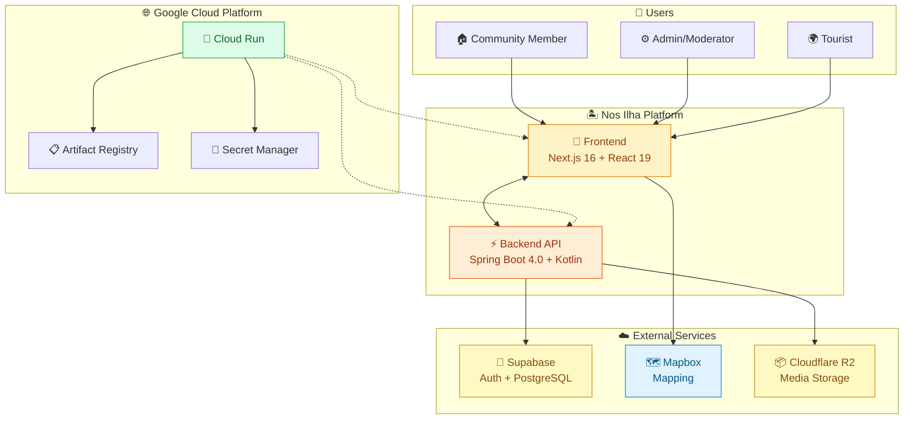
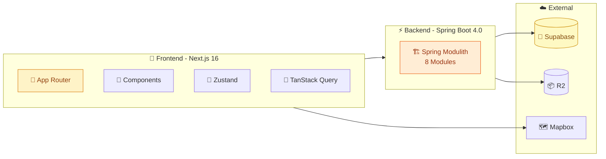
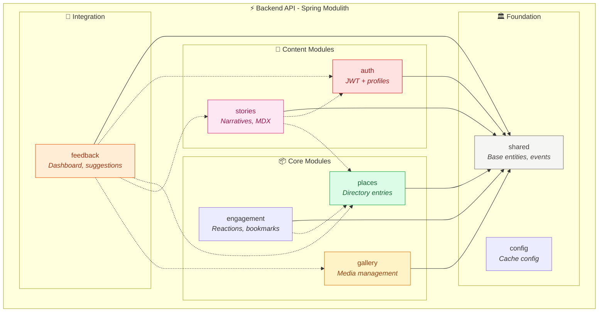
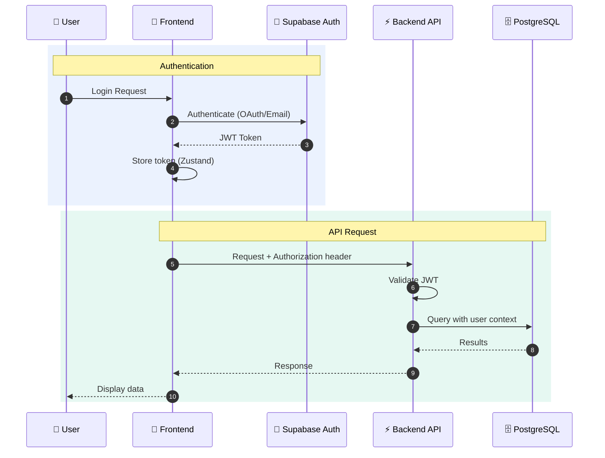
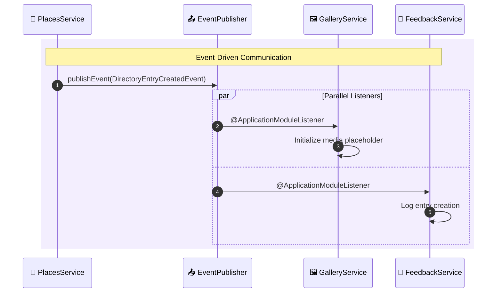
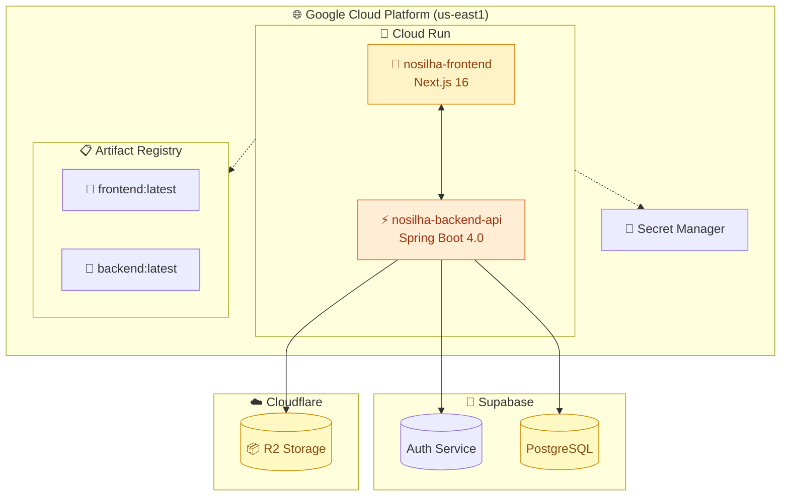

# Nos Ilha Architecture Documentation

This document provides a comprehensive technical overview of the Nos Ilha platform architecture using the [Arc42](https://arc42.org/) template.

---

## 1. Introduction and Goals

### 1.1 Purpose

Nos Ilha is a community-driven cultural heritage hub for Brava Island, Cape Verde. This volunteer-supported, open-source project preserves and celebrates the island's rich cultural memory through an interactive directory of cultural sites, landmarks, and local businesses with mapping functionality.

### 1.2 Quality Goals

| Priority | Quality Goal | Description |
|----------|-------------|-------------|
| 1 | Cultural Authenticity | Content verified by community members and cultural experts |
| 2 | Mobile-First Accessibility | Optimized for mobile devices on varying network conditions |
| 3 | Community Contribution | Low barrier to entry for content submissions |
| 4 | Maintainability | Solo-maintainer friendly architecture |
| 5 | Performance | Fast page loads with intelligent caching |

### 1.3 Stakeholders

| Stakeholder | Role | Expectations |
|-------------|------|--------------|
| Local Community | Primary users, content contributors | Easy navigation, accurate cultural information |
| Cape Verdean Diaspora | Remote users, story contributors | Connection to heritage, community stories |
| Tourists | Discovery users | Practical directory information, maps |
| Developers | Contributors | Clear documentation, modular architecture |
| Cultural Organizations | Partners | Platform for heritage preservation |

---

## 2. Constraints

### 2.1 Technical Constraints

| Constraint | Description |
|------------|-------------|
| Solo-maintained | Single primary maintainer; architecture must be simple to operate |
| Budget-conscious | GCP free tier optimization; Supabase free tier for auth/database |
| Monorepo structure | Frontend and backend in single repository |
| Fixed tech stack | Next.js 16, Spring Boot 4.0, Kotlin 2.3.0, Java 25 |

### 2.2 Organizational Constraints

| Constraint | Description |
|------------|-------------|
| Open source | MIT licensed; community contributions welcome |
| Volunteer-supported | No guaranteed SLA; community-driven development |
| Cultural sensitivity | Content requires community verification |

---

## 3. Context and Scope

### 3.1 System Context

### 3.2 External Interfaces

| System | Purpose | Interface |
|--------|---------|-----------|
| Supabase Auth | User authentication | JWT tokens, OAuth providers |
| Supabase PostgreSQL | Primary database | JDBC connection |
| Mapbox | Interactive maps | GL JS API |
| Cloudflare R2 | Media file storage | S3-compatible API |
| GCP Cloud Run | Container hosting | HTTP/HTTPS |
| GCP Artifact Registry | Docker images | Container Registry API |
| GCP Secret Manager | Secrets storage | Secret Manager API |

---

## 4. Solution Strategy

### 4.1 Technology Decisions

| Decision | Rationale |
|----------|-----------|
| **Modular Monolith** (Spring Modulith) | Simpler than microservices; enforced module boundaries |
| **Event-Driven Communication** | Loose coupling between modules via `@ApplicationModuleListener` |
| **Server-First Rendering** | React Server Components for performance |
| **ISR Caching** | Incremental Static Regeneration for content freshness |
| **Single Table Inheritance** | All place types in one table with discriminator |

### 4.2 Quality Strategy

| Quality Goal | Strategy |
|--------------|----------|
| Maintainability | TypeScript-first frontend, Kotlin backend, module boundary tests |
| Performance | ISR caching (frontend), Caffeine caching (backend) |
| Security | Supabase JWT validation, role-based access control |
| Testability | Module isolation, Testcontainers for integration tests |

---

## 5. Building Block View

### 5.1 Level 1: System Decomposition

### 5.2 Frontend Structure

| Route Group | Purpose | Key Routes |
|-------------|---------|------------|
| `(auth)` | Authentication | `/login`, `/signup` |
| `(main)` | Public content | `/directory`, `/map`, `/stories`, `/gallery` |
| `(admin)` | Administration | `/admin`, `/admin/sandbox` |

**State Management:**
- **Zustand** - Client state (auth, UI, filters)
- **TanStack Query** - Server state with caching
- **Zod** - Runtime validation

See [docs/state-management.md](state-management.md) for details.

### 5.3 Backend Modules

| Module | Purpose | Key Entities |
|--------|---------|--------------|
| `shared` | Foundation layer | AuditableEntity, DomainEvent, exceptions |
| `auth` | Authentication | User, UserProfile, JWT validation |
| `places` | Directory entries | DirectoryEntry (STI: Restaurant, Hotel, Beach, Heritage, Nature) |
| `gallery` | Media management | GalleryMedia, UserUploadedMedia, R2 storage |
| `engagement` | User interactions | Reaction, Bookmark, Content |
| `stories` | Community narratives | StorySubmission, MdxArchive |
| `feedback` | Community input | Suggestion, DirectorySubmission, ContactMessage |
| `config` | Configuration | Caffeine cache manager |

**Module Communication:**
- Modules communicate via domain events (`@ApplicationModuleListener`)
- No direct service dependencies between modules
- Query services expose read-only interfaces for cross-module data access

See [docs/spring-modulith.md](spring-modulith.md) for details.

---

## 6. Runtime View

### 6.1 Authentication Flow

### 6.2 Event-Driven Module Communication

### 6.3 Content Caching Strategy

| Layer | Cache Type | TTL | Use Case |
|-------|-----------|-----|----------|
| Frontend | ISR | 1 hour | Directory listings |
| Frontend | ISR | 30 min | Individual entries |
| Frontend | TanStack Query | 5 min | Client-side data |
| Backend | Caffeine | 5 min | Reaction counts |

---

## 7. Deployment View

### 7.1 Infrastructure Diagram

### 7.2 Deployment Configuration

| Service | Resource Limits | Scaling |
|---------|-----------------|---------|
| Frontend | 1 CPU, 512Mi | 0-10 instances |
| Backend | 1 CPU, 512Mi | 0-10 instances |

**Infrastructure as Code:** Terraform configurations in `/infrastructure/terraform/`

See [docs/ci-cd-pipeline.md](ci-cd-pipeline.md) for CI/CD details.

---

## 8. Cross-cutting Concerns

### 8.1 Security

| Layer | Mechanism |
|-------|-----------|
| Authentication | Supabase JWT with ES256 algorithm |
| Authorization | Role-based access (admin, user) via JWT claims |
| Input Validation | Zod (frontend), Bean Validation (backend) |
| Content Sanitization | OWASP Java HTML Sanitizer |
| CORS | Configured for production domains |

### 8.2 Error Handling

| Layer | Strategy |
|-------|----------|
| Frontend | Error boundaries, toast notifications, fallback to mock data |
| Backend | GlobalExceptionHandler, structured error responses |
| API | HTTP status codes with problem details |

### 8.3 Logging and Monitoring

| Component | Tool |
|-----------|------|
| Backend health | Spring Boot Actuator endpoints |
| Application logs | Cloud Run logging |
| Error tracking | Console errors, API error responses |

---

## 9. Architecture Decisions

Key decisions are documented in `/docs/adr/`:

| ADR | Decision | Status |
|-----|----------|--------|
| [ADR-001](adr/0001-nx-monorepo.md) | Monorepo structure | Accepted |
| [ADR-002](adr/0002-spring-modulith.md) | Spring Modulith over microservices | Accepted |
| [ADR-003](adr/0003-supabase-auth.md) | Supabase for authentication | Accepted |
| [ADR-004](adr/0004-es256-jwt-algorithm.md) | ES256 JWT algorithm | Accepted |

---

## 10. Quality Requirements

### 10.1 Quality Scenarios

| Quality | Scenario | Metric |
|---------|----------|--------|
| Performance | Page load on 3G | < 3 seconds |
| Maintainability | Module boundaries | Zero circular dependencies |
| Testability | E2E test suite | < 5 minutes execution |
| Reliability | Unit test coverage | >= 70% threshold |

### 10.2 Testing Strategy

| Type | Tool | Scope |
|------|------|-------|
| Unit tests | Vitest | Stores, hooks, schemas |
| E2E tests | Playwright | Critical user flows |
| Integration tests | Testcontainers | Backend API with PostgreSQL |
| Module tests | Spring Modulith | Module boundary verification |

See [docs/testing.md](testing.md) for details.

---

## 11. Risks and Technical Debt

### 11.1 Current Risks

| Risk | Impact | Mitigation |
|------|--------|------------|
| Solo maintainer | Bus factor of 1 | Documentation, modular design |
| Single region (us-east1) | Latency for Cape Verde users | Consider eu-west1 in future |
| Supabase dependency | Vendor lock-in | Standard PostgreSQL, JWT patterns |

### 11.2 Technical Debt

| Item | Status | Notes |
|------|--------|-------|
| detekt code analysis | Disabled | Pending Kotlin 2.3.0 compatibility |
| GCS bucket | Provisioned, unused | Using Cloudflare R2 instead |
| Media processing | Not implemented | Future: image optimization, moderation |

---

## 12. Glossary

### Domain Terms

| Term | Definition |
|------|------------|
| Morabeza | Cape Verdean hospitality and warmth |
| Sodade | Deep longing or nostalgia, central to Cape Verdean culture |
| Brava | The smallest inhabited island of Cape Verde |
| Fogo | Volcanic neighboring island visible from Brava |

### Technical Terms

| Term | Definition |
|------|------------|
| ISR | Incremental Static Regeneration (Next.js caching strategy) |
| STI | Single Table Inheritance (JPA pattern for polymorphism) |
| Spring Modulith | Framework for modular monolith architecture |
| RSC | React Server Components |

---

## Related Documentation

- [Spring Modulith Architecture](spring-modulith.md) - Backend module details
- [State Management](state-management.md) - Frontend state patterns
- [Design System](design-system.md) - UI components and styling
- [API Reference](api-reference.md) - REST API documentation
- [CI/CD Pipeline](ci-cd-pipeline.md) - Build and deployment
- [Testing](testing.md) - Test strategy and execution
