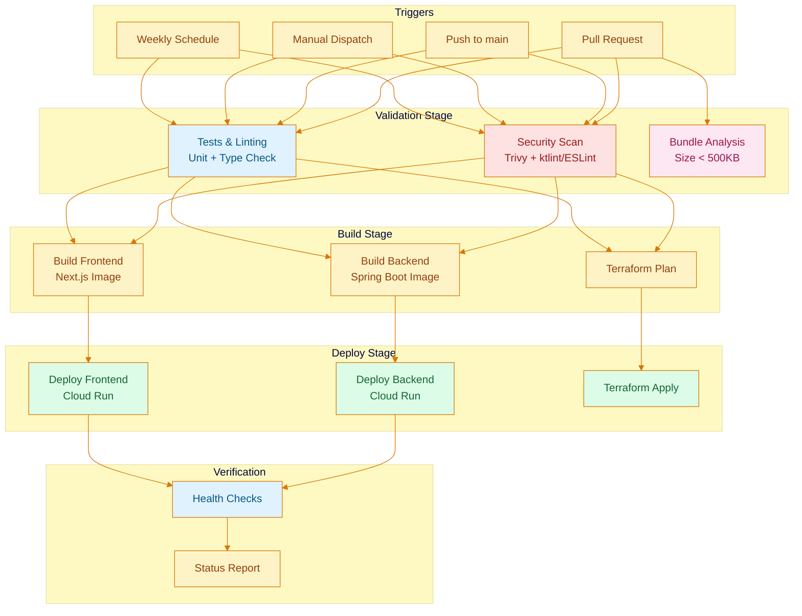
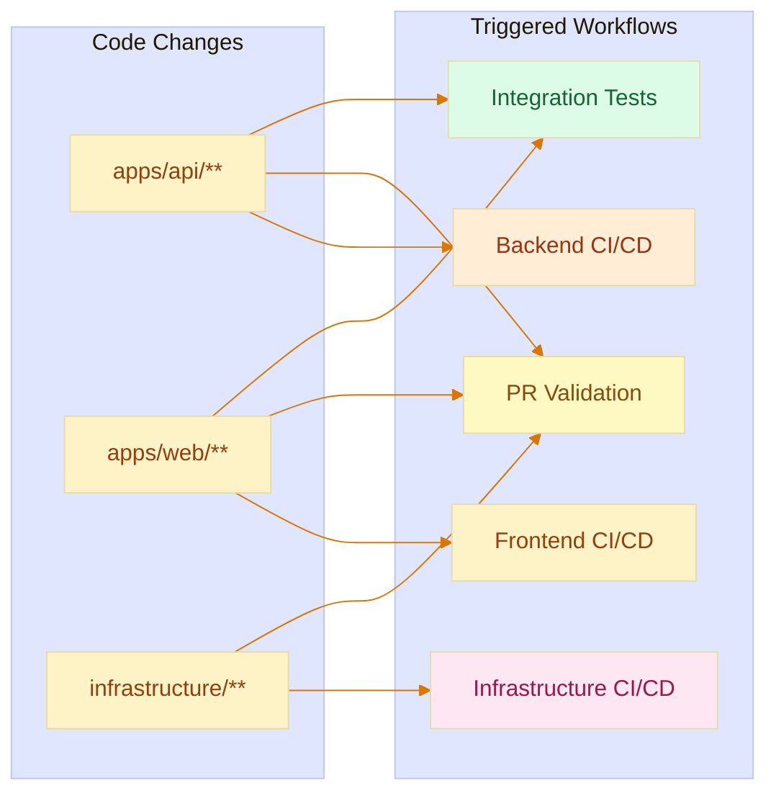

# CI/CD Pipeline

This document describes the Nos Ilha CI/CD pipeline architecture, workflow triggers, and deployment process.

## Pipeline Overview



## Workflows

The pipeline uses five modular workflows with path-based triggering for cost optimization.

### Workflow Summary

| Workflow | File | Triggers | Purpose |
|----------|------|----------|---------|
| Backend CI/CD | `backend-ci.yml` | `apps/api/**` changes | Build, test, deploy Spring Boot |
| Frontend CI/CD | `frontend-ci.yml` | `apps/web/**` changes | Build, lint, deploy Next.js |
| Infrastructure CI/CD | `infrastructure-ci.yml` | `infrastructure/**` changes | Terraform plan/apply |
| PR Validation | `pr-validation.yml` | All PRs | Status reporting, auto-merge |
| Integration Tests | `integration-ci.yml` | Main push, weekly | Health checks, security headers |

### Workflow Trigger Logic



## Backend CI/CD

**File:** `.github/workflows/backend-ci.yml`

### Triggers

- **Push to main:** `apps/api/**` (excludes `.md`, `.txt`, `README*`)
- **Pull requests:** `apps/api/**` changes
- **Manual dispatch:** Optional `deploy` and `force_deploy` inputs

### Jobs

| Job | Description | Condition |
|-----|-------------|-----------|
| `security-scan` | Trivy vulnerability scan, ktlint SARIF | Always |
| `test-and-lint` | JUnit + Testcontainers, ktlint, JaCoCo (70% coverage), Modulith verification | Always |
| `build` | Gradle `bootBuildImage`, push to Artifact Registry | Main branch only |
| `deploy-production` | Cloud Run deployment with health checks | Main branch + build success |

### Quality Gates

- **Coverage threshold:** 70% (enforced by JaCoCo)
- **Module boundaries:** Spring Modulith verification
- **Code style:** ktlint (detekt temporarily disabled for Java 25)
- **Security:** Trivy HIGH/CRITICAL vulnerabilities

### Cloud Run Configuration

```yaml
Service: nosilha-backend-api
Memory: 1Gi
CPU: 1
Min Instances: 0
Max Instances: 3
Timeout: 300s
```

## Frontend CI/CD

**File:** `.github/workflows/frontend-ci.yml`

### Triggers

- **Push to main:** `apps/web/**` (excludes `.md`, `.test.*`, `README*`)
- **Pull requests:** `apps/web/**` changes
- **Manual dispatch:** Optional `deploy` and `force_deploy` inputs

### Jobs

| Job | Description | Condition |
|-----|-------------|-----------|
| `security-scan` | Trivy vulnerability scan, ESLint SARIF | Always |
| `test-and-lint` | TypeScript check, ESLint, Velite content build, Next.js build | Always |
| `bundle-analysis` | Bundle size check (max 500KB) | PRs only |
| `build` | Docker build, push to Artifact Registry | Main branch only |
| `deploy-production` | Cloud Run deployment | Main branch + build success |

### Quality Gates

- **Type safety:** `tsc --noEmit`
- **Linting:** ESLint
- **Bundle size:** < 500KB (compressed)
- **Build success:** Next.js production build
- **Security:** Trivy HIGH/CRITICAL vulnerabilities

### Cloud Run Configuration

```yaml
Service: nosilha-frontend
Memory: 512Mi
CPU: 1
Min Instances: 0
Max Instances: 2
Timeout: 300s
```

### Testing Philosophy

Frontend uses a TypeScript-first approach in CI:
- **CI runs:** TypeScript compilation + ESLint + Next.js build
- **Local only:** Playwright E2E tests, Vitest unit tests

This provides 75% faster CI while maintaining quality through static analysis.

## Infrastructure CI/CD

**File:** `.github/workflows/infrastructure-ci.yml`

### Triggers

- **Push to main:** `infrastructure/**` changes
- **Pull requests:** `infrastructure/**` changes
- **Manual dispatch:** Configuration drift detection

### Jobs

| Job | Description | Condition |
|-----|-------------|-----------|
| `security-scan` | Trivy IaC security scan | Always |
| `validate` | Format check, init, validate | Always |
| `plan` | Terraform plan with PR comment | PRs only |
| `plan-comment` | Post plan output to PR | PRs only |
| `apply` | Terraform apply | Main branch push only |
| `drift-detection` | Check for configuration drift | Schedule/manual |

### Terraform Configuration

- **Version:** 1.12.2
- **State:** GCS bucket (`gs://nosilha-terraform-state-bucket`)
- **Provider caching:** Enabled for performance

## PR Validation

**File:** `.github/workflows/pr-validation.yml`

### Triggers

- **Pull requests:** All PRs to main
- **Pull request target:** For Dependabot PRs

### Jobs

| Job | Description |
|-----|-------------|
| `changes` | Nx-based change detection |
| `global-security-scan` | Full repository Trivy scan |
| `pr-status-report` | Aggregated status comment |
| `dependabot-auto-merge` | Auto-merge passing Dependabot PRs |

### Status Report

The workflow generates a PR comment showing:
- Components changed (Backend, Frontend, Infrastructure)
- Validation results from each service CI
- Overall merge readiness

## Integration Tests

**File:** `.github/workflows/integration-ci.yml`

### Triggers

- **Push to main:** After service deployments
- **Weekly schedule:** Mondays at 6 AM UTC
- **Manual dispatch:** On-demand testing

### Jobs

| Job | Description | Condition |
|-----|-------------|-----------|
| `changes` | Detect service changes | Always |
| `wait-for-services` | Wait for service builds | Any service changed |
| `api-integration-tests` | Testcontainers tests | Backend changed or scheduled |
| `security-integration` | Security headers validation | Any service changed |
| `deployment-health` | Cloud Run health checks | Any service changed |
| `integration-report` | Summary to GitHub Step Summary | Always |

## Security Scanning

**File:** `.github/workflows/reusable-security-scan.yml`

A reusable workflow called by service-specific pipelines.

### Scanning Tools

| Tool | Target | Severity |
|------|--------|----------|
| Trivy | Dependencies, containers, IaC | HIGH, CRITICAL |
| ktlint | Kotlin code style | All |
| ESLint | TypeScript/React | All (SARIF output) |

### SARIF Integration

All security findings upload to GitHub Security tab:
- `security-backend`: Backend Trivy results
- `security-frontend`: Frontend Trivy results
- `security-infrastructure`: Terraform Trivy results
- `code-quality-ktlint`: Kotlin style findings
- `eslint-frontend`: TypeScript/React findings

## Required Secrets

### GCP Service Account Permissions

The CI/CD service account requires these roles:
- `roles/run.admin` - Cloud Run administration
- `roles/artifactregistry.admin` - Artifact Registry management
- `roles/storage.admin` - Cloud Storage management
- `roles/iam.serviceAccountUser` - Service account usage
- `roles/secretmanager.accessor` - Secret Manager access

### GCP Authentication

```bash
GCP_PROJECT_ID          # GCP project ID
GCP_SA_KEY              # Service account JSON (base64)
# OR
GCP_WORKLOAD_IDENTITY   # Workload Identity Federation
```

### Application Secrets

```bash
NEXT_PUBLIC_API_URL               # Backend URL
NEXT_PUBLIC_MAPBOX_ACCESS_TOKEN   # Mapbox API token
NEXT_PUBLIC_SUPABASE_URL          # Supabase project URL
NEXT_PUBLIC_SUPABASE_ANON_KEY     # Supabase publishable key
NEXT_PUBLIC_GA_ID                 # Google Analytics (optional)
NEXT_PUBLIC_CLARITY_PROJECT_ID    # Microsoft Clarity (optional)
CODECOV_TOKEN                     # Codecov upload token
```

## Manual Deployment

### Using GitHub Actions

```bash
# Deploy backend
gh workflow run backend-ci.yml --ref main -f deploy=true

# Deploy frontend
gh workflow run frontend-ci.yml --ref main -f deploy=true

# Force deploy (bypasses change detection)
gh workflow run backend-ci.yml --ref main -f force_deploy=true

# Infrastructure
gh workflow run infrastructure-ci.yml --ref main
```

### Using gcloud CLI

```bash
# Get current service status
gcloud run services list --region=us-east1

# View deployment logs
gcloud logging read "resource.type=cloud_run_revision" --limit=100

# Manual health check
curl https://[SERVICE_URL]/actuator/health
```

## Troubleshooting

### Authentication Failures

```bash
# Verify service account permissions
gcloud projects get-iam-policy $GCP_PROJECT_ID \
    --flatten="bindings[].members" \
    --filter="bindings.members:serviceAccount:$SA_EMAIL"

# Required roles
# - roles/artifactregistry.admin
# - roles/run.admin
# - roles/iam.serviceAccountUser
# - roles/secretmanager.accessor
```

### Build Failures

```bash
# Backend - local verification
cd apps/api
./gradlew build --stacktrace
./gradlew test --info

# Frontend - local verification
cd apps/web
pnpm build
pnpm run lint
npx tsc --noEmit
```

### Deployment Failures

```bash
# Check Cloud Run logs
gcloud logs read --service=nosilha-backend-api --limit=50

# Describe service for configuration issues
gcloud run services describe nosilha-backend-api --region=us-east1

# Check revision status
gcloud run revisions list --service=nosilha-backend-api --region=us-east1
```

### Health Check Failures

The backend uses exponential backoff with up to 12 attempts:

```bash
# Test health endpoint directly
curl -v https://[SERVICE_URL]/actuator/health

# Expected response
{"status":"UP","components":{"db":{"status":"UP"},...}}
```

Common causes:
- **Cold start:** First request after scale-to-zero takes longer
- **Database connectivity:** Check Supabase connection string
- **Secret configuration:** Verify Terraform-managed secrets

### Terraform Lock Issues

```bash
# List existing locks
terraform force-unlock -force [LOCK_ID]

# The workflow includes automatic lock cleanup
# See: .github/scripts/terraform-lock-cleanup.sh
```

### Bundle Size Exceeded

If the frontend bundle exceeds 500KB:

```bash
# Analyze bundle
cd apps/web
pnpm build
npx @next/bundle-analyzer

# Common fixes:
# - Dynamic imports for large components
# - Remove unused dependencies
# - Use tree-shaking friendly imports
```

## Best Practices

### Branch Strategy

- **Feature branches** merged to `main` trigger deployment
- **Hotfix branches** for urgent fixes (same flow)
- No staging environment (cost optimization)

### Deployment Safety

- **Health checks** with retry and exponential backoff
- **Terraform-managed secrets** persist across revisions
- **Rollback:** Use previous container image tags

### Cost Optimization

- **Path-based triggers:** Only run relevant workflows
- **Scale-to-zero:** Min instances set to 0
- **Concurrency control:** Cancel in-progress duplicate runs
- **Test exclusions:** Frontend E2E runs locally only

## Local Validation

### Complete Test Suite

Before pushing changes, run this validation script:

```bash
#!/bin/bash
# Complete CI/CD Pipeline Validation

echo "📋 Infrastructure Validation"
cd infrastructure/terraform
terraform validate && echo "✅ Terraform validation passed"
terraform fmt -check -recursive && echo "✅ Terraform formatting passed"

echo "📋 Backend Testing"
cd ../../apps/api
./gradlew test && echo "✅ Backend tests passed"
./gradlew ktlintCheck && echo "✅ Backend linting passed"

echo "📋 Frontend Testing"
cd ../web
pnpm run lint && echo "✅ Frontend linting passed"
npx tsc --noEmit && echo "✅ TypeScript check passed"
pnpm run build && echo "✅ Frontend build passed"
```

### Spring Modulith Verification

```bash
cd apps/api

# Run module boundary verification
./gradlew test --tests "com.nosilha.core.ModularityTests"

# Generate module documentation
./gradlew test --tests "ModularityTests"
ls build/modulith/*.puml  # View generated diagrams
```

---

For secret management, see [docs/secret-management.md](./secret-management.md).
For security policy, see [SECURITY.md](../SECURITY.md).
