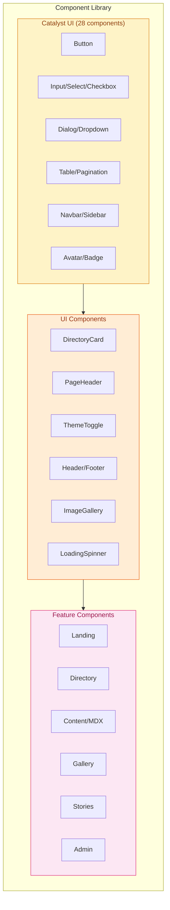

# Nos Ilha Design System

Frontend design system for the Nos Ilha cultural heritage platform. Built with Next.js 16, React 19, Tailwind CSS v4, and Catalyst UI components.

## Component Architecture



### Directory Structure

```
apps/web/src/components/
├── catalyst-ui/          # 28 Headless UI-based components
│   ├── button.tsx        # Solid, outline, plain variants
│   ├── input.tsx         # Form inputs with validation
│   ├── dialog.tsx        # Modal dialogs
│   ├── dropdown.tsx      # Dropdown menus
│   ├── table.tsx         # Data tables
│   ├── navbar.tsx        # Navigation bar
│   └── ...
├── ui/                   # Project-specific UI components
│   ├── directory-card.tsx
│   ├── page-header.tsx
│   ├── theme-toggle.tsx
│   ├── header.tsx
│   ├── footer.tsx
│   └── ...
├── content/              # MDX content components
├── directory/            # Directory feature components
├── landing/              # Homepage components
├── gallery/              # Gallery components
├── stories/              # Stories feature components
└── providers/            # React context providers
```

## Color System

The color system uses CSS custom properties defined in `globals.css` with automatic dark mode support via Tailwind CSS v4's `@variant dark`.

### Brand Palette

| Token | Light Mode | Dark Mode | Usage |
|-------|------------|-----------|-------|
| `ocean-blue` | `#0e4c75` | `#38bdf8` | Primary CTAs, links, focus rings |
| `ocean-blue-light` | `#2a769e` | - | Hover states, secondary accents |
| `valley-green` | `#2f6e4d` | - | Success states, nature elements |
| `bougainvillea-pink` | `#c02669` | `#f472b6` | Accent highlights, decorative |
| `sobrado-ochre` | `#d97706` | - | Warnings, warm accents |
| `sunny-yellow` | `#fbbf24` | - | Ratings, call-to-action |

### Neutral Scale (Bruma)

| Token | Hex | Usage |
|-------|-----|-------|
| `mist-50` | `#f8fafc` | Lightest backgrounds |
| `mist-100` | `#f1f5f9` | Secondary backgrounds |
| `mist-200` | `#e2e8f0` | Borders, dividers |
| `basalt-500` | `#64748b` | Secondary text |
| `basalt-800` | `#1e293b` | Dark surfaces |
| `basalt-900` | `#0f172a` | Primary text (light mode) |

### Semantic Tokens

Use these tokens for automatic dark mode support:

```css
/* Backgrounds */
--color-canvas       /* Page background: white / #0b1120 */
--color-surface      /* Cards, panels: mist-50 / #1e293b */
--color-surface-alt  /* Hover states: mist-100 / #334155 */

/* Text */
--color-body         /* Primary text: basalt-900 / #f1f5f9 */
--color-muted        /* Secondary text: basalt-500 / #94a3b8 */
--color-brand        /* Brand text: ocean-blue / #7dd3fc */

/* Borders */
--color-hairline     /* Subtle borders: mist-200 / #334155 */
--color-edge         /* Strong borders: basalt-500 / #475569 */
```

### Usage Patterns

```tsx
// Semantic tokens (automatic dark mode)
<div className="bg-canvas text-body border-hairline">
  <h1 className="text-body">Heading</h1>
  <p className="text-muted">Secondary text</p>
</div>

// Backward-compatible aliases
<div className="bg-background-primary text-text-primary border-border-primary">

// Brand colors for specific elements
<button className="bg-ocean-blue hover:bg-ocean-blue/90 text-white">
  Primary Action
</button>

// Status colors
<div className="bg-status-error/10 text-status-error border-status-error/20">
  Error message
</div>
```

### Status Colors

| Token | Hex | Usage |
|-------|-----|-------|
| `status-error` | `#be123c` | Error states, destructive actions |
| `status-success` | `#15803d` | Success confirmations |
| `status-warning` | `#b45309` | Warnings, caution |

## Typography

### Font Stack

```css
--font-sans: "Outfit", system-ui, sans-serif;   /* Body, UI */
--font-serif: "Fraunces", Georgia, serif;        /* Headings */
```

**Outfit** (Sans-serif): Geometric, modern, brand-focused. Used for body text, UI elements, navigation, and forms. Weights: 400, 500, 600, 700.

**Fraunces** (Serif): Variable font with SOFT, WONK, and opsz axes. Traditional, warm, captures Brava's literary heritage. Used for headings and storytelling. Weights: 400, 500, 700.

### Typography Scale

| Element | Font | Size (Mobile) | Size (Desktop) |
|---------|------|---------------|----------------|
| H1 | Fraunces Bold | `text-4xl` | `text-5xl/6xl` |
| H2 | Fraunces Bold | `text-3xl` | `text-4xl` |
| H3 | Fraunces Medium | `text-2xl` | `text-3xl` |
| Body | Outfit Regular | `text-base` | `text-lg` |
| Caption | Outfit Regular | `text-sm` | `text-sm` |
| Button | Outfit Semibold | `text-sm` | `text-base` |

### Usage

```tsx
<h1 className="font-serif text-4xl font-bold sm:text-5xl">Page Title</h1>
<h2 className="font-serif text-3xl font-bold">Section</h2>
<p className="font-sans text-base text-muted">Body text</p>
<button className="font-sans text-sm font-semibold">Button</button>
```

## Layout & Responsive Design

### Breakpoints

Standard Tailwind CSS breakpoints:

| Breakpoint | Width | Usage |
|------------|-------|-------|
| `sm` | 640px | Small tablets |
| `md` | 768px | Tablets |
| `lg` | 1024px | Desktop |
| `xl` | 1280px | Large desktop |
| `2xl` | 1536px | Extra large |
| `print` | @media print | Print styles |

### Container Patterns

```tsx
// Standard content container
<div className="mx-auto max-w-7xl px-6 lg:px-8">

// Centered content
<div className="mx-auto max-w-2xl lg:text-center">

// Section spacing
<section className="py-20 sm:py-24">
```

### Grid Systems

```tsx
// 1-2-4 column responsive grid
<div className="grid grid-cols-1 gap-8 md:grid-cols-2 lg:grid-cols-4">

// Feature grid
<div className="grid grid-cols-1 gap-x-8 gap-y-10 lg:grid-cols-3">
```

## Dark Mode

Three-mode theme system: System (default), Light, Dark.

### Implementation

The theme is managed by `ThemeToggle` component with state persisted to localStorage. Theme class is applied to `<html>` element.

```tsx
// Theme toggle cycles: system -> light -> dark -> system
<ThemeToggle />

// With light variant for dark backgrounds
<ThemeToggle variant="light" />
```

### Color Mapping (Volcanic Night)

| Element | Light Mode | Dark Mode |
|---------|------------|-----------|
| Page background | white | `#0b1120` |
| Surface | `mist-50` | `#1e293b` |
| Primary text | `basalt-900` | `#f1f5f9` |
| Secondary text | `basalt-500` | `#94a3b8` |
| Ocean blue | `#0e4c75` | `#38bdf8` |
| Pink | `#c02669` | `#f472b6` |

## Key Components

### Button (Catalyst UI)

```tsx
import { Button } from "@/components/catalyst-ui/button";

// Solid variants
<Button color="blue">Primary</Button>
<Button color="dark">Secondary</Button>
<Button color="red">Destructive</Button>

// Outline and plain
<Button outline>Outline</Button>
<Button plain>Plain</Button>

// As link
<Button href="/path" color="blue">Link Button</Button>
```

### PageHeader

```tsx
import { PageHeader } from "@/components/ui/page-header";

<PageHeader
  title="Directory"
  subtitle="Explore Brava's cultural sites"
  as="h1"           // h1 or h2
  showAccentBar     // Pink accent bar
  centered          // Center alignment
  size="large"      // large or default
/>
```

### DirectoryCard

```tsx
import { DirectoryCard } from "@/components/ui/directory-card";

<DirectoryCard
  entry={directoryEntry}
  showBookmark={true}
/>

// Features:
// - Image with category badge and bookmark button
// - Name, location, rating, description
// - Tags as hashtag pills
// - Hover animations
```

### Card (Base)

```tsx
import { Card } from "@/components/ui/card";

<Card className="p-6">
  {/* Card content */}
</Card>

// Content Card with title
import { Card } from "@/components/content/card";

<Card title="Section Title">
  {/* Content */}
</Card>
```

### ThemeToggle

```tsx
import { ThemeToggle } from "@/components/ui/theme-toggle";

<ThemeToggle />                           // Default style
<ThemeToggle variant="light" />           // For dark backgrounds
<ThemeToggle showContainer={false} />     // Icon only
```

## Animation System

### Built-in Animations

```css
/* Custom keyframes in globals.css */
.animate-glow          /* Ocean blue glow effect */
.animate-fog-flow      /* Mist flow animation */
.animate-pulse-subtle  /* Subtle pulse */
.animate-slide-up      /* Entrance animation */
.animate-fade-in       /* Fade in */

/* Content action toolbar */
.animate-bounce-reaction
.animate-scale-share
.animate-fab-expand
.animate-fab-collapse
```

### Motion Patterns

```tsx
// Framer Motion entrance
<motion.div
  initial={{ opacity: 0, y: 20 }}
  animate={{ opacity: 1, y: 0 }}
  transition={{ duration: 0.6 }}
>

// Hover effects with Tailwind
className="transition-all duration-300 hover:-translate-y-1 hover:shadow-xl"
className="transition-transform duration-500 group-hover:scale-105"
```

### Reduced Motion

```css
@media (prefers-reduced-motion: reduce) {
  *, *::before, *::after {
    animation-duration: 0.01ms !important;
    transition-duration: 0.01ms !important;
  }
}
```

## Accessibility

### Focus States

```tsx
// Standard focus ring
className="focus:outline-none focus-visible:ring-2 focus-visible:ring-ocean-blue focus-visible:ring-offset-2"

// Focus ring utility class
className="focus-ring"
```

### Touch Targets

```tsx
// Minimum 44x44px touch target
className="min-h-[44px] min-w-[44px]"
className="touch-target"  // Utility class

// TouchTarget component in Button
<TouchTarget>{children}</TouchTarget>
```

### Screen Reader Support

```tsx
// Skip link
<a href="#main-content" className="sr-only focus:not-sr-only ...">
  Skip to main content
</a>

// Hidden text
<span className="sr-only">Open menu</span>

// ARIA labels
aria-label={`View details for ${entry.name}`}
aria-current={isActive ? "page" : undefined}
```

## Print Styles

Print-specific styles in `globals.css`:

```css
@media print {
  body { font-family: var(--font-serif); font-size: 12pt; }
  a[href^="http"]::after { content: " (" attr(href) ")"; }
  .no-print { display: none; }
  @page { margin: 2cm; }
}
```

```tsx
// Print-only content
<div className="print:block hidden">Print version</div>

// Hide from print
<nav className="no-print">...</nav>
```

## Utility Classes

### Hover Surfaces

```css
.hover-surface         /* Subtle hover: mist-50 / basalt-800/50 */
.hover-surface-strong  /* Strong hover: mist-200 / basalt-800 */
```

### Glassmorphism

```css
.glass-panel  /* backdrop-blur-md, semi-transparent background */
```

## Development Guidelines

### Component Styling Pattern

```tsx
import clsx from "clsx";

const Component = ({ className, ...props }) => (
  <div
    className={clsx(
      // Base layout
      "rounded-lg p-4",
      // Semantic colors (auto dark mode)
      "bg-surface text-body border-hairline",
      // Interactive states
      "hover:bg-surface-alt transition-colors",
      // Custom classes
      className
    )}
    {...props}
  />
);
```

### Color Selection Guide

| Building... | Use | Example |
|-------------|-----|---------|
| Cards, sections | Semantic | `bg-surface` |
| Text content | Semantic | `text-body`, `text-muted` |
| Borders | Semantic | `border-hairline` |
| CTAs, buttons | Brand | `bg-ocean-blue` |
| Decorative | Brand | `text-bougainvillea-pink` |
| Status feedback | Status | `text-status-error` |

### Checklist for New Components

- [ ] Uses semantic color tokens
- [ ] Responsive (mobile-first)
- [ ] Keyboard accessible
- [ ] Focus states visible
- [ ] Touch targets 44x44px minimum
- [ ] Respects reduced motion
- [ ] Works in light and dark modes

## Key Files

| File | Purpose |
|------|---------|
| `apps/web/src/app/globals.css` | Color tokens, animations |
| `apps/web/src/app/layout.tsx` | Font loading, theme init |
| `apps/web/tailwind.config.ts` | Tailwind configuration |
| `apps/web/src/stores/uiStore.ts` | Theme state management |
