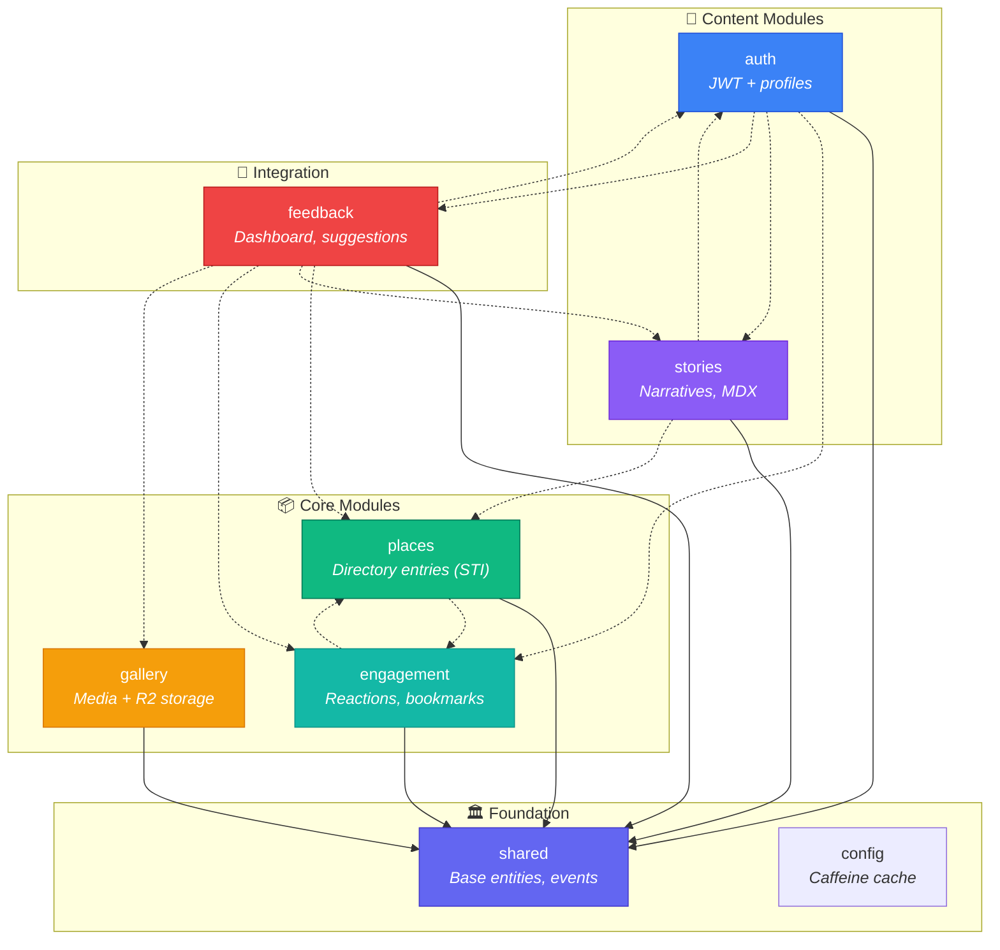
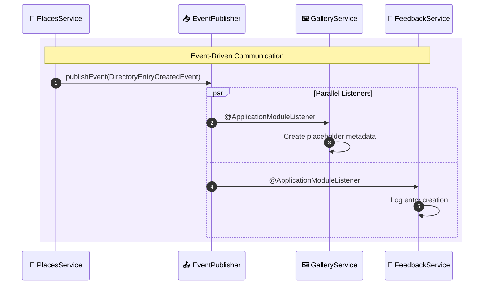

# Spring Modulith Guide

This guide covers the Spring Modulith architecture implemented in the Nos Ilha backend. For high-level architecture, see [architecture.md](architecture.md).

---

## Overview

Spring Modulith structures the backend as a **modular monolith** with:
- Enforced module boundaries (verified by tests)
- Event-driven communication between modules
- Auto-generated documentation (PlantUML diagrams)

---

## Module Structure

```
apps/api/src/main/kotlin/com/nosilha/core/
├── shared/       # Foundation layer (no dependencies)
├── auth/         # Authentication + profiles
├── places/       # Directory entries (STI pattern)
├── gallery/      # Media management
├── engagement/   # Reactions, bookmarks
├── stories/      # Community narratives
├── feedback/     # Suggestions, submissions, dashboard
└── config/       # Cache configuration
```

### Module Dependencies



---

## Module Details

### 1. Shared Module

**Package**: `com.nosilha.core.shared`
**Purpose**: Foundation layer with common infrastructure

| Subpackage | Contents |
|------------|----------|
| `domain/` | `AuditableEntity` (createdAt, updatedAt) |
| `events/` | `DomainEvent`, `ApplicationModuleEvent` |
| `api/` | `ApiResult`, DTOs |
| `exception/` | `GlobalExceptionHandler`, custom exceptions |
| `util/` | `ContentSanitizer` |
| `config/` | `JacksonConfig`, `PersistenceConfig` |

**Dependencies**: None (foundation layer)

### 2. Auth Module

**Package**: `com.nosilha.core.auth`
**Purpose**: Authentication, authorization, and profile management

| Component | Description |
|-----------|-------------|
| `ProfileController` | Profile management endpoints |
| `UserProfileQueryService` | Cross-module profile queries |
| `SecurityConfig` | Spring Security configuration |
| `SupabaseJwtAuthenticationConverter` | JWT validation |

**Dependencies**: `shared`, `engagement`, `stories`, `feedback`

**Events Published**:
- `UserLoggedInEvent`
- `UserLoggedOutEvent`

### 3. Places Module

**Package**: `com.nosilha.core.places`
**Purpose**: Directory entries with Single Table Inheritance

| Entity Type | Discriminator |
|-------------|---------------|
| Restaurant | `RESTAURANT` |
| Hotel | `HOTEL` |
| Beach | `BEACH` |
| Heritage | `HERITAGE` |
| Nature | `NATURE` |

**Dependencies**: `shared`, `engagement`

**Events Published**:
- `DirectoryEntryCreatedEvent`
- `DirectoryEntryUpdatedEvent`
- `DirectoryEntryDeletedEvent`

**Single Table Inheritance Pattern**:
```kotlin
@Entity
@Table(name = "directory_entries")
@Inheritance(strategy = InheritanceType.SINGLE_TABLE)
@DiscriminatorColumn(name = "category")
abstract class DirectoryEntry : AuditableEntity()

@Entity
@DiscriminatorValue("RESTAURANT")
class Restaurant : DirectoryEntry()
```

### 4. Gallery Module

**Package**: `com.nosilha.core.gallery`
**Purpose**: Media management (user uploads + external content)

| Component | Description |
|-----------|-------------|
| `GalleryController` | User upload endpoints |
| `AdminGalleryController` | Moderation endpoints |
| `R2StorageService` | Cloudflare R2 integration |
| `MediaQueryService` | Cross-module media queries |

**Dependencies**: `shared`

**Storage Strategy**:
- User uploads → Cloudflare R2 (presigned PUT URLs)
- External media → Platform-hosted (YouTube, Vimeo)
- Metadata → PostgreSQL

### 5. Engagement Module

**Package**: `com.nosilha.core.engagement`
**Purpose**: User interactions with content

| Entity | Description |
|--------|-------------|
| `Reaction` | User reactions (love, celebrate, insightful, support) |
| `Bookmark` | Saved content |
| `Content` | Content registration |

**Dependencies**: `shared`, `places`

### 6. Stories Module

**Package**: `com.nosilha.core.stories`
**Purpose**: Community narratives and MDX publishing

| Component | Description |
|-----------|-------------|
| `StoryController` | Story submission endpoints |
| `AdminStoryController` | Moderation endpoints |
| `MdxGenerationService` | MDX file generation |
| `StoriesQueryService` | Cross-module story queries |

**Dependencies**: `shared`, `auth`, `places`

**Events Published**:
- `StorySubmittedEvent`
- `StoryStatusChangedEvent`
- `StoryPublishedEvent`
- `MdxCommittedEvent`

### 7. Feedback Module

**Package**: `com.nosilha.core.feedback`
**Purpose**: Community feedback and admin dashboard

| Channel | Description |
|---------|-------------|
| Suggestions | Corrections, additions, feedback |
| Directory Submissions | User-proposed locations |
| Contact Messages | General inquiries |
| Dashboard | Aggregate statistics |

**Dependencies**: `shared`, `auth`, `places`, `stories`, `engagement`, `gallery`

### 8. Config Module

**Package**: `com.nosilha.core.config`
**Purpose**: Application-wide configuration

```kotlin
@Configuration
@EnableCaching
class CacheConfig {
    @Bean
    fun cacheManager(): CacheManager {
        return CaffeineCacheManager().apply {
            setCaffeine(
                Caffeine.newBuilder()
                    .maximumSize(500)
                    .expireAfterWrite(Duration.ofMinutes(5))
            )
        }
    }
}
```

**Dependencies**: None

---

## Event-Driven Communication

### Pattern

Modules communicate via domain events instead of direct dependencies:



### Publishing Events

```kotlin
@Service
class DirectoryEntryService(
    private val repository: DirectoryEntryRepository,
    private val eventPublisher: ApplicationEventPublisher
) {
    fun createEntry(entry: DirectoryEntry): DirectoryEntry {
        val saved = repository.save(entry)
        eventPublisher.publishEvent(
            DirectoryEntryCreatedEvent(saved.id!!, saved.name)
        )
        return saved
    }
}
```

### Listening to Events

```kotlin
@Service
class GalleryService {
    @ApplicationModuleListener
    fun onDirectoryEntryCreated(event: DirectoryEntryCreatedEvent) {
        logger.info("Creating placeholder for: ${event.name}")
    }
}
```

---

## Query Service Pattern

For cross-module data access, modules expose read-only query interfaces:

```kotlin
// stories/api/StoriesQueryService.kt (public interface)
interface StoriesQueryService {
    fun getStoryCount(): Long
    fun getRecentStories(limit: Int): List<StoryDto>
}

// stories/services/StoriesQueryServiceImpl.kt (internal)
@Service
internal class StoriesQueryServiceImpl(
    private val repository: StorySubmissionRepository
) : StoriesQueryService {
    override fun getStoryCount() = repository.count()
}
```

**Query Services**:
- `StoriesQueryService` - Stories module
- `MediaQueryService` - Gallery module
- `PlacesQueryService` - Places module
- `UserProfileQueryService` - Auth module

---

## Module Visibility Rules

| Access Level | Location | Visibility |
|--------------|----------|------------|
| Public | `api/` controllers | Accessible from other modules |
| Public | `events/` | Accessible from other modules |
| Public | Query services | Accessible from other modules |
| Internal | `domain/` services | Package-private |
| Internal | `repository/` | Package-private |
| Internal | Domain entities | Package-private |

---

## Verification Testing

### Module Tests

**Location**: `apps/api/src/test/kotlin/com/nosilha/core/ModularityTests.kt`

```kotlin
class ModularityTests {
    private val modules = ApplicationModules.of("com.nosilha.core")

    @Test
    fun `verify module structure`() {
        modules.verify()
    }

    @Test
    fun `generate module documentation`() {
        Documenter(modules)
            .writeModulesAsPlantUml()
            .writeIndividualModulesAsPlantUML()
    }
}
```

### Running Tests

```bash
# Verify module boundaries
./gradlew test --tests "ModularityTests"

# View generated diagrams
ls build/modulith/*.puml
```

---

## Adding New Modules

### 1. Create Structure

```bash
mkdir -p src/main/kotlin/com/nosilha/core/newmodule/{api,domain,repository,events}
```

### 2. Add Module Metadata

```kotlin
// newmodule/NewModuleMetadata.kt
@PackageInfo
@ApplicationModule(
    displayName = "New Module",
    allowedDependencies = [
        "shared :: api",
        "shared :: domain",
        "shared :: events",
        "shared :: exception",
    ],
    type = ApplicationModule.Type.OPEN,
)
class NewModuleMetadata
```

### 3. Implement Components

```kotlin
// newmodule/api/NewController.kt
@RestController
@RequestMapping("/api/v1/new")
class NewController(private val service: NewService)

// newmodule/domain/NewService.kt
@Service
internal class NewService(
    private val repository: NewRepository,
    private val eventPublisher: ApplicationEventPublisher
)

// newmodule/events/NewCreatedEvent.kt
data class NewCreatedEvent(val id: UUID) : ApplicationModuleEvent
```

### 4. Verify

```bash
./gradlew test --tests "ModularityTests"
```

---

## Best Practices

### Do

- Keep modules focused on single responsibility
- Use events for cross-module communication
- Expose only controllers, events, and query services
- Make services `internal` (package-private)
- Test module boundaries with `ModularityTests`

### Don't

- Import services from other modules directly
- Create circular dependencies
- Expose domain entities outside the module
- Skip module boundary verification

---

## Troubleshooting

### Module Boundary Violation

**Error**: `Module 'places' depends on 'gallery' but this is not allowed`

**Solution**: Use events instead of direct dependencies
```kotlin
// Before (wrong)
class DirectoryService(private val galleryService: GalleryService)

// After (correct)
class DirectoryService(private val eventPublisher: ApplicationEventPublisher)
```

### Event Not Received

**Symptom**: `@ApplicationModuleListener` not triggering

**Checklist**:
1. Event is being published
2. Listener method signature matches event type
3. Listener class is a Spring-managed bean (`@Service`)
4. Module allows dependency on the event source

### Circular Dependency

**Symptom**: Spring fails to start

**Solution**: Break the cycle by introducing events or query services

---

## Related Documentation

- [Architecture](architecture.md) - High-level system overview
- [API Coding Standards](api-coding-standards.md) - Backend conventions
- [Testing](testing.md) - Test strategy
