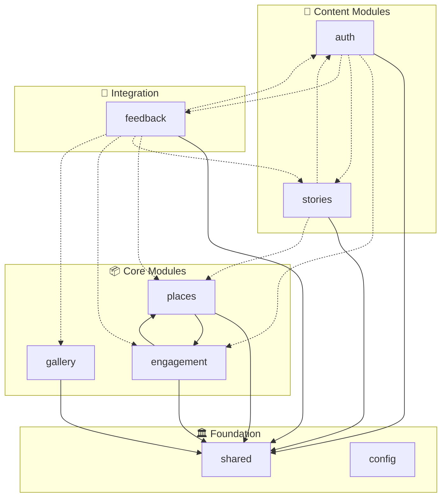
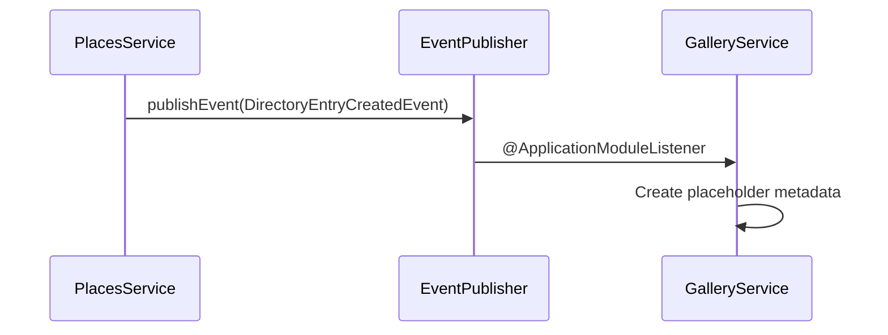

# Spring Modulith Guide

Spring Modulith architecture for the Nos Ilha backend. See [architecture.md](architecture.md) for system overview.

## Overview

The backend is a **modular monolith** with enforced module boundaries, event-driven communication, and auto-generated PlantUML documentation.

## Module Structure

```
apps/api/src/main/kotlin/com/nosilha/core/
├── shared/       # Foundation layer (no dependencies)
├── auth/         # Authentication + profiles
├── places/       # Directory entries (STI pattern)
├── gallery/      # Media management
├── engagement/   # Reactions, bookmarks
├── stories/      # Community narratives
├── feedback/     # Suggestions, dashboard
└── config/       # Cache configuration
```

### Module Dependencies



**Legend**: Solid lines = direct dependency, dashed = via query service/events

---

## Modules

| Module | Purpose | Dependencies | Events Published |
|--------|---------|--------------|------------------|
| **shared** | Base entities, events, exceptions, utils | None | — |
| **auth** | JWT auth, profiles, Supabase integration | shared, engagement, stories, feedback | `UserLoggedInEvent`, `UserLoggedOutEvent` |
| **places** | Directory entries (Restaurant, Hotel, Beach, Heritage, Nature) | shared, engagement | `DirectoryEntryCreatedEvent`, `DirectoryEntryUpdatedEvent`, `DirectoryEntryDeletedEvent` |
| **gallery** | Media uploads, R2 storage, moderation | shared | `HeroImagePromotedEvent` |
| **engagement** | Reactions, bookmarks, content registration | shared, places | — |
| **stories** | Community narratives, MDX publishing | shared, auth, places | `StorySubmittedEvent`, `StoryStatusChangedEvent`, `StoryPublishedEvent`, `MdxCommittedEvent` |
| **feedback** | Suggestions, submissions, dashboard | shared, auth, places, stories, engagement, gallery | — |
| **config** | Caffeine cache configuration | None | — |

### Shared Module Subpackages

| Subpackage | Contents |
|------------|----------|
| `api/` | `ApiResult`, DTOs |
| `config/` | `JacksonConfig`, `PersistenceConfig` |
| `domain/` | `AuditableEntity` |
| `events/` | `DomainEvent`, `ApplicationModuleEvent`, `DirectoryEntry*Event`, `HeroImagePromotedEvent` |
| `exception/` | `GlobalExceptionHandler`, custom exceptions |
| `service/` | Shared services |
| `util/` | `ContentSanitizer` |

### Query Services

Cross-module read-only access via public interfaces in `api/` packages:

| Service | Module | Purpose |
|---------|--------|---------|
| `UserProfileQueryService` | auth | Profile lookups |
| `PlacesQueryService` | places | Directory entry queries |
| `MediaQueryService` | gallery | Media metadata queries |
| `StoriesQueryService` | stories | Story queries |

**Pattern**: Interface in `module/api/` (public), implementation in `module/` (internal)

---

## Event-Driven Communication

Modules communicate via events instead of direct service dependencies:



**Key listeners**:
- `GalleryService.onDirectoryEntryCreated()` — creates placeholder metadata
- `DirectoryEntryService.onHeroImagePromoted()` — updates entry's imageUrl
- `MdxFileWriter.onMdxCommitted()` — writes MDX files

---

## Module Visibility Rules

| Location | Visibility |
|----------|------------|
| `api/` controllers, query services | Public (cross-module) |
| `events/` | Public (cross-module) |
| `domain/` services, `repository/` | Internal (package-private) |

---

## Verification

```bash
# Verify module boundaries
./gradlew test --tests "ModularityTests"

# View generated diagrams
ls build/modulith/*.puml
```

---

## Adding New Modules

1. Create structure: `mkdir -p src/main/kotlin/com/nosilha/core/newmodule/{api,domain,repository,events}`
2. Add `NewModuleMetadata.kt` with `@ApplicationModule` annotation
3. Declare `allowedDependencies` (e.g., `"shared :: api"`, `"shared :: domain"`)
4. Implement controller in `api/`, services as `internal` in `domain/`
5. Run `./gradlew test --tests "ModularityTests"` to verify

---

## Best Practices

- Use events for cross-module communication (not direct service imports)
- Expose only controllers, events, and query services publicly
- Make domain services `internal` (package-private)
- Test module boundaries with `ModularityTests`
- Avoid circular dependencies — break cycles with events or query services

---

## Troubleshooting

| Problem | Solution |
|---------|----------|
| Module boundary violation | Use events instead of direct service dependencies |
| `@ApplicationModuleListener` not triggering | Verify: event published, signature matches, class is `@Service`, module allows dependency |
| Circular dependency | Introduce events or query services to break the cycle |

---

## Related Documentation

- [Architecture](architecture.md) — System overview
- [API Coding Standards](api-coding-standards.md) — Backend conventions
- [Testing](testing.md) — Test strategy
