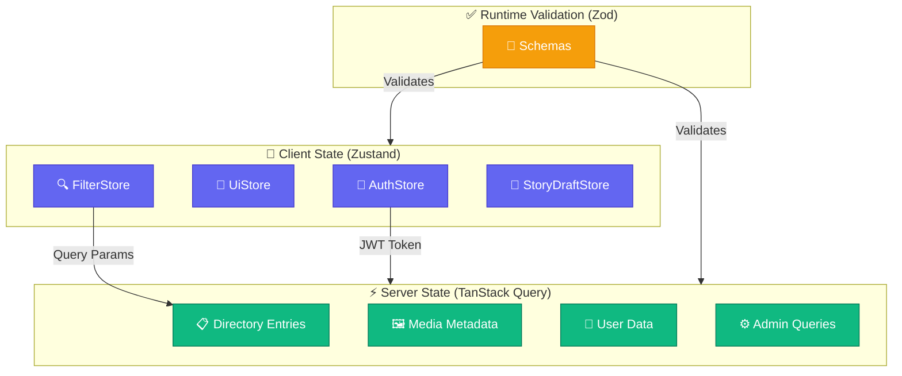
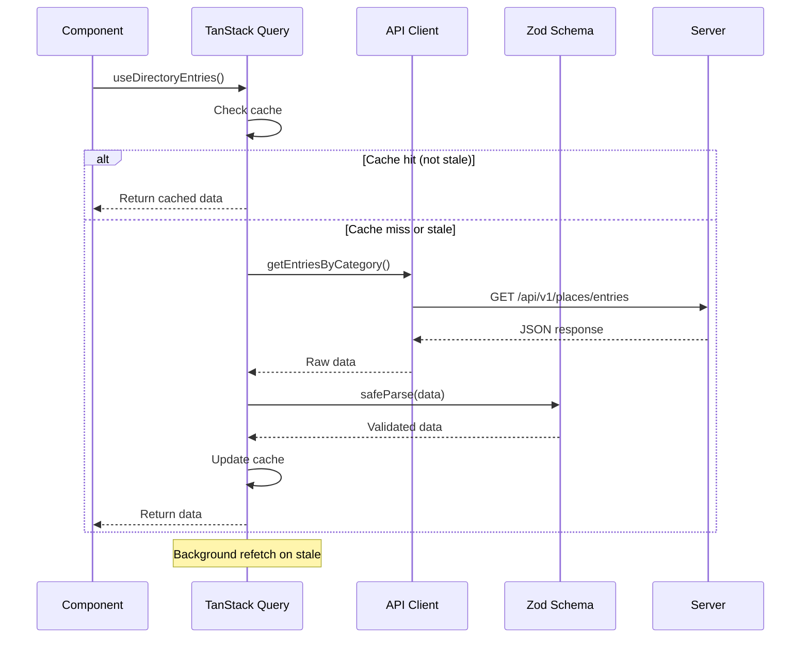
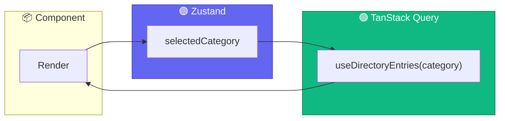

# State Management Guide

This document provides technical guidance on state management in the Nos Ilha frontend application, covering Zustand for client state, TanStack Query for server state, and Zod for runtime validation.

---

## 1. Architecture Overview

### 1.1 State Layer Separation



### 1.2 File Structure

```
apps/web/src/
├── stores/                      # Zustand stores (client state)
│   ├── authStore.ts            # Authentication + session
│   ├── uiStore.ts              # Theme, modals, sidebar
│   ├── filterStore.ts          # Search/filter parameters
│   ├── storyDraftStore.ts      # Story draft persistence
│   └── index.ts                # Barrel exports
├── hooks/queries/               # TanStack Query hooks (server state)
│   ├── useDirectoryEntries.ts  # Paginated directory listing
│   ├── useDirectoryEntry.ts    # Single entry by slug
│   ├── useMediaMetadata.ts     # Media metadata
│   ├── useUnifiedSearch.ts     # Cross-category search
│   ├── use-bookmarks.ts        # User bookmarks
│   ├── use-contributions.ts    # User contributions
│   ├── admin/                  # Admin-specific queries
│   └── index.ts                # Barrel exports
└── schemas/                     # Zod validation schemas
    ├── directoryEntrySchema.ts # Directory entry validation
    ├── authSchema.ts           # Login/signup forms
    ├── filterSchema.ts         # Filter parameters
    ├── userProfileSchema.ts    # User profile data
    ├── mediaMetadataSchema.ts  # Media metadata
    ├── adminSchemas.ts         # Admin operations
    └── index.ts                # Barrel exports
```

---

## 2. Zustand: Client State

### 2.1 Store Summary

| Store | Persistence | Purpose |
|-------|-------------|---------|
| `useAuthStore` | LocalStorage (user only) | Authentication state, session, user data |
| `useUiStore` | LocalStorage (theme only) | Theme, modals, sidebar state |
| `useFilterStore` | None (URL is source of truth) | Search query, category, filters |
| `useStoryDraftStore` | LocalStorage | Story draft auto-save |

### 2.2 AuthStore

Manages authentication state with Supabase integration.

```typescript
// apps/web/src/stores/authStore.ts
interface AuthState {
  user: AuthUser | null;
  session: Session | null;
  isLoading: boolean;
  setUser: (user: AuthUser | null) => void;
  setSession: (session: Session | null) => void;
  setLoading: (isLoading: boolean) => void;
  logout: () => void;
}

// Pre-built selectors for optimized re-renders
export const useUser = () => useAuthStore((state) => state.user);
export const useSession = () => useAuthStore((state) => state.session);
export const useAuthLoading = () => useAuthStore((state) => state.isLoading);
export const useIsAuthenticated = () => useAuthStore((state) => state.user !== null);
```

### 2.3 FilterStore

Manages directory search and filter state. Does not persist (URL is source of truth).

```typescript
// apps/web/src/stores/filterStore.ts
type SortByValue = "name_asc" | "name_desc" | "rating_desc" | "created_at_desc" | "relevance";

interface FilterState {
  searchQuery: string;
  selectedCategory: CategoryValue | undefined;
  selectedTown: string | undefined;
  minRating: number | undefined;
  hasImage: boolean | undefined;
  sortBy: SortByValue;
  selectedCategories: string[];  // Multi-select for map filtering
  // Actions...
  hasActiveFilters: () => boolean;
}

// Pre-built selectors
export const useSearchQuery = () => useFilterStore((state) => state.searchQuery);
export const useSelectedCategory = () => useFilterStore((state) => state.selectedCategory);
export const useHasActiveFilters = () => useFilterStore((state) => state.hasActiveFilters());
```

### 2.4 UiStore

Manages UI preferences and transient state.

```typescript
// apps/web/src/stores/uiStore.ts
type Theme = "light" | "dark" | "system";
type ModalType = "login" | "signup" | "filter" | "share" | null;

interface UiState {
  theme: Theme;
  activeModal: ModalType;
  filterPanelOpen: boolean;
  sidebarOpen: boolean;
  // Actions...
}

// Pre-built selectors
export const useTheme = () => useUiStore((state) => state.theme);
export const useActiveModal = () => useUiStore((state) => state.activeModal);
```

### 2.5 StoryDraftStore

Persists story drafts for resume capability.

```typescript
// apps/web/src/stores/storyDraftStore.ts
interface StoryDraftData {
  title: string;
  content: string;
  storyType?: StoryType;
  templateType?: StoryTemplate;
}

interface StoryDraftState {
  draft: StoryDraftData | null;
  lastSaved: string | null;
  setDraft: (data: Partial<StoryDraftData>) => void;
  updateDraft: (data: Partial<StoryDraftData>) => void;
  clearDraft: () => void;
  hasDraft: () => boolean;
}
```

### 2.6 Best Practices

```typescript
// Always use selective subscriptions
const user = useAuthStore((state) => state.user);          // Re-renders only when user changes
const { user } = useAuthStore();                           // Re-renders on ANY store change

// Use pre-built selectors when available
const isAuthenticated = useIsAuthenticated();              // Optimized
const theme = useTheme();                                  // Optimized
```

---

## 3. TanStack Query: Server State

### 3.1 Query Data Flow



### 3.2 Query Hooks Summary

| Hook | Query Key | Stale Time | Purpose |
|------|-----------|------------|---------|
| `useDirectoryEntries` | `["directory", "entries", category, page, size]` | 5 min | Paginated listing |
| `useDirectoryEntry` | `["directory", "entry", slug]` | 10 min | Single entry |
| `useUnifiedSearch` | `["search", query]` | 5 min | Cross-category search |
| `useBookmarks` | `["bookmarks", userId]` | 5 min | User bookmarks |
| `useContributions` | `["contributions", userId]` | 5 min | User submissions |

### 3.3 Directory Entries Hook

```typescript
// apps/web/src/hooks/queries/useDirectoryEntries.ts
export function useDirectoryEntries(
  category: string = "all",
  page: number = 0,
  size: number = 20,
  options?: UseQueryOptions
) {
  return useQuery<PaginatedResult<DirectoryEntry>, Error>({
    queryKey: ["directory", "entries", category, page, size],
    queryFn: async () => {
      const result = await getEntriesByCategory(category, page, size);

      // Runtime validation with Zod
      const validated = directoryEntriesSchema.safeParse(result.items);
      if (!validated.success) {
        console.error("Validation failed:", validated.error.format());
        return result;  // Graceful degradation
      }

      return { items: validated.data, pagination: result.pagination };
    },
    staleTime: 5 * 60 * 1000,   // 5 minutes
    gcTime: 30 * 60 * 1000,     // 30 minutes (formerly cacheTime)
    ...options,
  });
}
```

### 3.4 Prefetching

```typescript
// Prefetch for improved perceived performance
export function usePrefetchDirectoryEntry(queryClient: QueryClient, slug: string) {
  return () => queryClient.prefetchQuery({
    queryKey: ["directory", "entry", slug],
    queryFn: () => getEntryBySlug(slug),
    staleTime: 10 * 60 * 1000,
  });
}
```

### 3.5 Cache Key Strategy

```
["directory"]                          # All directory queries
["directory", "entries", ...]          # Entry listings
["directory", "entry", slug]           # Single entry
["search", query]                      # Search results
["bookmarks", userId]                  # User bookmarks
["admin", "stats"]                     # Admin statistics
["admin", "stories", status]           # Admin story management
```

---

## 4. Zod: Runtime Validation

### 4.1 Schema Summary

| Schema | Purpose | Used By |
|--------|---------|---------|
| `directoryEntrySchema` | Discriminated union for entry types | Query hooks |
| `loginSchema` / `signupSchema` | Form validation | React Hook Form |
| `filterSchema` | URL param validation | FilterStore |
| `userProfileSchema` | Profile API responses | User queries |
| `authUserSchema` | Minimal auth context | AuthStore |

### 4.2 Directory Entry Schema (Discriminated Union)

```typescript
// apps/web/src/schemas/directoryEntrySchema.ts
const baseDirectoryEntrySchema = z.object({
  id: z.string().uuid(),
  slug: z.string().min(1),
  name: z.string().min(1),
  imageUrl: z.string().url().nullable(),
  town: z.string().min(1),
  latitude: z.number().min(-90).max(90),
  longitude: z.number().min(-180).max(180),
  description: z.string(),
  rating: z.number().min(0).max(5).optional(),
  reviewCount: z.number().int().nonnegative(),
  createdAt: z.string().datetime(),
  updatedAt: z.string().datetime(),
});

export const directoryEntrySchema = z.discriminatedUnion("category", [
  baseDirectoryEntrySchema.extend({
    category: z.literal("Restaurant"),
    details: restaurantDetailsSchema,
  }),
  baseDirectoryEntrySchema.extend({
    category: z.literal("Hotel"),
    details: hotelDetailsSchema,
  }),
  baseDirectoryEntrySchema.extend({
    category: z.literal("Beach"),
    details: z.null(),
  }),
  // Heritage, Nature...
]);

// Type inference
export type DirectoryEntryInput = z.infer<typeof directoryEntrySchema>;
```

### 4.3 Form Validation with React Hook Form

```typescript
// Example: Login form
import { useForm } from "react-hook-form";
import { zodResolver } from "@hookform/resolvers/zod";
import { loginSchema, type LoginInput } from "@/schemas/authSchema";

function LoginForm() {
  const { register, handleSubmit, formState: { errors } } = useForm<LoginInput>({
    resolver: zodResolver(loginSchema),
  });

  return (
    <form onSubmit={handleSubmit(onSubmit)}>
      <input {...register("email")} />
      {errors.email && <span>{errors.email.message}</span>}
      {/* ... */}
    </form>
  );
}
```

### 4.4 URL Parameter Parsing

```typescript
// apps/web/src/schemas/filterSchema.ts
export function parseUrlSearchParams(params: URLSearchParams): FilterInput {
  const urlParams = urlSearchParamsSchema.parse({
    q: params.get("q") || undefined,
    category: params.get("category") || undefined,
    // ...
  });

  return filterSchema.parse({
    searchQuery: urlParams.q,
    category: urlParams.category as CategoryValue | undefined,
    minRating: urlParams.minRating ? parseFloat(urlParams.minRating) : undefined,
    hasImage: urlParams.hasImage === "true",
  });
}
```

---

## 5. Integration Patterns

### 5.1 Client + Server State Integration



```typescript
function DirectoryPage() {
  // Client state (Zustand)
  const selectedCategory = useSelectedCategory();
  const setCategory = useFilterStore((state) => state.setCategory);

  // Server state (TanStack Query) - reacts to client state changes
  const { data, isLoading } = useDirectoryEntries(selectedCategory || "all");

  return (
    <div>
      <CategorySelector value={selectedCategory} onChange={setCategory} />
      {isLoading ? <Skeleton /> : <DirectoryList entries={data?.items} />}
    </div>
  );
}
```

### 5.2 Complete Form Pattern

```typescript
function CreateStoryForm() {
  // UI state for modal control
  const closeModal = useUiStore((state) => state.closeModal);

  // Draft persistence
  const { draft, updateDraft, clearDraft } = useStoryDraftStore();

  // Form with Zod validation
  const form = useForm({
    resolver: zodResolver(storySchema),
    defaultValues: draft || { title: "", content: "" },
  });

  // Auto-save draft on change
  useEffect(() => {
    const subscription = form.watch((values) => updateDraft(values));
    return () => subscription.unsubscribe();
  }, [form, updateDraft]);

  const onSubmit = async (data) => {
    await submitStory(data);
    clearDraft();
    closeModal();
  };

  return <form onSubmit={form.handleSubmit(onSubmit)}>{/* ... */}</form>;
}
```

---

## 6. Testing

Unit tests for stores and hooks are located in `apps/web/src/__tests__/`.

```bash
cd apps/web
pnpm run test:unit    # Run Vitest unit tests
```

Key test files:
- `authStore.test.ts` - Authentication state transitions
- `filterStore.test.ts` - Filter state and URL sync
- `useDirectoryEntries.test.ts` - Query hook behavior

See [`testing.md`](testing.md) for complete testing documentation.

---

## 7. Troubleshooting

| Issue | Symptom | Solution |
|-------|---------|----------|
| State not persisting | Resets on reload | Check `persist` middleware and `partialize` config |
| Stale cache data | Outdated UI after mutation | Call `queryClient.invalidateQueries()` |
| Excessive re-renders | Performance issues | Use selective subscriptions: `useStore(s => s.field)` |
| Validation errors | Console warnings | Check Zod schema matches API response structure |
| Hydration mismatch | SSR errors | Ensure persisted state handles initial `null` gracefully |

---

## Related Documentation

- [`architecture.md`](architecture.md) - System architecture overview
- [`testing.md`](testing.md) - Testing state management patterns
- [`design-system.md`](design-system.md) - Frontend component patterns
