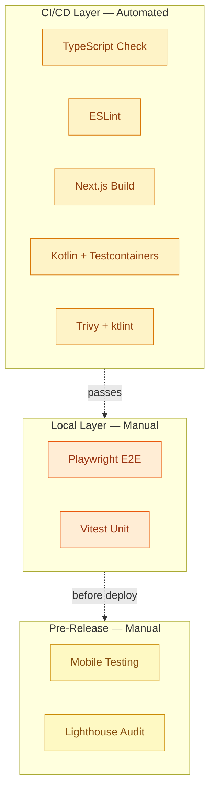

# Testing Guide

This document describes the testing strategy for the Nos Ilha platform, optimized for a solo-maintained open-source project.

## Testing Strategy Overview



### Two-Layer Approach

| Layer | Environment | Tools | Purpose |
|-------|-------------|-------|---------|
| **CI/CD** | GitHub Actions | TypeScript, ESLint, Testcontainers | Automated quality gates |
| **Local** | Developer machine | Playwright, Vitest | Pre-release validation |

This approach reduces CI/CD costs by 73% while maintaining high confidence through strict TypeScript and comprehensive backend testing.

---

## Frontend Testing

### CI/CD Quality Gates (Automated)

Every push and pull request runs these checks:

```bash
cd apps/web
pnpm build:content           # Velite content types
pnpm lint                    # ESLint
pnpm exec tsc --noEmit       # TypeScript compilation
pnpm build                   # Next.js build
```

**Execution time**: 3-5 minutes

**What these catch**:
- Type errors and API contract violations
- Code quality and accessibility issues
- Build-time errors and missing imports

### E2E Tests (Local Only)

**Location**: `apps/web/tests/e2e/`
**Config**: `apps/web/playwright.config.ts`

```bash
cd apps/web
pnpm run test:e2e            # Headless Chromium
pnpm run test:e2e:headed     # With browser UI
pnpm run test:e2e:debug      # Debug mode with breakpoints
pnpm run test:e2e:report     # View HTML report
```

**Test files** (4 critical user flows):

| Test | Purpose |
|------|---------|
| `auth-login.spec.ts` | User authentication flow |
| `auth-logout.spec.ts` | Session cleanup |
| `directory-browsing.spec.ts` | Directory navigation |
| `map-interaction.spec.ts` | Mapbox integration |

**Configuration highlights**:
- Single browser: Chromium only (not Firefox/Safari)
- Timeout: 45s global, 10s assertions
- No retries: Fast feedback for local development
- Auto-starts dev server if not running

### Unit Tests (Local Only)

**Location**: `apps/web/tests/unit/`
**Config**: `apps/web/vitest.config.ts`

```bash
cd apps/web
pnpm run test:unit           # Run once
pnpm run test:unit --watch   # Watch mode for TDD
```

**Test files** (4 critical stores/hooks):

| Test | Purpose |
|------|---------|
| `stores/authStore.test.ts` | Zustand auth state |
| `stores/filterStore.test.ts` | Directory filter state |
| `stores/uiStore.test.ts` | UI state management |
| `hooks/useDirectoryEntries.test.tsx` | TanStack Query hook |

**Configuration highlights**:
- Environment: jsdom
- Coverage: v8 provider (optional, not enforced)
- Path alias: `@/` resolves to `./src/`

---

## Backend Testing

### CI/CD Quality Gates (Automated)

Every push runs comprehensive backend validation:

```bash
cd apps/api
./gradlew ktlintCheck        # Kotlin code style
./gradlew test               # Unit + integration tests
./gradlew jacocoTestReport   # Coverage report
./gradlew jacocoTestCoverageVerification  # Coverage threshold (5%)
```

**Note**: detekt is temporarily disabled pending Kotlin 2.3.0 compatibility.

### Testcontainers Integration

Backend tests use Testcontainers for real PostgreSQL integration:

```kotlin
// Example: Integration test with PostgreSQL container
@SpringBootTest
@Testcontainers
class DirectoryEntryIntegrationTest {

    companion object {
        @Container
        @JvmStatic
        val postgres = PostgreSQLContainer("postgres:16")
            .withDatabaseName("nosilha_test")
    }

    @Test
    fun `should create directory entry`() {
        // Test against real PostgreSQL
    }
}
```

**Test files** (7 test classes):

| Test Class | Purpose |
|------------|---------|
| `CoreApplicationTests.kt` | Application context loading |
| `ModularityTests.kt` | Spring Modulith module boundaries |
| `SuggestionControllerTest.kt` | Feedback API endpoints |
| `GalleryUploadIntegrationTest.kt` | Media upload flow |
| `RelatedContentControllerTest.kt` | Places API endpoints |
| `AdminModerationSecurityTest.kt` | Admin security validation |
| `TestSecurityConfig.kt` | Test security configuration |

### Spring Modulith Validation

Module boundary tests verify architectural constraints:

```bash
cd apps/api
./gradlew test --tests "com.nosilha.core.ModularityTests"
```

Validates:
- Module structure passes Spring Modulith verification
- No circular dependencies between modules
- Shared kernel, auth, places, gallery modules exist
- Generates PlantUML documentation in `build/modulith/`

### Coverage Reports

JaCoCo generates HTML and XML coverage reports:

```bash
cd apps/api
./gradlew test jacocoTestReport
# Reports: build/reports/jacoco/test/html/index.html
```

Current threshold: 5% (temporary, target: 70%)

---

## CI/CD Integration

### Frontend Pipeline

```yaml
# .github/workflows/frontend-ci.yml
jobs:
  test-and-lint:
    steps:
      - pnpm build:content    # Generate content types
      - pnpm lint             # ESLint
      - pnpm exec tsc --noEmit # TypeScript
      - pnpm build            # Next.js build
```

**Path-based triggering**: Only runs when `apps/web/**` changes.

### Backend Pipeline

```yaml
# .github/workflows/backend-ci.yml
jobs:
  test-and-lint:
    steps:
      - ./gradlew ktlintCheck          # Code style
      - ./gradlew test                 # Tests with Testcontainers
      - ./gradlew jacocoTestReport     # Coverage
      - ./gradlew jacocoTestCoverageVerification  # Threshold
```

**Parallel execution**: ktlint and tests run concurrently.

### Security Scanning

Both pipelines include security scanning via `reusable-security-scan.yml`:
- **Trivy**: Container and dependency scanning
- **ktlint/ESLint SARIF**: Code quality reports uploaded to GitHub Security

---

## Pre-Release Checklist

Before major deployments (15-20 minutes):

### 1. Local E2E Tests (10 min)

```bash
cd apps/web
pnpm run test:e2e
```

All 4 tests should pass. Use `--headed` flag to debug failures.

### 2. Mobile Device Testing (10 min)

Test on real devices:
- **iOS Safari**: iPhone or simulator
- **Android Chrome**: Android device or emulator
- **Key flows**: Homepage -> Directory -> Entry details -> Map

Focus areas:
- Responsive layout correctness
- Touch interaction functionality
- Acceptable mobile performance

### 3. Lighthouse Audit (Optional, 5 min)

```bash
cd apps/web
npx @lhci/cli@latest autorun
```

Check Core Web Vitals and accessibility score (target: >90).

---

## Troubleshooting

### TypeScript Errors in CI

```bash
cd apps/web
pnpm exec tsc --noEmit
```

Common issues:
- Missing type imports
- Incorrect component props
- API response type mismatches

### ESLint Errors in CI

```bash
cd apps/web
pnpm run lint:fix
```

Auto-fixes most issues. Check `eslint.config.mjs` for remaining errors.

### E2E Tests Fail Locally

1. Run with UI: `pnpm run test:e2e:headed`
2. Check dev server: http://localhost:3000
3. Verify `.env.local` environment variables
4. Check `tests/setup/global-setup.ts` for test data

### Backend Tests Fail

```bash
cd apps/api
./gradlew test --info
```

Common issues:
- Docker not running (Testcontainers requires Docker)
- PostgreSQL container port conflict
- Missing test configuration in `application-test.yml`

### Coverage Threshold Fails

```bash
cd apps/api
./gradlew jacocoTestReport
# Open build/reports/jacoco/test/html/index.html
```

Add tests to uncovered areas. Current threshold: 5% (target: 70%).

---

## Configuration Reference

### Frontend

| File | Purpose |
|------|---------|
| `playwright.config.ts` | Playwright E2E configuration |
| `vitest.config.ts` | Vitest unit test configuration |
| `tests/setup/global-setup.ts` | E2E test data seeding |
| `tests/setup/vitest.setup.tsx` | Unit test setup |

### Backend

| File | Purpose |
|------|---------|
| `build.gradle.kts` | Test dependencies and JaCoCo config |
| `src/test/resources/application-test.yml` | Test profile configuration |
| `TestSecurityConfig.kt` | Test security overrides |

### Package Scripts

```json
{
  "test:e2e": "playwright test",
  "test:e2e:headed": "playwright test --headed",
  "test:e2e:debug": "playwright test --debug",
  "test:e2e:report": "playwright show-report",
  "test:unit": "vitest --project unit"
}
```

---

## Related Documentation

- [CI/CD Pipeline](./ci-cd-pipeline.md) - Complete CI/CD reference
- [Architecture](./architecture.md) - System overview
- [Spring Modulith](./spring-modulith.md) - Backend module architecture
