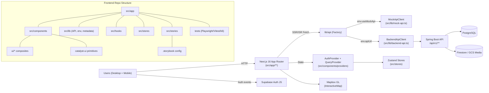

# Nos Ilha Frontend Codebase Analysis

All findings focus on the Next.js frontend located in `frontend/`. References to design system decisions are grounded in `docs/DESIGN_SYSTEM.md`, and system-level observations align with `docs/ARCHITECTURE.md`.

---

## 1. Project Overview

- **Project type:** Cultural-heritage web application frontend that renders public pages, map experiences, and simple admin flows using the Next.js App Router.
- **Tech stack:** Next.js 16 + React 19.2 + TypeScript 5, Tailwind CSS v4 tokens, Framer Motion, TanStack Query, Zustand state, Zod validation, Supabase Auth, Mapbox GL, Storybook 9 (Next.js Vite builder). Tooling includes ESLint flat config, Prettier, Vitest, Playwright, Lighthouse CI, k6, Chromatic.
- **Architecture pattern:** Server Components–first App Router with route groups (`(main)`, `(auth)`, `(admin)`), ISR caching, and a strategy-pattern API layer that swaps between a Spring Boot backend and a local mock service.
- **Languages & versions:** TypeScript-first codebase (some JS configs). Node 20 in Dockerfile, Mapbox and Supabase clients rely on ES modules. Styling is pure CSS via Tailwind’s new `@theme` DSL.

---

## 2. Directory Structure Analysis

### Root-level context

- `.storybook/` – Storybook config (`main.ts`, `preview.ts`, `vitest.setup.ts`) already imports global Tailwind styles but lacks provider wrappers.
- `.mcp/`, `playwright-mcp-output/`, `playwright-report/`, `test-results/` – Playwright MCP automation artifacts and CI outputs. `playwright-report/data/` contains PNG/WEBM captures; `test-results/` stores per-scenario assets.
- `.next/` – A full production build (~1.5 GB via `du`). Keeping this folder in the repo inflates clone size and should be pruned.
- `package.json` / `package-lock.json` – Define scripts for development, Storybook, Playwright suites, Lighthouse, k6, MCP server, etc.
- `Dockerfile` – Multi-stage Node 20 Alpine image that builds standalone output for Cloud Run deployment (consistent with `docs/ARCHITECTURE.md`).
- `.env.*` – Local env variants (`.env.local`, `.env.local.example`, `.env.test*`). Real values should be kept out of VCS.

### `public/`

- Contains hero imagery (`public/images/**`) referenced throughout homepage/people/history routes. Assets mirror palettes defined in `docs/DESIGN_SYSTEM.md`.

### `src/app/`

- Next.js App Router entrypoint. `layout.tsx` wires fonts, SEO metadata, Supabase/TanStack Query providers, and the persistent `Header`/`Footer`/`Banner`.
- Route groups:
  - `(main)/` – Public pages (`page.tsx` for home, `map`, `directory/[category]`, per-entry slug page, etc.) that fetch via `lib/api`.
  - `(auth)/` – `login` + `signup` forms built with Catalyst UI primitives.
  - `(admin)/add-entry` – Client component gated by `AuthProvider`.
  - `api/health` – Simple GET route for uptime probes.
  - `test/` – Appears to hold feature-flag/test routes (not populated yet).

### `src/components/`

- **`catalyst-ui/`** – Design-system-aligned primitives (Button, Input, Sidebar, etc.) following the brand guidance described in `docs/DESIGN_SYSTEM.md`.
- **`ui/`** – Nos Ilha–specific composites (DirectoryCard, PageHeader, ContentActionToolbar, InteractiveMap, banners, etc.).
- **`auth/`, `admin/`** – Feature forms composed from catalyst primitives.
- **`providers/`** – Behavior providers (`AuthProvider`, `QueryProvider`).

### Supporting folders

- `src/hooks/` – React hooks such as `useDirectoryEntries` (TanStack Query) and `useMediaQuery`. Query hooks collocate with API fetchers and Zod validation.
- `src/lib/` – Platform services: API contracts/factory (mock vs backend), Supabase client, env validation, metadata builders, animation system.
- `src/schemas/` – Zod schemas (directory entries, filters, auth) for runtime validation.
- `src/stores/` – Zustand stores for auth, filters, UI state.
- `src/styles/` – Supplemental CSS (e.g., `print.css`).
- `src/stories/` – Only five Storybook stories today (CatalystButton, DirectoryCard, PageHeader, PhotoGalleryFilter, ThemeToggle).
- `tests/` – Rich test suite structure: Playwright E2E cases, API contract tests, shared flows, Lighthouse/perf, k6 load tests, Vitest unit tests (stores/hooks). `tests/unit/components` is empty, highlighting a gap.

---

## 3. File-by-File Breakdown (Key Representatives)

### Core Application Files

- `src/app/layout.tsx` – Global metadata (OpenGraph, Twitter, structured data) and providers. Uses fonts defined in `docs/DESIGN_SYSTEM.md` and injects a client-side theme script.
- `src/app/(main)/page.tsx` – Hero landing page with feature highlights, uses `getEntriesByCategory("all")` and renders `DirectoryCard`.
- `src/app/(main)/map/page.tsx` – Client page that dynamically imports `InteractiveMap` with suspense fallbacks.
- `src/app/(main)/directory/[category]/page.tsx` – ISR-enabled listing page with breadcrumb schema generation.
- `src/app/(main)/directory/entry/[slug]/page.tsx` – Detail page that injects `ContentActionToolbar`, `ImageGallery`, `RelatedContent`, and canonical metadata.
- `src/app/api/health/route.ts` – Serverless health endpoint.

### Configuration Files

- `package.json` – Comprehensive scripts for dev/build/test/Storybook/Lighthouse/k6/MCP. Dependencies highlight Next 16, React 19.2, Tailwind 4, TanStack Query 5, Supabase 2.5x, etc.
- `tsconfig.json` – Strict mode, path alias `@/*`, bundler module resolution.
- `next.config.ts` – Standalone output, relaxed ESLint on build, remote image patterns.
- `tailwind.config.ts` & `src/app/globals.css` – Theme tokens from `docs/DESIGN_SYSTEM.md` with `@theme`/`@variant` definitions and animation utilities.
- `eslint.config.mjs` – Flat config layering Next, Prettier, Storybook plugin, and custom rules for cultural content (e.g., `react/no-unescaped-entities` exceptions).
- `.storybook/main.ts` and `.storybook/preview.ts` – Next.js Vite framework config, Chromatic + a11y addons, light/dark backgrounds, but no custom decorators for providers yet.
- `Dockerfile` – Three-stage build for Cloud Run; copies standalone server output and exposes 3000.

### Data Layer & API Abstractions

- `src/lib/api-contracts.ts` – Type-safe interface for API clients, caching hints (`CacheConfig`), pagination metadata.
- `src/lib/api-factory.ts`, `src/lib/api.ts`, `src/lib/backend-api.ts`, `src/lib/mock-api.ts` – Strategy pattern that toggles between live Spring Boot endpoints and curated mock data. Backend client handles Supabase auth headers, ISR caching, validation, and error parsing. Mock client seeds Cape Verde–authentic samples.
- `src/lib/env.ts` – Validates required env vars at module load and enforces URL formats; logs guidance if missing.
- `src/schemas/*.ts` – Zod discriminated unions for directory entries, media metadata, filters, auth forms.
- `src/types/*.ts` – Shared DTOs (DirectoryEntry union, Town, Reaction, content-action toolbar props).

### Frontend/UI Layer

- Catalyst primitives (buttons, inputs, dialogs) reflect spacing/typography tokens from `docs/DESIGN_SYSTEM.md`.
- Composite UI components in `src/components/ui/` manage complex behavior:
  - `interactive-map.tsx` – Mapbox map with clustering, uses Zustand filters, handles loading/error/empty states.
  - `content-action-toolbar/**` – Responsive action suite (desktop rail + mobile FAB) with Reaction buttons, share/copy/print actions, Supabase-authenticated API calls.
  - `newsletter`, `page-header`, `directory-card`, `image-gallery`, `related-content`, etc.

### Testing Assets

- `playwright.config.ts` – Defines E2E projects (Desktop Chrome + Mobile Chrome), attaches tracing/screenshots/videos, seeds data via `tests/setup/global-setup.ts`.
- `vitest.config.ts` – Multi-project config (unit + browser-based Storybook tests) with coverage thresholds.
- `tests/e2e/*.spec.ts`, `tests/shared/*.spec.ts` – Scenario-based tests (auth, directory, map, cultural flows).
- `tests/k6/*.js` – Load scripts for API endpoints.
- `tests/unit/stores/*.test.ts`, `tests/unit/hooks/*.test.tsx` – Zustand and hook coverage. Component unit tests are missing.

### Documentation & DevOps

- `README.md` – Still the default `create-next-app` text; needs replacement with project-specific guidance (should reference `docs/DESIGN_SYSTEM.md`/`docs/ARCHITECTURE.md` per repo standards).
- `../docs/*.md` (outside this folder) – Authoritative guides referenced throughout this analysis.
- `Dockerfile`, `.env.local.example`, `lighthouserc.js`, `package scripts` – Provide deployment/testing automation, but no `.github` workflows live inside `frontend/` (CI resides at repo root).

---

## 4. API Endpoints Analysis

The frontend’s backend client (`src/lib/backend-api.ts`) targets the Spring Boot API documented in `docs/ARCHITECTURE.md`. Key endpoints:

| Method   | Endpoint                                             | Purpose                                               | Notes                                                               |
| -------- | ---------------------------------------------------- | ----------------------------------------------------- | ------------------------------------------------------------------- |
| `GET`    | `/api/v1/directory/entries?category&size&page`       | Fetch paginated directory entries or category slices. | Uses ISR revalidate 3600 via `CacheConfig.DIRECTORY_ENTRIES`.       |
| `GET`    | `/api/v1/directory/slug/:slug`                       | Fetch a single entry.                                 | ISR revalidate 1800, returns `undefined` on 404.                    |
| `POST`   | `/api/v1/directory/entries`                          | Create a directory entry.                             | Requires Supabase JWT; handles validation errors via `ErrorDetail`. |
| `GET`    | `/api/v1/directory/entries?size=100`                 | Map data feed (no-store cache).                       | Shared with `InteractiveMap`.                                       |
| `POST`   | `/api/v1/media/upload`                               | Upload image, returns public URL.                     | Authenticated; accepts optional category/description metadata.      |
| `GET`    | `/api/v1/towns/all`                                  | Fetch all towns.                                      | Two usages (general + map).                                         |
| `GET`    | `/api/v1/towns/slug/:slug`                           | Fetch a town by slug.                                 | Returns undefined on 404.                                           |
| `POST`   | `/api/v1/reactions`                                  | Submit/update reaction (`ReactionCreateDto`).         | Requires Supabase auth; Reaction buttons use optimistic updates.    |
| `DELETE` | `/api/v1/reactions/content/:contentId`               | Remove current user reaction.                         | Called when toggling off selection.                                 |
| `GET`    | `/api/v1/reactions/content/:contentId`               | Fetch aggregated reaction counts + user reaction.     | Cached for 5 minutes via `CacheConfig.REACTION_COUNTS`.             |
| `POST`   | `/api/v1/suggestions`                                | Submit community suggestions for content.             | Rate-limited server-side; UI uses `suggest-improvement` actions.    |
| `GET`    | `/api/v1/directory/entries/:contentId/related?limit` | Related content feed.                                 | Displayed beneath entry pages.                                      |
| `GET`    | `/api/health` (Next.js route)                        | Frontend health info (uptime/environment).            | Used by infrastructure probes.                                      |

Request/response payloads follow the `ApiResponse<T>` or `PagedApiResponse<T>` wrappers defined in `src/lib/api-contracts.ts`. The API factory uses `NEXT_PUBLIC_USE_MOCK_API` toggles to substitute the mock client during local development or testing.

Authentication: Supabase session tokens automatically attach via `BackendApiClient.authenticatedFetch`, which signs out users on 401 and forces `/login`.

---

## 5. Architecture Deep Dive

- **Rendering model:** Per `docs/ARCHITECTURE.md`, the frontend leans on Server Components for data fetching (e.g., directory listings call `getEntriesByCategory` server-side). Client components are reserved for interactive flows such as maps, auth forms, and toolbars.
- **Data flow:** Users hit App Router routes → server components call `lib/api` → API factory selects backend vs mock implementation → Backend client fetches Spring Boot endpoints (`env.apiUrl`) using ISR caching hints → responses validated via Zod + manual guards before feeding UI. Client components needing live interactivity (content toolbar, map, search) use TanStack Query or Zustand stores for incremental updates.
- **State management:** Global auth state is centralized in `src/stores/authStore.ts` (Zustand + persist + devtools). Filters and UI stores follow the same pattern. Local component state handles UI-level details (e.g., Reaction button spinners).
- **Providers & cross-cutting concerns:** `QueryProvider` and `AuthProvider` wrap the layout, ensuring React Query cache and Supabase session context are available. Additional libs (Framer Motion, Mapbox GL, Heroicons) integrate directly at component level.
- **Design system alignment:** Colors, typography, spacing, and animation tokens follow the semantic token scheme from `docs/DESIGN_SYSTEM.md`. Components rely on Tailwind semantic classes (`bg-background-primary`, `text-text-secondary`, etc.) to auto-honor light/dark modes.
- **Testing pyramid:** Playwright handles feature and regression tests (desktop/mobile), Vitest covers stores/hooks, Storybook + Chromatic are configured for UI regression, Lighthouse + k6 for performance. However, component-level unit tests and Storybook coverage are still sparse.
- **Module dependencies:** `src/components/ui/content-action-toolbar` depends on `src/components/ui/actions/*`, `src/types/content-action-toolbar`, and `getReactionCounts` from `lib/api`. `InteractiveMap` relies on `lib/api`, `stores/filterStore`, Mapbox GL, and clustering libs. Most routes share `PageHeader` and design primitives, ensuring consistent UX.

---

## 6. Environment & Setup Analysis

- **Required env vars** (validated in `src/lib/env.ts` and documented in `.env.local.example`):
  - `NEXT_PUBLIC_API_URL` – Backend base URL.
  - `NEXT_PUBLIC_USE_MOCK_API` – Switch between backend/mock clients.
  - `NEXT_PUBLIC_MAPBOX_ACCESS_TOKEN` – Public Mapbox token (`pk.*`) required for map rendering.
  - `NEXT_PUBLIC_SUPABASE_URL`, `NEXT_PUBLIC_SUPABASE_ANON_KEY` – Supabase project credentials for auth.
  - Optional test helpers: `PLAYWRIGHT_BASE_URL`, `MCP_SERVER_PORT`, `DEBUG`, `NODE_ENV`.
- **Local setup:**
  1. `npm install`
  2. Configure `.env.local` with real API, Mapbox, and Supabase values.
  3. `npm run dev` (uses Turbopack) and open `http://localhost:3000`.
  4. Optional: run backend (`../backend`) and infrastructure stack per `docs/ARCHITECTURE.md`.
- **Testing workflow:**
  - `npm run lint`, `npm run format:check`
  - `npm run test:unit` (Vitest)
  - `npm run test:e2e` or scenario-specific scripts (`test:mobile`, `test:performance`, `test:api`)
  - `npm run lighthouse:audit`, `npm run k6:*`
  - `npm run storybook` for component review; `npm run build-storybook` for static docs.
- **Deployment:** `npm run build` produces a standalone server consumed by the Dockerfile. The resulting image runs `node server.js` and expects Cloud Run to inject `PORT`. Storybook is ready for Chromatic uploads via `@chromatic-com/storybook`.

---

## 7. Technology Stack Breakdown

- **Runtime & Framework:** Node 20, Next.js 16 (App Router), React 19.2 Server Components.
- **Styling & Design:** Tailwind CSS v4 semantic tokens, custom CSS animations, fonts from Merriweather/Lato per `docs/DESIGN_SYSTEM.md`.
- **State & Data:** TanStack Query 5, Zustand 5, React Hook Form + Zod, Supabase Auth, Mapbox GL 3 + react-map-gl, Supercluster for map clustering.
- **API Layer:** Strategy pattern via `lib/api-factory`, fetch wrappers with ISR hints, Supabase-authenticated POST/DELETE operations, optional mock responses.
- **Testing & QA:** Playwright (desktop/mobile, MCP automation), Vitest (unit + Storybook integration), Lighthouse CI (`lighthouserc.js`), k6 load scripts, Chromatic visual regression, bundlesize budgets.
- **Tooling:** ESLint flat config (Next + Prettier), Prettier with Tailwind plugin, Storybook 9 + Next.js Vite builder, Framer Motion for interactions.
- **Deployment & Ops:** Docker multi-stage builds, environment validation, remote image config, `output: standalone` ready for Cloud Run (matching `docs/ARCHITECTURE.md` guidance).

---

## 8. Visual Architecture Diagram

This diagram captures user-to-frontend interactions, the API switching strategy, dependencies on Supabase/Auth, and the internal folder relationships most relevant to component and page development.

---

## 9. Key Insights & Recommendations

1. **Git hygiene:** `.next/`, `playwright-report/`, and `test-results/` directories are present in the repo tree and account for ~1.5 GB. These build artifacts should remain untracked to keep clones lightweight and prevent accidental deployments of stale bundles.
2. **Documentation gap:** `frontend/README.md` still contains the default `create-next-app` text. Replace it with project-specific onboarding information referencing `docs/DESIGN_SYSTEM.md` and `docs/ARCHITECTURE.md` so new contributors see the real requirements.
3. **Storybook coverage:** Only five stories exist despite dozens of components. This limits our ability to enforce design consistency, run Chromatic diffing, or share living documentation with the community.
4. **Unit test scope:** `tests/unit/components` is empty. Consider adding focused tests for complex UI (ContentActionToolbar, InteractiveMap filter logic, auth flows) to catch regressions before E2E tests.
5. **Env files in repo:** `.env.local` and `.env.test.*` sit next to `.env.local.example`. Confirm that sensitive values are excluded or sanitized to avoid leaking Supabase keys or API URLs.
6. **Provider consistency:** Storybook `preview.ts` imports global CSS but does not wrap stories with `AuthProvider`, `QueryProvider`, or necessary layout wrappers, so components that rely on context cannot be rendered there yet.
7. **A11y enforcement:** `@storybook/addon-a11y` is configured but `parameters.a11y.test` is set to `"todo"`. Tighten this once catalog coverage improves, and integrate Playwright/axe scans for critical flows.

---

## 10. Storybook Catalog Expansion Plan

To honor the brand language and UX guardrails in `docs/DESIGN_SYSTEM.md`, the Storybook catalog must become the single source of truth for components and page states. Proposed roadmap:

1. **Audit & Inventory (Week 1):**
   - Generate a component inventory (Catalyst primitives, UI composites, page templates) by scanning `src/components/**` and `src/app/(main)`.
   - Document props, dependencies, and required providers for each item. Use the semantic color/typography tokens listed in `docs/DESIGN_SYSTEM.md` as acceptance criteria.

2. **Configure Foundations (Week 1–2):**
   - Extend `.storybook/preview.ts` to wrap all stories in `AuthProvider`, `QueryProvider`, and a layout shell so components that rely on context (e.g., ReactionButtons) render without runtime errors.
   - Add decorators for light/dark mode toggling, viewport presets, and mock router context (Next.js `RouterContext`) to mirror App Router behavior.
   - Wire `@storybook/addon-a11y` to `test: "error"` in CI once stories stabilize.

3. **Document Primitives (Week 2):**
   - Create Storybook files for every Catalyst component (Button, Input, Fieldset, Dialog, Navbar, etc.), showcasing default/hover/disabled/error states. Reference the semantic tokens from `docs/DESIGN_SYSTEM.md` in story descriptions so brand reviewers can verify color usage.

4. **Cover Composite UI (Week 3):**
   - Author stories for `DirectoryCard`, `PageHeader`, `Banner`, `InteractiveMap` (with a static fallback or screenshot), `ContentActionToolbar`, `NewsletterSignup`, `MapFilterControl`, `RelatedContent`, `ImageGallery`, `PeopleCard`, etc.
   - Utilize the existing mock JSON payloads inside `src/lib/__test_mocks__` to supply realistic data without hitting APIs.
   - For highly interactive components (ReactionButtons, Map, ImageUploader), add stories for loading/error/empty/authenticated vs guest contexts.

5. **Page-Level Scenarios (Week 4):**
   - Create page stories (or `.mdx` documents) for critical routes: Home, Directory category, Entry detail, Map, Login, Add Entry. Leverage Next.js story annotations to mock server data and highlight layout composition patterns from `docs/ARCHITECTURE.md`.
   - Document SEO metadata expectations, hero imagery, and structured data requirements within MDX notes.

6. **Automate Testing & Publishing (Week 4–5):**
   - Enable `@storybook/addon-vitest`’s story testing to validate play functions (e.g., simulate reactions, toggle map filters).
   - Integrate Chromatic in CI to upload every PR build. Use Chromatic baselines to enforce the semantic color rules defined in `docs/DESIGN_SYSTEM.md`.
   - Add a `npm run storybook:ci` script (storybook build + chromatic upload) to PR workflows.

7. **Maintenance & Governance (Ongoing):**
   - Establish a checklist requiring new components/pages to ship with Storybook stories, documented states, and Chromatic snapshots.
   - Schedule quarterly audits comparing Storybook tokens with `docs/DESIGN_SYSTEM.md` in case brand colors or typography evolve.
   - Use `src/stories` as the canonical location; align naming with route/component hierarchies (`components/ui/Header.stories.tsx`, `pages/directory/CategoryPage.stories.tsx`, etc.).

Executing this plan will turn Storybook into a living catalog that precise mirrors our page compositions and component states, making it easier for new contributors (and cultural reviewers) to validate experiences without running the full stack.

---

_Stats: 3,275 files detected (2,145 code files). Repository size sans `node_modules`/`.git` is ~1.5 GB largely because `.next/` is currently present in the workspace._
